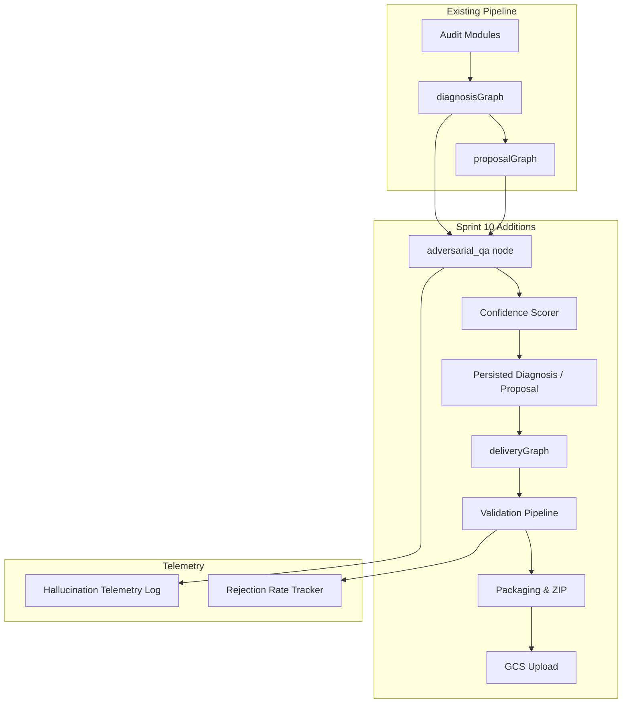

# Design Document: Agentic Delivery + QA Hardening

## Overview

Sprint 10 adds two orthogonal but complementary capabilities to the Autonomous Proposal Engine:

- **Delivery Agent** (`lib/graph/delivery-graph.ts`): A new LangGraph subgraph that converts audit findings into validated, packaged, ready-to-install artifacts. It replaces the stub `dispatchToAgent` in `DeliveryEngine` with real code generation, a validation pipeline, and ZIP bundle assembly.

- **Adversarial QA** (`lib/graph/adversarial-qa-graph.ts`): A new LangGraph node that runs three sequential fact-checking passes (hallucination sweep, consistency check, competitor fairness) after every diagnosis and proposal generation. It assigns confidence scores, softens low-confidence language, and logs all caught hallucinations for telemetry.

Both features integrate into the existing LangGraph-based pipeline without breaking the current `diagnosisGraph` → `proposalGraph` → `DeliveryEngine` flow.

---

## Architecture



### Integration Points

| Existing File | Change |
|---|---|
| `lib/graph/diagnosis-graph.ts` | Add `adversarial_qa` node after `validate_diagnosis` |
| `lib/graph/proposal-graph.ts` | Add `adversarial_qa` node after `validate_claims` |
| `lib/pipeline/deliveryEngine.ts` | Replace stub `dispatchToAgent` with `deliveryGraph` dispatch |
| `lib/config/thinking-budgets.ts` | Add `delivery_agent: 16384` and `adversarial_qa: 8192` |
| `lib/pipeline/types.ts` | Extend `Deliverable` with artifact fields |
| `prisma/schema.prisma` | Add `GeneratedArtifact`, `HallucinationLog`, `AdversarialQARun` models |

---

## Components and Interfaces

### 1. Delivery Graph (`lib/graph/delivery-graph.ts`)

A LangGraph `StateGraph` with the following nodes:

```
generate_artifact → validate_artifact → package_artifact → assemble_bundle → upload_bundle
```

**State shape:**

```typescript
interface DeliveryState {
  findings: Finding[];                    // Input: findings from accepted proposal tier
  proposalSections: Record<string, any>;  // Input: approved proposal sections
  artifacts: GeneratedArtifact[];         // Accumulates as generation runs
  packages: ImplementationPackage[];      // Accumulates as packaging runs
  bundle: DeliveryBundle | null;          // Final assembled bundle
  validationSummary: ValidationSummary;   // Rejection rate tracking
  tenantId: string;
  proposalId: string;
}
```

**Node responsibilities:**

- `generate_artifact`: Calls `generateWithGemini` with `thinkingBudget: 16384`. Routes to the correct generator function based on `finding.category`. Returns raw artifact content + metadata.
- `validate_artifact`: Runs the Validation Pipeline (syntax → schema → Lighthouse dry-run). Updates artifact status to `VALIDATED` or `FAILED_VALIDATION`.
- `package_artifact`: Wraps each validated artifact in an `ImplementationPackage` with installation instructions, before/after preview, and estimated impact.
- `assemble_bundle`: Zips all packages + README using the `archiver` npm package. Stores the buffer.
- `upload_bundle`: Uploads the ZIP to GCS via `lib/storage.ts` and persists the URL to `DeliveryTask`.

### 2. Artifact Generators (`lib/delivery/generators/`)

One generator module per finding category:

| File | Category | Output Type |
|---|---|---|
| `schemaGenerator.ts` | SCHEMA | JSON-LD snippet (LocalBusiness / FAQPage / Review) |
| `metaTagGenerator.ts` | SEO | HTML `<meta>` block (title, description, OG tags) |
| `speedGenerator.ts` | SPEED / PERFORMANCE | JS/CSS optimization script |
| `gbpGenerator.ts` | GBP | Plain-text GBP content drafts |
| `contentGenerator.ts` | CONTENT | Markdown content brief + draft |
| `accessibilityGenerator.ts` | ACCESSIBILITY | HTML ARIA additions + CSS color contrast fixes |

Each generator exports:

```typescript
interface ArtifactGenerator {
  generate(finding: Finding, proposalContext: Record<string, any>): Promise<RawArtifact>;
  getArtifactType(): ArtifactType;
  supportsWordPress(): boolean;
  generateWordPressPlugin?(finding: Finding, artifact: RawArtifact): Promise<string>; // .php content
}
```

### 3. Validation Pipeline (`lib/delivery/validationPipeline.ts`)

Sequential checks, each returning a `ValidationCheckResult`:

```typescript
interface ValidationCheckResult {
  checkName: 'syntax' | 'schema' | 'lighthouse' | 'human_review';
  passed: boolean;
  details: string;
  flaggedForHumanReview?: boolean;
}
```

**Syntax check**: Uses `JSON.parse` for JSON-LD, `node-html-parser` for HTML, `acorn` for JS, regex for PHP.

**Schema check**: Calls the Google Rich Results Test API (`https://searchconsole.googleapis.com/v1/urlTestingTools/mobileFriendlyTest:run` — or the structured data endpoint). Parses the response for errors.

**Lighthouse dry-run**: Calls Lighthouse CI API or simulates via `lighthouse` npm package in headless mode against a local HTML fixture. Records projected score delta.

**Human-in-the-loop flag**: Any artifact that fails syntax or schema check is automatically flagged. Creates a `HumanReviewFlag` record in the DB.

### 4. Adversarial QA Node (`lib/graph/adversarial-qa-graph.ts`)

A single LangGraph node (not a full subgraph) that runs three sequential passes:

```typescript
interface AdversarialQAState {
  content: string;                    // The diagnosis narrative or proposal text
  findings: Finding[];                // Raw findings for cross-reference
  rawEvidence: EvidenceSnapshot[];    // Raw audit evidence
  comparisonReport?: ComparisonReport;
  hallucinationFlags: HallucinationFlag[];
  consistencyFlags: ConsistencyFlag[];
  competitorFairnessFlags: CompetitorFairnessFlag[];
  confidenceScores: Record<string, ConfidenceLevel>; // findingId → HIGH|MEDIUM|LOW
  hardenedContent: string;            // Content after softening low-confidence claims
}
```

**Pass 1 — Hallucination Sweep**: Prompts the LLM (thinking budget 8,192) to enumerate every factual claim in `content`, then cross-reference each against `findings` and `rawEvidence`. Claims with no traceable source are flagged.

**Pass 2 — Consistency Check**: Prompts the LLM to compare recommendations against findings and ROI claims against measured impact scores. Flags mismatches.

**Pass 3 — Competitor Fairness**: Prompts the LLM to verify competitor claims against `comparisonReport` evidence timestamps. Flags stale or overstated competitor comparisons.

After all three passes, the node:
1. Assigns `ConfidenceLevel` to each finding based on evidence quality.
2. Applies language softening to LOW-confidence claims via regex + LLM rewrite.
3. Logs all flags to `HallucinationLog` table.

### 5. Confidence Scorer (`lib/delivery/confidenceScorer.ts`)

```typescript
type ConfidenceLevel = 'HIGH' | 'MEDIUM' | 'LOW';

interface ConfidenceRule {
  level: ConfidenceLevel;
  condition: (finding: Finding) => boolean;
}

// Rules (evaluated in order, first match wins):
// HIGH: finding.evidence contains at least one entry with a valid pointer + collected_at
// MEDIUM: finding.evidence is non-empty but lacks a direct measurement pointer
// LOW: finding.evidence is empty or all entries are inferred/estimated
```

Language softening map:

| Pattern | Replacement |
|---|---|
| `"your X is Y"` | `"estimated X: ~Y (modeled)"` |
| `"X costs you $N/month"` | `"estimated monthly impact: ~$N (modeled)"` |
| `"competitors are outperforming"` | `"competitors may be outperforming (as of last audit)"` |

### 6. Hallucination Telemetry (`lib/telemetry/hallucinationTelemetry.ts`)

```typescript
interface HallucinationEvent {
  auditId: string;
  proposalId?: string;
  category: 'data_fabrication' | 'metric_inflation' | 'false_competitor_claim' | 'unsupported_recommendation';
  flaggedText: string;
  location: string; // e.g. "executiveSummary", "tier.growth.narrative"
  timestamp: Date;
}

interface WeeklyHallucinationReport {
  weekStart: Date;
  totalClaims: number;
  caughtHallucinations: number;
  rate: number; // 0-1
  byCategory: Record<string, number>;
}
```

The telemetry module exposes:
- `logHallucination(event: HallucinationEvent): Promise<void>` — writes to `HallucinationLog` table
- `computeWeeklyRate(tenantId: string, weekStart: Date): Promise<WeeklyHallucinationReport>`
- `checkRateAlert(tenantId: string): Promise<boolean>` — returns true if 7-day rate > 5%

### 7. Red Team Dataset (`tests/red-team/`)

50 structured JSON fixtures, each with shape:

```typescript
interface RedTeamCase {
  id: string;
  description: string;
  category: 'hidden_redirect' | 'fake_schema' | 'competitor_better' | 'no_issues' | 'ambiguous_data';
  seedHallucination: string;          // The planted false claim
  mockFindings: Partial<Finding>[];
  mockEvidence: Partial<EvidenceSnapshot>[];
  expectedFlags: string[];            // Substrings that must appear in flagged claims
  passCriteria: 'must_flag' | 'must_not_flag';
}
```

CI gate: `tests/red-team/adversarialQA.eval.ts` runs all 50 cases and asserts ≥ 90% pass rate.

---

## Data Models

### New Prisma Models

```prisma
model GeneratedArtifact {
  id           String   @id @default(uuid())
  tenantId     String
  proposalId   String
  findingId    String
  artifactType String   // 'json_ld', 'html_meta', 'speed_script', 'gbp_draft', 'content_brief', 'aria_fix', 'wp_plugin'
  content      String   @db.Text
  status       String   @default("pending") // 'pending', 'validated', 'failed_validation', 'packaged'
  validationResults Json @default("[]")     // ValidationCheckResult[]
  confidenceLevel   String? // 'HIGH', 'MEDIUM', 'LOW'
  estimatedImpact   String?
  installationInstructions String? @db.Text
  beforePreview    String? @db.Text
  afterPreview     String? @db.Text
  wordpressPlugin  String? @db.Text         // .php content if applicable
  humanReviewFlag  Boolean @default(false)
  createdAt    DateTime @default(now())
  updatedAt    DateTime @updatedAt

  @@index([tenantId, proposalId])
  @@index([findingId])
  @@index([status])
}

model DeliveryBundle {
  id           String   @id @default(uuid())
  tenantId     String
  proposalId   String   @unique
  zipUrl       String?  // GCS URL
  readmeContent String? @db.Text
  artifactCount Int     @default(0)
  status       String   @default("assembling") // 'assembling', 'ready', 'failed'
  createdAt    DateTime @default(now())
  updatedAt    DateTime @updatedAt

  @@index([tenantId])
  @@index([proposalId])
}

model AdversarialQARun {
  id           String   @id @default(uuid())
  tenantId     String
  auditId      String?
  proposalId   String?
  runType      String   // 'diagnosis', 'proposal'
  hallucinationFlags Json @default("[]")
  consistencyFlags   Json @default("[]")
  competitorFlags    Json @default("[]")
  totalClaimsChecked Int  @default(0)
  totalFlagged       Int  @default(0)
  hardenedContent    String? @db.Text
  createdAt    DateTime @default(now())

  @@index([tenantId, auditId])
  @@index([proposalId])
  @@index([createdAt])
}

model HallucinationLog {
  id           String   @id @default(uuid())
  tenantId     String
  auditId      String?
  proposalId   String?
  category     String   // 'data_fabrication', 'metric_inflation', 'false_competitor_claim', 'unsupported_recommendation'
  flaggedText  String   @db.Text
  location     String
  weekStart    DateTime // Truncated to Monday for weekly aggregation
  createdAt    DateTime @default(now())

  @@index([tenantId, weekStart])
  @@index([auditId])
  @@index([category])
}

model HumanReviewFlag {
  id           String   @id @default(uuid())
  tenantId     String
  artifactId   String
  findingId    String
  reason       String   @db.Text
  status       String   @default("pending") // 'pending', 'approved', 'rejected'
  reviewedBy   String?
  reviewedAt   DateTime?
  createdAt    DateTime @default(now())

  @@index([tenantId, status])
  @@index([artifactId])
}
```

### Extended `DeliveryTask` fields (migration)

Add to existing `DeliveryTask`:
```prisma
  artifactId      String?   // FK to GeneratedArtifact
  bundleId        String?   // FK to DeliveryBundle
  confidenceLevel String?   // 'HIGH', 'MEDIUM', 'LOW'
```

### Extended `Finding` fields (migration)

Add to existing `Finding`:
```prisma
  confidenceLevel String?   // 'HIGH', 'MEDIUM', 'LOW' — set by Confidence Scorer
```

---

## Correctness Properties

*A property is a characteristic or behavior that should hold true across all valid executions of a system — essentially, a formal statement about what the system should do. Properties serve as the bridge between human-readable specifications and machine-verifiable correctness guarantees.*

### Property 1: Artifact type coverage

*For any* Finding with a category in {SCHEMA, SEO, SPEED, GBP, CONTENT, ACCESSIBILITY}, the Delivery_Agent SHALL produce exactly one artifact of the corresponding type. No finding in these categories should produce zero artifacts or an artifact of the wrong type.

**Validates: Requirements 1.1, 1.2, 1.3, 1.4, 1.5, 1.6**

---

### Property 2: Validation status completeness

*For any* generated artifact, after the Validation_Pipeline runs, the artifact's status SHALL be either `VALIDATED` or `FAILED_VALIDATION` — never `pending`. No artifact should remain in an indeterminate state after the pipeline completes.

**Validates: Requirements 2.1, 2.4, 2.5**

---

### Property 3: Rejection rate monotonicity

*For any* set of N artifacts processed by the Validation_Pipeline, the rejection rate SHALL equal `(count of FAILED_VALIDATION artifacts) / N`. The metric SHALL be consistent with the individual artifact statuses — it cannot report a lower rate than the actual failure count implies.

**Validates: Requirements 2.6**

---

### Property 4: Implementation package completeness

*For any* validated artifact, the resulting Implementation_Package SHALL contain all four required fields: artifact content, installation instructions, estimated impact, and (where applicable) a before/after preview. No field SHALL be null or empty string.

**Validates: Requirements 3.1**

---

### Property 5: Delivery bundle integrity

*For any* Delivery_Bundle, the number of Implementation_Packages inside the ZIP SHALL equal the `artifactCount` field on the `DeliveryBundle` record, and the ZIP SHALL contain a README file. The bundle is internally consistent.

**Validates: Requirements 3.2, 3.3, 3.7**

---

### Property 6: Hallucination sweep coverage

*For any* diagnosis or proposal text and its associated raw evidence, every factual claim that has no traceable source in the evidence SHALL be flagged by the Adversarial_QA Hallucination Sweep. No unflagged claim should exist without a corresponding evidence pointer.

**Validates: Requirements 4.1, 4.2**

---

### Property 7: Confidence score assignment completeness

*For any* Finding processed by the Confidence Scorer, the resulting confidence level SHALL be exactly one of {HIGH, MEDIUM, LOW} — never null or undefined. Every finding in a READY proposal SHALL have a confidence level assigned.

**Validates: Requirements 7.1, 7.2, 7.3, 10.5**

---

### Property 8: LOW confidence language softening

*For any* claim associated with a LOW-confidence finding, the hardenedContent produced by the Adversarial_QA node SHALL NOT contain the original assertive phrasing. The softened version SHALL contain a qualifier such as "estimated", "modeled", or "as of last audit".

**Validates: Requirements 7.4**

---

### Property 9: Red team pass rate gate

*For any* run of the Red_Team_Dataset against the Adversarial_QA node, the pass rate SHALL be ≥ 90%. Equivalently, for any set of 50 seeded test cases, at most 5 may be missed by the adversarial QA system.

**Validates: Requirements 8.3, 10.4**

---

### Property 10: Hallucination log consistency

*For any* AdversarialQARun record, the `totalFlagged` field SHALL equal the sum of the lengths of `hallucinationFlags`, `consistencyFlags`, and `competitorFlags` arrays. The aggregate count SHALL be derivable from the individual flag arrays.

**Validates: Requirements 9.1**

---

### Property 11: No unattributed claims in READY proposals

*For any* proposal with status `READY`, every factual claim in the executive summary and tier narratives SHALL have a traceable finding ID or evidence pointer. The set of unattributed claims SHALL be empty.

**Validates: Requirements 10.6**

---

## Error Handling

| Scenario | Behavior |
|---|---|
| LLM returns malformed JSON-LD | Syntax check fails → artifact marked `FAILED_VALIDATION` → human review flag created |
| Google Rich Results Test API unavailable | Schema check skipped, artifact marked `VALIDATED_PARTIAL`, warning logged |
| Lighthouse CI unavailable | Lighthouse check skipped, artifact marked `VALIDATED_PARTIAL`, warning logged |
| GCS upload fails | Bundle status set to `FAILED`, error logged, retry queued |
| Adversarial QA LLM timeout | QA run marked `INCOMPLETE`, proposal held in `DRAFT` status, alert sent |
| All 3 adversarial passes complete but 0 claims checked | Treated as a QA failure — proposal not promoted to `READY` |
| Red team eval pass rate < 90% | CI pipeline fails, release blocked |
| Hallucination rate > 5% in 7-day window | Alert sent to tenant admin via existing `lib/notifications/email.ts` |

---

## Testing Strategy

### Unit Tests

- `lib/delivery/generators/*.test.ts` — one test file per generator, verifying output shape and required fields for representative finding inputs.
- `lib/delivery/validationPipeline.test.ts` — tests for each validation check type, including failure paths.
- `lib/delivery/confidenceScorer.test.ts` — tests for all three confidence levels and language softening.
- `lib/telemetry/hallucinationTelemetry.test.ts` — tests for rate computation and alert threshold.

### Property-Based Tests (Vitest + `fast-check`)

Each property from the Correctness Properties section is implemented as a single property-based test using `fast-check`. Minimum 100 iterations per test.

Tag format: **Feature: agentic-delivery-qa-hardening, Property N: {property_text}**

- **Property 1** → `lib/delivery/__tests__/artifactCoverage.property.test.ts`
- **Property 2** → `lib/delivery/__tests__/validationStatus.property.test.ts`
- **Property 3** → `lib/delivery/__tests__/rejectionRate.property.test.ts`
- **Property 4** → `lib/delivery/__tests__/packageCompleteness.property.test.ts`
- **Property 5** → `lib/delivery/__tests__/bundleIntegrity.property.test.ts`
- **Property 6** → `lib/graph/__tests__/hallucinationSweep.property.test.ts`
- **Property 7** → `lib/delivery/__tests__/confidenceAssignment.property.test.ts`
- **Property 8** → `lib/delivery/__tests__/languageSoftening.property.test.ts`
- **Property 9** → `tests/red-team/adversarialQA.eval.ts` (deterministic eval, not randomized)
- **Property 10** → `lib/telemetry/__tests__/logConsistency.property.test.ts`
- **Property 11** → `lib/graph/__tests__/noUnattributedClaims.property.test.ts`

### Integration Tests

- `lib/graph/__tests__/deliveryGraph.integration.test.ts` — end-to-end delivery graph run with mock findings, asserting bundle is assembled and uploaded.
- `lib/graph/__tests__/adversarialQA.integration.test.ts` — end-to-end adversarial QA run with seeded hallucinations, asserting flags are produced.

### CI Gate

`tests/red-team/adversarialQA.eval.ts` is run as a required CI step. It loads all 50 fixtures, runs the Adversarial_QA node against each, and asserts ≥ 90% pass rate. Failure blocks the release.
