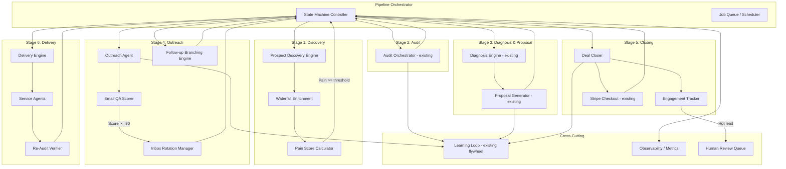

# Design Document: Autonomous Proposal Engine

## Overview

The Autonomous Proposal Engine extends the existing ProposalOS Next.js application into a fully autonomous pipeline executing the loop: Discover → Audit → Diagnose → Propose → Outreach → Close → Deliver → Learn → Repeat. The system builds on the existing Audit Orchestrator, Diagnosis Pipeline, Proposal Generator, Email Pipeline, and Flywheel infrastructure already in the codebase.

The core architectural addition is a **Pipeline Orchestrator** — a state-machine-driven controller that manages prospect lifecycle transitions and triggers the appropriate subsystem at each stage. Each pipeline stage is implemented as an independent, idempotent worker that reads from and writes to the PostgreSQL database, enabling horizontal scaling with no in-memory state dependencies.

Key design decisions:
- **Event-driven stage transitions**: Prospect status changes trigger downstream stages via a database-backed job queue, not in-memory event emitters
- **Existing subsystem reuse**: The Audit Orchestrator, Diagnosis Engine, Proposal Generator, and Email Pipeline are wrapped with thin adapter layers rather than rewritten
- **Idempotent workers**: Every pipeline stage can be safely retried without side effects, enabling fault tolerance at scale
- **Tenant isolation by convention**: All queries include `tenantId` filters; the existing Prisma schema already enforces this pattern

## Architecture

The system follows a **staged pipeline architecture** with a central state machine coordinating transitions between independent processing stages.



### Execution Model

Pipeline stages execute as **cron-triggered batch processors** (extending the existing `app/api/cron/` pattern) and **API-triggered individual processors**. Each cron job:

1. Queries for prospects in the appropriate status with `nextActionAt <= now()`
2. Processes a configurable batch size with concurrency limits
3. Transitions prospect status on success/failure
4. Records metrics and costs

This matches the existing `scheduled-audits` and `follow-ups` cron patterns already in the codebase.

## Components and Interfaces

### 1. Pipeline Orchestrator (`lib/pipeline/orchestrator.ts`)

The central controller managing prospect state transitions.

```typescript
interface PipelineConfig {
  tenantId: string;
  concurrencyLimit: number;
  batchSize: number;
  painScoreThreshold: number;
  dailyVolumeLimit: number;
  spendingLimitCents: number;
  hotLeadPercentile: number; // default: 95 (top 5%)
}

interface StageResult {
  success: boolean;
  prospectId: string;
  fromStatus: ProspectStatus;
  toStatus: ProspectStatus;
  costCents: number;
  error?: string;
  metadata?: Record<string, unknown>;
}

interface PipelineOrchestrator {
  processStage(stage: PipelineStage, tenantId: string, batchSize: number): Promise<StageResult[]>;
  transitionProspect(prospectId: string, toStatus: ProspectStatus): Promise<void>;
  getMetrics(tenantId: string): Promise<PipelineMetrics>;
  pauseStage(stage: PipelineStage, tenantId: string): Promise<void>;
  resumeStage(stage: PipelineStage, tenantId: string): Promise<void>;
}
```

### 2. Prospect State Machine (`lib/pipeline/stateMachine.ts`)

Enforces valid state transitions and records transition history.

```typescript
type ProspectStatus =
  | 'discovered'
  | 'audited'
  | 'proposed'
  | 'outreach_sent'
  | 'hot_lead'
  | 'closing'
  | 'closed_won'
  | 'delivering'
  | 'delivered'
  | 'unqualified'
  | 'audit_failed'
  | 'low_value'
  | 'closed_lost';

interface StateTransition {
  from: ProspectStatus;
  to: ProspectStatus;
  timestamp: Date;
  stage: PipelineStage;
  tenantId: string;
  metadata?: Record<string, unknown>;
}

interface ProspectStateMachine {
  canTransition(from: ProspectStatus, to: ProspectStatus): boolean;
  transition(prospectId: string, to: ProspectStatus, stage: PipelineStage): Promise<StateTransition>;
  getHistory(prospectId: string): Promise<StateTransition[]>;
  serializeHistory(transitions: StateTransition[]): string; // JSON serialization
  deserializeHistory(json: string): StateTransition[]; // JSON deserialization
}

// Valid transitions map
const VALID_TRANSITIONS: Record<ProspectStatus, ProspectStatus[]> = {
  discovered: ['audited', 'unqualified', 'audit_failed'],
  audited: ['proposed', 'low_value'],
  proposed: ['outreach_sent'],
  outreach_sent: ['hot_lead', 'closed_lost'],
  hot_lead: ['closing', 'closed_lost'],
  closing: ['closed_won', 'closed_lost'],
  closed_won: ['delivering'],
  delivering: ['delivered'],
  delivered: [],
  unqualified: [],
  audit_failed: [],
  low_value: [],
  closed_lost: [],
};
```

### 3. Prospect Discovery Engine (`lib/pipeline/discovery.ts`)

Discovers and qualifies prospects from external sources.

```typescript
interface DiscoveryConfig {
  city: string;
  state?: string;
  vertical: string;
  targetLeads: number;
  painThreshold: number;
  sources: { googlePlaces: boolean; yelp: boolean; directories: boolean };
}

interface PainScoreBreakdown {
  websiteSpeed: number;      // 0-20
  mobileBroken: number;      // 0-15
  gbpNeglected: number;      // 0-15
  noSsl: number;             // 0-10
  zeroReviewResponses: number; // 0-10
  socialMediaDead: number;   // 0-10
  competitorsOutperforming: number; // 0-10
  accessibilityViolations: number; // 0-10
}

interface ProspectDiscoveryEngine {
  discover(config: DiscoveryConfig, tenantId: string): Promise<DiscoveryResult>;
  computePainScore(signals: QualificationSignals): PainScoreBreakdown;
  enrichProspect(leadId: string): Promise<EnrichmentResult>;
}
```

### 4. Pain Score Calculator (`lib/pipeline/painScore.ts`)

Computes the composite qualification score from multi-signal audit data.

```typescript
interface QualificationSignals {
  pageSpeedScore?: number;       // 0-100 from Lighthouse
  mobileResponsive?: boolean;
  hasSsl?: boolean;
  gbpClaimed?: boolean;
  gbpPhotoCount?: number;
  gbpReviewCount?: number;
  gbpReviewRating?: number;
  gbpReviewResponseRate?: number; // 0-1
  gbpPostingFrequencyDays?: number;
  socialPresent?: boolean;
  socialLastPostDays?: number;
  competitorScoreGap?: number;   // How much competitors outperform
  accessibilityViolationCount?: number;
}

interface PainScoreCalculator {
  calculate(signals: QualificationSignals): { total: number; breakdown: PainScoreBreakdown };
  serialize(config: PainScoreConfig): string;   // JSON
  deserialize(json: string): PainScoreConfig;   // JSON
}
```

### 5. Outreach Agent (`lib/pipeline/outreach.ts`)

Generates and sends proof-backed outreach emails with vertical-specific pain language.

```typescript
interface OutreachContext {
  prospect: ProspectLead;
  audit: Audit;
  proposal: Proposal;
  findings: Finding[];
  painBreakdown: PainScoreBreakdown;
  vertical: string;
  tenantBranding: TenantBranding;
}

interface OutreachAgent {
  generateEmail(context: OutreachContext): Promise<GeneratedEmail>;
  scoreEmail(email: GeneratedEmail): EmailQAResult;
  sendWithRotation(email: GeneratedEmail, tenantId: string): Promise<SendResult>;
  scheduleFollowUps(leadId: string, initialEmailId: string): Promise<void>;
  processBehaviorBranch(leadId: string, event: OutreachEventType): Promise<void>;
}
```

### 6. Email QA Scorer (`lib/pipeline/emailQaScorer.ts`)

Extends the existing `lib/email/qualityCheck.ts` with the enhanced scoring dimensions.

```typescript
interface EmailQAConfig {
  maxReadingGradeLevel: number;  // default: 5
  maxWordCount: number;          // default: 80
  minFindingReferences: number;  // default: 2
  maxSpamRiskScore: number;      // default: 30
  minQualityScore: number;       // default: 90
  jargonWordList: string[];
  dimensionWeights: {
    readability: number;
    wordCount: number;
    jargon: number;
    findingRefs: number;
    spamRisk: number;
  };
}

interface EmailQAResult {
  compositeScore: number;  // 0-100
  dimensions: {
    readability: { score: number; gradeLevel: number };
    wordCount: { score: number; count: number };
    jargon: { score: number; termsFound: string[] };
    findingRefs: { score: number; refsFound: number };
    spamRisk: { score: number; triggersFound: string[] };
  };
  passed: boolean;
  suggestions: string[];
}

interface EmailQAScorer {
  score(email: GeneratedEmail, config: EmailQAConfig): EmailQAResult;
  serializeConfig(config: EmailQAConfig): string;   // JSON
  deserializeConfig(json: string): EmailQAConfig;    // JSON
}
```

### 7. Deal Closer (`lib/pipeline/dealCloser.ts`)

Tracks engagement and manages the closing workflow.

```typescript
interface EngagementScore {
  emailOpens: number;
  emailClicks: number;
  proposalViews: number;
  proposalDwellSeconds: number;
  scrollDepth: number;
  tierInteractions: number;
  total: number;
}

interface DealCloser {
  recordEvent(leadId: string, event: EngagementEvent): Promise<void>;
  computeEngagementScore(leadId: string): Promise<EngagementScore>;
  isHotLead(score: EngagementScore, tenantConfig: PipelineConfig): boolean;
  createCheckoutSession(leadId: string, tier: string): Promise<string>; // Stripe session URL
  handlePaymentSuccess(leadId: string, stripeSessionId: string): Promise<void>;
  handlePaymentFailure(leadId: string, stripeSessionId: string): Promise<void>;
}
```

### 8. Delivery Engine (`lib/pipeline/deliveryEngine.ts`)

Fulfills accepted proposals using AI service agents.

```typescript
interface Deliverable {
  id: string;
  proposalId: string;
  findingId: string;
  agentType: 'speed_optimization' | 'seo_fix' | 'accessibility' | 'security_hardening' | 'content_generation';
  status: 'queued' | 'in_progress' | 'completed' | 'verified' | 'failed' | 'escalated';
  estimatedCompletionDate: Date;
  completedAt?: Date;
  verificationAuditId?: string;
  beforeAfterComparison?: Record<string, unknown>;
}

interface DeliveryEngine {
  generateDeliverables(proposalId: string, tier: string): Promise<Deliverable[]>;
  dispatchToAgent(deliverable: Deliverable): Promise<void>;
  verifyDeliverable(deliverableId: string): Promise<VerificationResult>;
  escalateOverdue(): Promise<Deliverable[]>;
  checkAllComplete(proposalId: string): Promise<boolean>;
}
```

### 9. Learning Loop Extensions (`lib/pipeline/learningLoop.ts`)

Extends the existing `lib/flywheel/dataFlywheel.ts` with additional tracking.

```typescript
interface LearningLoop {
  // Existing (from dataFlywheel.ts)
  updateBenchmark(industry: string, metrics: Record<string, number>): Promise<void>;
  trackFindingOutcome(findingType: string, accepted: boolean): Promise<void>;
  trackPromptOutcome(promptId: string, outcome: { qaScore?: number; accepted?: boolean }): Promise<void>;

  // New extensions
  trackOutreachOutcome(templateId: string, outcome: OutreachOutcome): Promise<void>;
  trackWinLoss(proposalId: string, outcome: WinLossData): Promise<void>;
  recalibratePricing(vertical: string, city: string): Promise<PricingCalibration>;
  getVerticalInsights(vertical: string): Promise<VerticalInsights>;
}

interface OutreachOutcome {
  openRate: number;
  clickRate: number;
  replyRate: number;
  conversionRate: number;
  vertical: string;
  city: string;
}

interface WinLossData {
  outcome: 'won' | 'lost' | 'ghosted';
  tierChosen?: string;
  dealValue?: number;
  lostReason?: string;
  objectionsRaised?: string[];
  competitorMentioned?: string;
}
```

### 10. Pipeline Metrics & Observability (`lib/pipeline/metrics.ts`)

```typescript
interface PipelineMetrics {
  tenantId: string;
  period: { start: Date; end: Date };
  discoveredPerDay: number;
  auditsCompletedPerDay: number;
  proposalsGeneratedPerDay: number;
  emailsSentPerDay: number;
  openRate: number;
  replyRate: number;
  conversionRate: number;
  stageErrorRates: Record<PipelineStage, number>;
  totalCostCents: number;
  humanTouchRate: number;
}

interface PipelineObserver {
  getMetrics(tenantId: string, period: DateRange): Promise<PipelineMetrics>;
  checkCircuitBreaker(stage: PipelineStage, tenantId: string): Promise<boolean>;
  logStageFailure(stage: PipelineStage, prospectId: string, error: Error): Promise<void>;
  alertAdmin(tenantId: string, message: string): Promise<void>;
}
```

## Data Models

The existing Prisma schema already contains most of the required models. Below are the additions and modifications needed.

### New Models

```prisma
// Prospect state transition history
model ProspectStateTransition {
  id         String   @id @default(uuid())
  tenantId   String
  leadId     String
  fromStatus String
  toStatus   String
  stage      String   // Pipeline stage that triggered the transition
  metadata   Json     @default("{}")
  createdAt  DateTime @default(now())

  lead ProspectLead @relation(fields: [leadId], references: [id], onDelete: Cascade)

  @@index([leadId, createdAt])
  @@index([tenantId, createdAt])
}

// Delivery tasks for fulfilled proposals
model DeliveryTask {
  id         String @id @default(uuid())
  tenantId   String
  proposalId String
  findingId  String
  agentType  String // 'speed_optimization', 'seo_fix', 'accessibility', 'security_hardening', 'content_generation'
  status     String @default("queued") // 'queued', 'in_progress', 'completed', 'verified', 'failed', 'escalated'

  estimatedCompletionDate DateTime
  completedAt             DateTime?
  verificationAuditId     String?
  beforeAfterComparison   Json?
  errorMessage            String?

  createdAt DateTime @default(now())
  updatedAt DateTime @updatedAt

  @@index([tenantId, status])
  @@index([proposalId])
  @@index([estimatedCompletionDate])
}

// Pipeline stage configuration per tenant
model PipelineConfig {
  id       String @id @default(uuid())
  tenantId String @unique

  concurrencyLimit    Int     @default(10)
  batchSize           Int     @default(50)
  painScoreThreshold  Int     @default(60)
  dailyVolumeLimit    Int     @default(200)
  spendingLimitCents  Int     @default(100000) // $1000 default
  hotLeadPercentile   Int     @default(95)
  emailMinQualityScore Int    @default(90)
  maxEmailsPerDomainPerDay Int @default(50)

  // Follow-up schedule (days after initial send)
  followUpSchedule Json @default("[3, 7, 14]")

  // Stage-level pause flags
  pausedStages Json @default("[]")

  // Country/language config
  country  String @default("US")
  language String @default("en")
  currency String @default("USD")

  // Pricing multiplier
  pricingMultiplier Float @default(1.0)

  createdAt DateTime @default(now())
  updatedAt DateTime @updatedAt

  @@index([tenantId])
}

// Pipeline error log for observability
model PipelineErrorLog {
  id         String   @id @default(uuid())
  tenantId   String
  stage      String
  prospectId String?
  errorType  String
  errorMessage String @db.Text
  stackTrace String?  @db.Text
  metadata   Json     @default("{}")
  createdAt  DateTime @default(now())

  @@index([tenantId, stage, createdAt])
  @@index([createdAt])
}

// Outreach template performance tracking
model OutreachTemplatePerformance {
  id         String @id @default(uuid())
  templateId String
  vertical   String
  city       String?

  totalSent      Int   @default(0)
  openCount      Int   @default(0)
  clickCount     Int   @default(0)
  replyCount     Int   @default(0)
  conversionCount Int  @default(0)

  openRate       Float @default(0)
  clickRate      Float @default(0)
  replyRate      Float @default(0)
  conversionRate Float @default(0)

  updatedAt DateTime @updatedAt

  @@unique([templateId, vertical, city])
  @@index([vertical])
}

// Win/loss tracking with reason codes
model WinLossRecord {
  id         String @id @default(uuid())
  tenantId   String
  proposalId String
  leadId     String
  vertical   String
  city       String?

  outcome           String  // 'won', 'lost', 'ghosted'
  tierChosen        String?
  dealValue         Decimal? @db.Decimal(10, 2)
  lostReason        String?
  objectionsRaised  Json    @default("[]")
  competitorMentioned String?

  createdAt DateTime @default(now())

  @@index([tenantId, vertical, outcome])
  @@index([createdAt])
}

// Pre-warming actions for multi-channel engagement
model PreWarmingAction {
  id       String @id @default(uuid())
  tenantId String
  leadId   String

  platform   String // 'gbp', 'facebook', 'instagram'
  actionType String // 'question', 'like', 'comment', 'follow', 'post_interaction'
  status     String @default("scheduled") // 'scheduled', 'completed', 'failed', 'skipped'

  scheduledAt DateTime
  executedAt  DateTime?
  errorMessage String?

  createdAt DateTime @default(now())

  @@index([tenantId, platform, scheduledAt])
  @@index([leadId])
}

// Detected signals for signal-based selling
model DetectedSignal {
  id       String @id @default(uuid())
  tenantId String
  leadId   String?

  signalType String // 'bad_review', 'website_change', 'competitor_upgrade', 'new_business_license', 'hiring_spike'
  priority   String @default("medium") // 'high', 'medium', 'low'
  sourceData Json   @default("{}")

  outreachTriggered Boolean @default(false)
  outreachEmailId   String?

  detectedAt DateTime @default(now())
  createdAt  DateTime @default(now())

  @@unique([tenantId, leadId, signalType, detectedAt])
  @@index([tenantId, signalType, detectedAt])
  @@index([leadId])
}

// AI Sales Chat conversations
model ChatConversation {
  id         String @id @default(uuid())
  tenantId   String
  proposalId String
  sessionId  String

  messages Json    @default("[]") // Array of ChatMessage
  outcome  String? // 'converted', 'escalated', 'abandoned'
  objections Json  @default("[]") // Array of objection strings

  startedAt   DateTime  @default(now())
  completedAt DateTime?

  @@index([tenantId, proposalId])
  @@index([sessionId])
}

// Agency partner accounts
model AgencyPartner {
  id       String @id @default(uuid())

  name     String
  contactEmail String
  contactName  String?

  verticals   Json @default("[]")   // Array of target verticals
  geographies Json @default("[]")   // Array of target geographies
  monthlyVolume Int @default(50)

  pricingModel     String  // 'per_lead', 'subscription'
  perLeadPriceCents Int?
  subscriptionPriceCents Int?

  isActive  Boolean  @default(true)
  createdAt DateTime @default(now())
  updatedAt DateTime @updatedAt

  deliveredLeads PartnerDeliveredLead[]

  @@index([isActive])
}

// Leads delivered to agency partners
model PartnerDeliveredLead {
  id        String @id @default(uuid())
  partnerId String
  leadId    String

  packagedData Json // Full lead package (audit, proposal, pain score, contact)
  status       String @default("delivered") // 'delivered', 'viewed', 'contacted', 'converted', 'rejected'

  deliveredAt DateTime @default(now())
  updatedAt   DateTime @updatedAt

  partner AgencyPartner @relation(fields: [partnerId], references: [id], onDelete: Cascade)

  @@index([partnerId, status])
  @@index([leadId])
}

// Cross-tenant anonymized intelligence model
model SharedIntelligenceModel {
  id      String @id @default(uuid())
  version String @unique

  patterns Json // Array of AnonymizedPattern
  metadata Json @default("{}")

  isActive  Boolean  @default(true)
  createdAt DateTime @default(now())

  @@index([version])
  @@index([isActive])
}
```

### Modifications to Existing Models

```prisma
// Add to ProspectLead model:
//   pipelineStatus  String @default("discovered")  -- replaces/extends existing status
//   auditId         String?  -- link to full audit
//   proposalId      String?  -- link to generated proposal
//   engagementScore Int @default(0)
//   stateTransitions ProspectStateTransition[]

// Add to Tenant model:
//   pipelineConfig PipelineConfig?
```

### Existing Models Leveraged As-Is

- `Audit`, `Finding`, `EvidenceSnapshot` — audit pipeline output
- `Proposal`, `ProposalView`, `ProposalAcceptance`, `ContactRequest` — proposal and engagement
- `OutreachEmail`, `OutreachEmailEvent`, `OutreachSendingDomain`, `OutreachDomainDailyStat` — outreach infrastructure
- `ProspectDiscoveryJob`, `ProspectLead`, `ProspectEnrichmentRun` — discovery and enrichment
- `BenchmarkStats`, `FindingEffectiveness`, `PromptPerformance` — learning loop
- `TenantBranding`, `Tenant`, `User` — multi-tenancy


### 11. Pre-Warming Engine (`lib/pipeline/preWarming.ts`)

Engages with prospects across GBP, Facebook, and Instagram 3–5 days before outreach email delivery.

```typescript
interface PreWarmingAction {
  id: string;
  leadId: string;
  platform: 'gbp' | 'facebook' | 'instagram';
  actionType: 'question' | 'like' | 'comment' | 'follow' | 'post_interaction';
  scheduledAt: Date;
  executedAt?: Date;
  status: 'scheduled' | 'completed' | 'failed' | 'skipped';
}

interface PreWarmingConfig {
  windowDays: { min: number; max: number }; // default: { min: 3, max: 5 }
  dailyLimits: { gbp: number; facebook: number; instagram: number }; // default: 20, 15, 15
}

interface PreWarmingEngine {
  scheduleActions(leadId: string, outreachDate: Date, config: PreWarmingConfig): Promise<PreWarmingAction[]>;
  executeAction(action: PreWarmingAction): Promise<void>;
  checkWindowComplete(leadId: string): Promise<boolean>;
  getDailyActionCount(platform: string, date: Date): Promise<number>;
}
```

### 12. Signal Detector (`lib/pipeline/signalDetector.ts`)

Monitors external signals indicating optimal outreach timing.

```typescript
type SignalType = 'bad_review' | 'website_change' | 'competitor_upgrade' | 'new_business_license' | 'hiring_spike';

interface DetectedSignal {
  id: string;
  leadId?: string;
  signalType: SignalType;
  sourceData: Record<string, unknown>;
  detectedAt: Date;
  priority: 'high' | 'medium' | 'low';
  outreachTriggered: boolean;
}

interface SignalDetector {
  runDetection(tenantId: string, signalType: SignalType): Promise<DetectedSignal[]>;
  deduplicateSignals(signals: DetectedSignal[]): DetectedSignal[];
  triggerSignalOutreach(signal: DetectedSignal): Promise<void>;
  getSchedule(): Record<SignalType, string>; // cron expressions
}
```

### 13. AI Sales Chat (`lib/pipeline/aiSalesChat.ts`)

Real-time AI assistant on proposal pages for objection handling and conversion.

```typescript
interface ChatContext {
  proposalId: string;
  auditFindings: Finding[];
  proposalTiers: { essentials: TierConfig; growth: TierConfig; premium: TierConfig };
  industryBenchmarks: Record<string, number>;
  objectionPlaybook: ObjectionEntry[];
  tenantBranding: TenantBranding;
}

interface ChatMessage {
  role: 'prospect' | 'assistant';
  content: string;
  timestamp: Date;
  confidence?: number; // 0-1, for assistant messages
  intent?: 'question' | 'objection' | 'purchase_intent' | 'general';
}

interface AISalesChat {
  handleMessage(context: ChatContext, history: ChatMessage[], message: string): Promise<ChatMessage>;
  detectIntent(message: string): Promise<{ intent: string; confidence: number }>;
  shouldEscalate(confidence: number, config: { threshold: number }): boolean;
  recordOutcome(proposalId: string, outcome: 'converted' | 'escalated' | 'abandoned', objections: string[]): Promise<void>;
}
```

### 14. Partner Portal (`lib/pipeline/partnerPortal.ts`)

Manages agency partner relationships and lead delivery.

```typescript
interface PartnerConfig {
  partnerId: string;
  verticals: string[];
  geographies: string[];
  monthlyVolume: number;
  pricingModel: 'per_lead' | 'subscription';
  perLeadPrice?: number; // cents
  subscriptionPrice?: number; // cents/month
}

interface PackagedLead {
  leadId: string;
  businessName: string;
  auditSummary: Record<string, unknown>;
  proposalSummary: Record<string, unknown>;
  painScore: number;
  painBreakdown: PainScoreBreakdown;
  decisionMaker: { name: string; title: string; email: string };
  deliveredAt: Date;
  status: 'delivered' | 'viewed' | 'contacted' | 'converted' | 'rejected';
}

interface PartnerPortal {
  onboardPartner(config: PartnerConfig): Promise<void>;
  matchLeadsToPartner(partnerId: string): Promise<PackagedLead[]>;
  deliverLead(partnerId: string, leadId: string): Promise<PackagedLead>;
  updateLeadStatus(partnerId: string, leadId: string, status: string): Promise<void>;
  getPartnerMetrics(partnerId: string): Promise<PartnerMetrics>;
}
```

### 15. Cross-Tenant Intelligence (`lib/pipeline/crossTenantIntelligence.ts`)

Anonymized learning across all tenants for predictive scoring.

```typescript
interface AnonymizedPattern {
  vertical: string;
  geoRegion: string;
  winRate: number;
  effectiveFindingTypes: string[];
  optimalPriceRange: { min: number; max: number };
  bestEmailPatterns: string[];
  sampleSize: number;
}

interface PredictiveScore {
  closeProb: number; // 0-100
  confidence: number; // 0-1
  factors: { factor: string; weight: number; value: number }[];
  modelVersion: string;
}

interface CrossTenantIntelligence {
  aggregatePatterns(tenantId: string, outcomes: WinLossData[]): Promise<void>;
  predictCloseProb(prospect: { vertical: string; painScore: number; geoRegion: string; businessSize?: string }): Promise<PredictiveScore>;
  getModelVersion(): string;
  rollbackModel(version: string): Promise<void>;
  ensureAnonymized(data: Record<string, unknown>): boolean; // Verify no PII
}
```

## Correctness Properties

*A property is a characteristic or behavior that should hold true across all valid executions of a system — essentially, a formal statement about what the system should do. Properties serve as the bridge between human-readable specifications and machine-verifiable correctness guarantees.*

### Property 1: Pain Score is bounded and correctly weighted

*For any* set of qualification signals, the computed Pain Score must be between 0 and 100 inclusive, and each dimension score must not exceed its weight cap (website speed ≤ 20, mobile broken ≤ 15, GBP neglected ≤ 15, no SSL ≤ 10, zero review responses ≤ 10, social media dead ≤ 10, competitors outperforming ≤ 10, accessibility violations ≤ 10), and the total must equal the sum of all dimension scores.

**Validates: Requirements 1.3**

### Property 2: Pain Score threshold correctly gates qualification

*For any* prospect with a computed Pain Score, if the score is below the configured threshold the prospect's status must be "unqualified", and if the score meets or exceeds the threshold the prospect must proceed to enrichment.

**Validates: Requirements 1.4**

### Property 3: Waterfall enrichment respects provider sequence and fault tolerance

*For any* enrichment run, providers must be queried in order (Apollo → Hunter → Proxycurl → Clearbit), the sequence must stop as soon as a verified email is obtained, and if any provider errors or times out the sequence must skip that provider and continue with the next.

**Validates: Requirements 1.5, 1.8**

### Property 4: Prospect deduplication within a tenant

*For any* batch of discovered prospects for a given tenant, if a prospect with the same source and sourceExternalId already exists for that tenant, the duplicate must be skipped and the existing record must remain unchanged.

**Validates: Requirements 1.6**

### Property 5: Discovery results contain all required fields

*For any* completed discovery job, every persisted prospect record must contain non-null values for: business name, website URL, city, industry, listing source, Pain Score, pain breakdown, and status "discovered".

**Validates: Requirements 1.1, 1.7**

### Property 6: Tenant volume limits are enforced

*For any* discovery run for a tenant, the number of newly persisted prospects must not exceed the tenant's configured daily volume limit.

**Validates: Requirements 1.9**

### Property 7: State machine only allows valid transitions

*For any* prospect status and any attempted transition, the transition must succeed only if the target status is in the set of valid successors for the current status. Invalid transitions must be rejected and logged.

**Validates: Requirements 12.1, 12.2**

### Property 8: State transitions are fully recorded

*For any* successful state transition, a transition record must be created containing the prospect ID, from-status, to-status, timestamp, originating stage, and tenant ID.

**Validates: Requirements 12.3**

### Property 9: State transition history round-trip serialization

*For any* list of state transition records, serializing to JSON and then deserializing must produce a list equivalent to the original.

**Validates: Requirements 12.4**

### Property 10: Concurrency limit is never exceeded

*For any* batch processing run, the number of concurrently executing pipeline operations must never exceed the configured concurrency limit for the tenant.

**Validates: Requirements 2.5**

### Property 11: Proposal contains all required sections

*For any* diagnosis result with one or more Pain Clusters, the generated proposal must contain a non-empty executive summary, three tier configurations (Essentials, Growth, Premium) each with mapped finding IDs, pricing for all three tiers, and a non-empty assumptions list.

**Validates: Requirements 3.2**

### Property 12: Proposal web link tokens are unique

*For any* two generated proposals, their web link tokens must be distinct.

**Validates: Requirements 3.3**

### Property 13: Pricing reflects tenant multiplier

*For any* generated proposal for a tenant with a pricing multiplier, each tier's price must equal the base price multiplied by the tenant's pricing multiplier (within floating-point tolerance).

**Validates: Requirements 3.6**

### Property 14: Outreach emails reference sufficient findings and include scorecard link

*For any* generated outreach email, the email body must reference at least 2 specific audit findings by title or metric, and must contain a valid scorecard URL.

**Validates: Requirements 4.1, 4.3**

### Property 15: Only emails passing QA gate are sent

*For any* outreach email that is actually sent (status = SENT), its Email QA score must be greater than or equal to the configured minimum quality score (default: 90).

**Validates: Requirements 4.4**

### Property 16: Email regeneration respects retry limit

*For any* outreach email generation attempt, if the email fails QA scoring, regeneration must occur up to 3 times. After 3 consecutive failures, the outreach must be marked as "generation_failed" and no email must be sent.

**Validates: Requirements 4.5**

### Property 17: Inbox rotation daily limit per domain

*For any* sending domain on any calendar day, the total number of emails sent through that domain must not exceed the configured daily limit (default: 50).

**Validates: Requirements 4.6**

### Property 18: Reply pauses follow-up sequence

*For any* prospect that replies to an outreach email, all pending follow-up emails for that prospect must be cancelled or paused, and no further follow-up emails must be sent until the sequence is explicitly resumed.

**Validates: Requirements 4.9**

### Property 19: Email QA composite score is bounded and decomposable

*For any* email evaluated by the Email QA Scorer, the composite score must be between 0 and 100 inclusive, and must equal the weighted sum of the individual dimension scores (readability, word count, jargon, finding references, spam risk), and any dimension scoring below its threshold must produce at least one improvement suggestion.

**Validates: Requirements 5.1, 5.2**

### Property 20: Email QA config round-trip serialization

*For any* valid EmailQAConfig object, serializing to JSON and then deserializing must produce an object equivalent to the original, with all dimension weights, thresholds, and jargon word lists preserved.

**Validates: Requirements 5.3**

### Property 21: Engagement events are recorded with required fields

*For any* engagement event (email open, click, proposal view), the recorded event must contain a non-null timestamp, event type, and the associated prospect/lead ID.

**Validates: Requirements 6.1**

### Property 22: Hot lead routing by percentile

*For any* set of active prospects for a tenant, the prospects routed to the Human Review Queue must be exactly those whose engagement score is in the top N percentile (configurable, default: top 5%).

**Validates: Requirements 6.6**

### Property 23: Deliverables map to accepted tier's findings

*For any* accepted proposal, the generated deliverables must map one-to-one to the finding IDs in the accepted tier, each deliverable must have an agent type matching the finding's category, and each must have an estimated completion date within the tier's delivery timeline.

**Validates: Requirements 7.1, 7.2**

### Property 24: Overdue deliverables are escalated

*For any* deliverable task whose estimated completion date has passed and whose status is not "completed" or "verified", the task must be transitioned to "escalated" status.

**Validates: Requirements 7.5**

### Property 25: Learning loop updates metrics on pipeline outcomes

*For any* proposal outcome (won/lost), the corresponding finding effectiveness scores must be incremented, and for any completed outreach sequence, the template performance metrics (open rate, click rate, reply rate, conversion rate) must be recalculated from the accumulated data.

**Validates: Requirements 8.1, 8.2, 8.3, 8.5, 8.6**

### Property 26: Tenant data isolation

*For any* pipeline query scoped to a tenant ID, the results must contain zero records belonging to a different tenant ID.

**Validates: Requirements 9.1**

### Property 27: Tenant branding is applied to outreach and proposals

*For any* outreach email or proposal generated for a tenant with branding configured, the output must use the tenant's brand name and contact email, not the platform defaults.

**Validates: Requirements 9.3, 9.4**

### Property 28: Tenant spending limit enforcement

*For any* tenant, if the cumulative API cost for the current billing cycle exceeds the configured spending limit, the pipeline must be paused for that tenant and no further cost-incurring operations must execute.

**Validates: Requirements 9.5**

### Property 29: Stage failure logging completeness

*For any* pipeline stage failure, the error log record must contain the stage name, error message, prospect identifier (if applicable), and tenant ID.

**Validates: Requirements 10.2**

### Property 30: Circuit breaker activates on high error rate

*For any* pipeline stage, if the error rate exceeds 10% over a rolling one-hour window, that stage must be paused and an admin alert must be generated, while other stages continue operating.

**Validates: Requirements 10.6**

### Property 31: Country-specific configuration application

*For any* prospect in a given country, the pipeline must apply the country-specific language, currency, and data provider configuration, and the applied configuration must match the country's settings.

**Validates: Requirements 11.2**

### Property 32: FIFO queue ordering

*For any* set of queued work items for a pipeline stage, items must be processed in the order they were enqueued (first-in, first-out).

**Validates: Requirements 11.4**

### Property 33: Pre-warming actions respect platform daily limits

*For any* platform (GBP, Facebook, Instagram) on any calendar day, the total number of pre-warming actions executed must not exceed the configured daily limit for that platform.

**Validates: Requirements 13.4**

### Property 34: Pre-warming window completes before outreach

*For any* prospect with scheduled pre-warming actions, the outreach email must not be sent until either all pre-warming actions are completed or the pre-warming window has expired.

**Validates: Requirements 13.3**

### Property 35: Signal deduplication prevents duplicate outreach

*For any* detected signal event, the Signal Detector must not trigger more than one outreach email for the same signal type and prospect combination.

**Validates: Requirements 14.6**

### Property 36: Signal-triggered outreach references the signal event

*For any* outreach email triggered by a detected signal, the email body must contain a reference to the specific signal event (e.g., review text, competitor name, website change description).

**Validates: Requirements 14.5**

### Property 37: AI Sales Chat escalates on low confidence

*For any* AI Sales Chat response with a confidence score below the configured threshold (default: 70%), the chat must escalate to the Human Review Queue and must not present a definitive answer to the prospect.

**Validates: Requirements 15.5**

### Property 38: Partner lead isolation

*For any* partner portal query scoped to a partner ID, the results must contain zero leads delivered to a different partner, and zero leads from the direct pipeline that were not explicitly delivered to that partner.

**Validates: Requirements 16.6**

### Property 39: Cross-tenant intelligence contains no PII

*For any* record in the shared intelligence model, the record must contain zero tenant-identifiable data (no business names, contact information, tenant IDs, or prospect-specific identifiers).

**Validates: Requirements 17.4**

### Property 40: Predictive close probability is bounded

*For any* prospect evaluated by the Cross Tenant Intelligence, the predictive close probability score must be between 0 and 100 inclusive, and must be accompanied by a confidence score between 0 and 1 and a model version identifier.

**Validates: Requirements 17.2**

## Error Handling

### Stage-Level Error Handling

Each pipeline stage implements a consistent error handling pattern:

1. **Catch and log**: All errors are caught, logged to `PipelineErrorLog` with full context (stage, prospect ID, tenant ID, error details)
2. **Prospect status update**: Failed prospects are transitioned to the appropriate terminal state (e.g., `audit_failed`, `closed_lost`)
3. **Continue batch**: Individual prospect failures do not halt batch processing; the stage continues with remaining prospects
4. **Cost tracking**: API costs incurred before failure are still recorded against the tenant

### Circuit Breaker Pattern

The Pipeline Orchestrator implements a circuit breaker for each stage:

- **Monitoring**: Track error count and total count per stage per tenant over a rolling 1-hour window
- **Trip threshold**: If error rate exceeds 10%, pause the stage for that tenant
- **Alert**: Send admin notification via the existing webhook system
- **Recovery**: Operator manually resumes the stage after investigation, or auto-resume after a configurable cooldown period

### Retry Strategies

| Component | Retry Count | Backoff | Fallback |
|-----------|-------------|---------|----------|
| Waterfall enrichment provider | 0 (skip to next) | N/A | Next provider in sequence |
| Email send | 3 | Exponential (1s, 2s, 4s) | Mark as "send_failed" |
| Email generation (QA fail) | 3 | Immediate regeneration | Mark as "generation_failed" |
| Stripe payment | 1 | 24h delay | Payment recovery email |
| Audit module | 0 (existing behavior) | N/A | Module marked failed, audit continues |

### Spending Limit Enforcement

When a tenant's cumulative API cost approaches or exceeds the spending limit:
1. Pipeline Orchestrator checks cost before each batch
2. If limit exceeded, all cost-incurring stages are paused for that tenant
3. Admin is notified
4. Pipeline resumes when limit is increased or billing cycle resets

## Testing Strategy

### Testing Framework

- **Unit tests**: Vitest (already configured in `vitest.config.ts`)
- **Property-based tests**: `fast-check` library for TypeScript
- **Minimum iterations**: 100 per property test

### Unit Tests

Unit tests cover specific examples, edge cases, and integration points:

- Pain Score calculation with known inputs and expected outputs
- State machine transitions for each valid and invalid pair
- Email QA scoring with specific email content
- Waterfall enrichment with mocked provider responses
- Deliverable generation from known proposal tiers
- Circuit breaker activation with specific error sequences

### Property-Based Tests

Each correctness property from the design document is implemented as a `fast-check` property test:

- **Tag format**: `Feature: autonomous-proposal-engine, Property {N}: {title}`
- **Minimum 100 iterations** per property
- **Generators**: Custom `fast-check` arbitraries for ProspectLead, QualificationSignals, EmailQAConfig, StateTransition, PainScoreBreakdown, etc.
- **Round-trip tests**: Serialization/deserialization for EmailQAConfig and StateTransition history

### Test Organization

Property tests are co-located with the implementation they validate:
- `lib/pipeline/__tests__/painScore.property.test.ts` — Properties 1, 2
- `lib/pipeline/__tests__/stateMachine.property.test.ts` — Properties 7, 8, 9
- `lib/pipeline/__tests__/emailQaScorer.property.test.ts` — Properties 19, 20
- `lib/pipeline/__tests__/outreach.property.test.ts` — Properties 14, 15, 16, 17, 18
- `lib/pipeline/__tests__/discovery.property.test.ts` — Properties 3, 4, 5, 6
- `lib/pipeline/__tests__/dealCloser.property.test.ts` — Properties 21, 22
- `lib/pipeline/__tests__/delivery.property.test.ts` — Properties 23, 24
- `lib/pipeline/__tests__/tenantIsolation.property.test.ts` — Properties 26, 27, 28
- `lib/pipeline/__tests__/orchestrator.property.test.ts` — Properties 10, 25, 29, 30, 31, 32
- `lib/pipeline/__tests__/preWarming.property.test.ts` — Properties 33, 34
- `lib/pipeline/__tests__/signalDetector.property.test.ts` — Properties 35, 36
- `lib/pipeline/__tests__/aiSalesChat.property.test.ts` — Property 37
- `lib/pipeline/__tests__/partnerPortal.property.test.ts` — Property 38
- `lib/pipeline/__tests__/crossTenantIntelligence.property.test.ts` — Properties 39, 40
