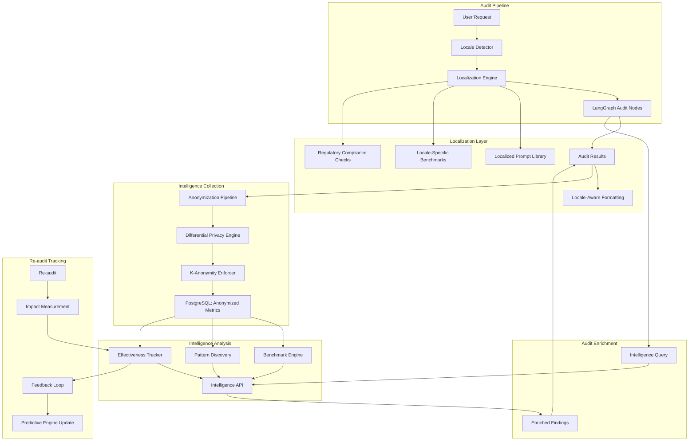

# Design Document: Deep Localization + Cross-Tenant Intelligence

## Overview

This feature introduces two major subsystems that enable global scale and network effects:

1. **Deep Localization Framework**: Detects user locale and adapts all audit content, prompts, recommendations, benchmarks, and compliance checks to local context. Not just translation—full cultural and market adaptation across language, search engines, benchmarks, competitors, regulations, currency, and tone.

2. **Cross-Tenant Intelligence System**: Builds privacy-preserving intelligence from every audit that benefits all users. Anonymized metrics flow into a shared intelligence layer that powers benchmarks, pattern discovery, and recommendation effectiveness tracking. Privacy-first design ensures no raw client data is ever shared across tenants.

The system operates continuously, learning from every audit to improve future audits while maintaining strict privacy guarantees through differential privacy and k-anonymity.

## Architecture

### High-Level Architecture



### Component Interaction Flow

1. **Locale Detection**: User Request → Locale Detector → Detected Locale
2. **Localization**: Detected Locale → Localization Engine → Localized Prompts + Benchmarks + Compliance Checks
3. **Audit Execution**: Localized Prompts → LangGraph Nodes → Audit Results
4. **Enrichment**: Audit Results → Intelligence API → Benchmarks + Patterns + Effectiveness Data
5. **Anonymization**: Audit Results → Anonymization Pipeline → Differential Privacy → K-Anonymity → Storage
6. **Re-audit Tracking**: Re-audit Results → Impact Measurement → Effectiveness Tracker → Predictive Engine

## Components and Interfaces

### 1. Locale Detector

**Purpose**: Auto-detects user locale from multiple signals with manual override capability.

**Data Model**:
```typescript
interface LocaleDetectionResult {
  detectedLocale: string;
  detectionMethod: 'tld' | 'hreflang' | 'gbp' | 'ip_geolocation' | 'manual_override' | 'default';
  confidence: number; // 0-1
  fallbackChain: string[]; // Locales tried in order
}

interface LocaleConfig {
  locale: string;
  language: string;
  primarySearchEngine: 'google' | 'yandex' | 'baidu' | 'naver';
  currency: string;
  regulations: string[]; // e.g., ['GDPR', 'PIPEDA']
  tone: 'formal' | 'casual' | 'professional';
  benchmarkCohorts: string[];
}
```

**Interface**:
```typescript
class LocaleDetector {
  async detectLocale(context: DetectionContext): Promise<LocaleDetectionResult>;
  async getLocaleConfig(locale: string): Promise<LocaleConfig>;
  async validateLocale(locale: string): Promise<boolean>;
  async getSupportedLocales(): Promise<string[]>;
}

interface DetectionContext {
  domain?: string;
  htmlContent?: string;
  gbpLocation?: string;
  ipAddress?: string;
  manualOverride?: string;
}
```

**Detection Priority**:
1. Manual override parameter (?locale=de-DE)
2. Domain TLD (.de → de-DE)
3. hreflang tags in HTML
4. GBP location
5. IP geolocation
6. Default to en-US

### 2. Localization Engine

**Purpose**: Adapts all audit content to locale with cultural context.

**Data Model**:
```typescript
interface LocalizationContext {
  locale: string;
  localeConfig: LocaleConfig;
  auditContext: any;
  targetNodeId: string;
}

interface LocalizedPrompt {
  nodeId: string;
  locale: string;
  promptText: string;
  culturalContext: string;
  thinkingBudget: number; // 4,096 tokens
  createdAt: Date;
  approvalStatus: 'pending' | 'approved' | 'rejected';
  nativeSpeakerReview?: string;
}

interface LocalizationDimensions {
  language: string;
  searchEngine: string;
  benchmarks: string;
  competitors: string;
  regulations: string[];
  currency: string;
  tone: string;
}
```

**Interface**:
```typescript
class LocalizationEngine {
  async localizePrompt(nodeId: string, locale: string): Promise<LocalizedPrompt>;
  async localizeAuditResults(results: AuditResults, locale: string): Promise<LocalizedResults>;
  async formatMetrics(metrics: any, locale: string): Promise<FormattedMetrics>;
  async getLocalizationDimensions(locale: string): Promise<LocalizationDimensions>;
  async validateLocalization(locale: string): Promise<ValidationResult>;
}

interface LocalizedResults {
  findings: LocalizedFinding[];
  recommendations: LocalizedRecommendation[];
  benchmarks: LocalizedBenchmark[];
  regulatoryFlags: RegulatoryFlag[];
}

interface LocalizedFinding {
  originalFinding: Finding;
  localizedText: string;
  locale: string;
  culturalContext: string;
}
```

**Gemini Prompt Template for Localization**:
```typescript
const LOCALIZATION_PROMPT_TEMPLATE = `
You are an expert in SEO and cultural adaptation for the ${locale} market.

Original Prompt:
${originalPrompt}

Localization Dimensions:
- Language: ${language}
- Primary Search Engine: ${searchEngine}
- Benchmarks: ${benchmarks}
- Competitors: ${competitors}
- Regulations: ${regulations.join(', ')}
- Currency: ${currency}
- Tone: ${tone}

Task: Rewrite the prompt for the ${locale} market with full cultural context.
Consider:
1. Local search engine requirements and best practices
2. Regional competitors and competitive landscape
3. Local regulations and compliance requirements
4. Cultural communication style and tone
5. Local business practices and market norms

Use your full 4,096 token thinking budget to deeply understand the market context
and create a culturally appropriate prompt.
`;
```

### 3. Localized Prompt Library

**Purpose**: Stores and manages locale variants of all LangGraph node prompts.

**Data Model**:
```typescript
interface PromptLibraryEntry {
  nodeId: string;
  variants: Map<string, LocalizedPrompt>; // locale → LocalizedPrompt
  basePrompt: string;
  createdAt: Date;
  lastUpdated: Date;
  versionHistory: LocalizedPrompt[];
}

interface PromptLibraryStats {
  totalNodes: number;
  localesSupported: string[];
  pendingApprovals: number;
  approvedVariants: number;
}
```

**Interface**:
```typescript
class LocalizedPromptLibrary {
  async getPrompt(nodeId: string, locale: string): Promise<LocalizedPrompt>;
  async createVariant(nodeId: string, locale: string, prompt: string): Promise<LocalizedPrompt>;
  async submitForApproval(variantId: string, nativeSpeakerReview: string): Promise<void>;
  async approveVariant(variantId: string): Promise<void>;
  async rejectVariant(variantId: string, reason: string): Promise<void>;
  async getStats(): Promise<PromptLibraryStats>;
  async validateCompleteness(locale: string): Promise<ValidationResult>;
}
```

**Approval Workflow**:
1. Variant created by Localization Engine
2. Submitted for native speaker review
3. Native speaker provides feedback
4. Variant approved or rejected
5. Approved variant deployed to library

### 4. Benchmark Engine

**Purpose**: Aggregates anonymized metrics by industry, size, and locale.

**Data Model**:
```typescript
interface AnonymizedMetric {
  id: string;
  industry: string;
  businessSize: 'small' | 'medium' | 'large';
  locale: string;
  metricType: string;
  value: number;
  timestamp: Date;
  cohortId: string;
}

interface BenchmarkCohort {
  id: string;
  industry: string;
  businessSize: string;
  locale: string;
  recordCount: number;
  metrics: Map<string, BenchmarkMetric>;
  kAnonymity: number;
  lastUpdated: Date;
}

interface BenchmarkMetric {
  name: string;
  mean: number;
  median: number;
  p25: number;
  p75: number;
  p95: number;
  sampleSize: number;
}

interface BenchmarkQuery {
  industry: string;
  businessSize?: string;
  locale: string;
  metricTypes?: string[];
}
```

**Interface**:
```typescript
class BenchmarkEngine {
  async addMetrics(metrics: AnonymizedMetric[]): Promise<void>;
  async queryBenchmarks(query: BenchmarkQuery): Promise<BenchmarkCohort>;
  async getCohortStats(cohortId: string): Promise<CohortStats>;
  async enforceKAnonymity(minK: number): Promise<void>;
  async getMergedCohort(cohortId: string): Promise<BenchmarkCohort>;
  async getTrendData(industry: string, locale: string, timeRange: TimeRange): Promise<TrendData>;
}

interface CohortStats {
  recordCount: number;
  kAnonymity: number;
  metrics: BenchmarkMetric[];
  confidence: number;
}
```

**K-Anonymity Enforcement**:
- Minimum k = 10 for all cohorts
- If cohort < 10 records, merge with broader cohort
- Merge strategy: industry → all industries, then size → all sizes, then locale → all locales

### 5. Anonymization Pipeline

**Purpose**: Removes client-identifying information and applies privacy techniques.

**Data Model**:
```typescript
interface RawAuditMetrics {
  clientId: string;
  clientName: string;
  domain: string;
  contactInfo: string;
  auditResults: any;
  timestamp: Date;
}

interface AnonymizedAuditMetrics {
  anonymousId: string; // Hashed, non-reversible
  industry: string;
  businessSize: string;
  locale: string;
  metrics: Map<string, number>;
  timestamp: Date;
  differentialPrivacyNoise: number;
}

interface AnonymizationConfig {
  fieldsToRemove: string[];
  fieldsToGeneralize: Map<string, GeneralizationRule>;
  differentialPrivacyEpsilon: number;
  kAnonymityMinimum: number;
}

interface GeneralizationRule {
  field: string;
  generalizationType: 'suppress' | 'aggregate' | 'hash' | 'round';
  parameters?: any;
}
```

**Interface**:
```typescript
class AnonymizationPipeline {
  async anonymizeMetrics(rawMetrics: RawAuditMetrics): Promise<AnonymizedAuditMetrics>;
  async removeIdentifyingInfo(data: any): Promise<any>;
  async applyDifferentialPrivacy(data: any, epsilon: number): Promise<any>;
  async validateAnonymization(data: AnonymizedAuditMetrics): Promise<ValidationResult>;
  async auditAnonymization(data: AnonymizedAuditMetrics): Promise<AuditLog>;
}
```

**Anonymization Steps**:
1. Remove: client name, domain, contact info, email, phone
2. Generalize: location (to region), business size (to category)
3. Hash: client ID (one-way hash for re-audit matching)
4. Apply differential privacy: add calibrated noise to metrics
5. Enforce k-anonymity: merge cohorts if needed

### 6. Pattern Discovery Engine

**Purpose**: Auto-discovers recurring patterns across audits.

**Data Model**:
```typescript
interface Pattern {
  id: string;
  description: string;
  affectedPlatforms: string[]; // e.g., ['WordPress', 'Shopify']
  affectedPlugins?: string[]; // e.g., ['Yoast', 'Rank Math']
  frequency: number; // Number of audits where pattern observed
  industries: string[];
  locales: string[];
  recommendedFixes: string[];
  confidenceScore: number; // 0-1, based on frequency
  discoveredAt: Date;
  lastObservedAt: Date;
  trend: 'increasing' | 'stable' | 'decreasing';
}

interface PatternQuery {
  platform?: string;
  plugin?: string;
  industry?: string;
  locale?: string;
  minFrequency?: number;
}
```

**Interface**:
```typescript
class PatternDiscoveryEngine {
  async analyzeAudit(auditResults: AuditResults): Promise<Pattern[]>;
  async promotePattern(pattern: Pattern): Promise<void>;
  async queryPatterns(query: PatternQuery): Promise<Pattern[]>;
  async getPatternStats(): Promise<PatternStats>;
  async trackPatternTrend(patternId: string, timeRange: TimeRange): Promise<TrendData>;
}

interface PatternStats {
  totalPatterns: number;
  activePatterns: number;
  averageFrequency: number;
  topPlatforms: string[];
  topIndustries: string[];
}
```

**Pattern Promotion Criteria**:
- Observed in 10+ audits
- Confidence score ≥ 0.7
- Affects multiple industries or locales
- Has clear recommended fixes

### 7. Recommendation Effectiveness Tracker

**Purpose**: Measures actual impact of recommendations vs predicted impact.

**Data Model**:
```typescript
interface RecommendationImplementation {
  id: string;
  recommendationId: string;
  recommendationType: string;
  industry: string;
  locale: string;
  predictedImpact: {
    trafficChange: number;
    rankingChange: number;
    conversionChange: number;
  };
  implementedAt: Date;
}

interface EffectivenessRecord {
  id: string;
  implementationId: string;
  reAuditDate: Date;
  actualImpact: {
    trafficChange: number;
    rankingChange: number;
    conversionChange: number;
  };
  accuracy: number; // 0-1, how close actual was to predicted
  confidenceLevel: number;
}

interface EffectivenessStats {
  recommendationType: string;
  industry: string;
  locale: string;
  sampleSize: number;
  averageAccuracy: number;
  averageActualImpact: number;
  confidenceInterval: [number, number];
}
```

**Interface**:
```typescript
class RecommendationEffectivenessTracker {
  async recordImplementation(implementation: RecommendationImplementation): Promise<void>;
  async recordOutcome(record: EffectivenessRecord): Promise<void>;
  async getEffectivenessStats(recommendationType: string, industry: string, locale: string): Promise<EffectivenessStats>;
  async getAccuracyTrends(recommendationType: string, timeRange: TimeRange): Promise<TrendData>;
  async getPredictiveAccuracy(): Promise<AccuracyMetrics>;
}

interface AccuracyMetrics {
  overallAccuracy: number;
  byRecommendationType: Map<string, number>;
  byIndustry: Map<string, number>;
  byLocale: Map<string, number>;
  trend: 'improving' | 'stable' | 'declining';
}
```

### 8. Intelligence API

**Purpose**: Provides internal API for querying cross-tenant intelligence.

**Data Model**:
```typescript
interface IntelligenceQuery {
  queryType: 'benchmarks' | 'patterns' | 'effectiveness';
  filters: Map<string, any>;
  timestamp: Date;
  requesterId: string;
}

interface IntelligenceResponse {
  data: any;
  metadata: {
    sampleSize: number;
    confidence: number;
    kAnonymity: number;
    lastUpdated: Date;
  };
  privacyNotice: string;
}

interface APIAuditLog {
  id: string;
  query: IntelligenceQuery;
  response: IntelligenceResponse;
  timestamp: Date;
  requesterId: string;
  complianceReview?: string;
}
```

**Interface**:
```typescript
class IntelligenceAPI {
  async queryBenchmarks(industry: string, locale: string, size?: string): Promise<IntelligenceResponse>;
  async queryPatterns(platform?: string, plugin?: string, industry?: string): Promise<IntelligenceResponse>;
  async queryEffectiveness(recommendationType: string, industry?: string, locale?: string): Promise<IntelligenceResponse>;
  async auditQuery(query: IntelligenceQuery): Promise<void>;
  async getAuditLog(timeRange: TimeRange): Promise<APIAuditLog[]>;
  async validatePrivacy(response: IntelligenceResponse): Promise<ValidationResult>;
}
```

**API Endpoints**:
- `GET /intelligence/benchmarks?industry=dental&locale=en-US&size=small`
- `GET /intelligence/patterns?platform=wordpress&plugin=yoast`
- `GET /intelligence/effectiveness?recommendation_type=schema_markup&industry=medical`

**Rate Limiting**: 1000 requests per hour per service account

### 9. Regulatory Compliance Checker

**Purpose**: Flags recommendations that may violate local regulations.

**Data Model**:
```typescript
interface RegulatoryRule {
  id: string;
  regulation: string; // e.g., 'GDPR', 'PIPEDA', 'Privacy Act'
  locale: string;
  applicableRecommendationTypes: string[];
  complianceRequirements: string[];
  suggestedAlternatives: string[];
}

interface RegulatoryFlag {
  recommendationId: string;
  regulation: string;
  severity: 'warning' | 'error';
  message: string;
  complianceRequirements: string[];
  suggestedAlternatives: string[];
}

interface RegulatoryConfig {
  locale: string;
  applicableRegulations: RegulatoryRule[];
}
```

**Interface**:
```typescript
class RegulatoryComplianceChecker {
  async checkRecommendation(recommendation: Recommendation, locale: string): Promise<RegulatoryFlag[]>;
  async getApplicableRegulations(locale: string): Promise<RegulatoryRule[]>;
  async validateCompliance(recommendations: Recommendation[], locale: string): Promise<ComplianceReport>;
  async getSuggestedAlternatives(flag: RegulatoryFlag): Promise<string[]>;
}

interface ComplianceReport {
  locale: string;
  totalRecommendations: number;
  flaggedRecommendations: number;
  flags: RegulatoryFlag[];
  complianceScore: number;
}
```

**Regulatory Rules**:
- **GDPR (EU)**: Data collection, consent, privacy policy, cookie consent
- **PIPEDA (Canada)**: Personal information collection, consent, privacy policy
- **Privacy Act (Australia)**: Personal information handling, privacy policy, consent

## Data Models

### PostgreSQL Schema

```sql
-- Locale Configuration
CREATE TABLE locale_configs (
  locale VARCHAR(10) PRIMARY KEY,
  language VARCHAR(50) NOT NULL,
  primary_search_engine VARCHAR(50) NOT NULL,
  currency VARCHAR(3) NOT NULL,
  regulations JSONB NOT NULL,
  tone VARCHAR(50) NOT NULL,
  created_at TIMESTAMPTZ NOT NULL DEFAULT NOW()
);

-- Localized Prompts
CREATE TABLE localized_prompts (
  id UUID PRIMARY KEY DEFAULT gen_random_uuid(),
  node_id VARCHAR(255) NOT NULL,
  locale VARCHAR(10) NOT NULL,
  prompt_text TEXT NOT NULL,
  cultural_context TEXT,
  approval_status VARCHAR(50) NOT NULL DEFAULT 'pending',
  native_speaker_review TEXT,
  created_at TIMESTAMPTZ NOT NULL DEFAULT NOW(),
  approved_at TIMESTAMPTZ,
  UNIQUE(node_id, locale),
  FOREIGN KEY (locale) REFERENCES locale_configs(locale)
);

CREATE INDEX idx_localized_prompts_node_locale ON localized_prompts(node_id, locale);
CREATE INDEX idx_localized_prompts_approval ON localized_prompts(approval_status);

-- Anonymized Metrics
CREATE TABLE anonymized_metrics (
  id UUID PRIMARY KEY DEFAULT gen_random_uuid(),
  anonymous_id VARCHAR(64) NOT NULL,
  industry VARCHAR(100) NOT NULL,
  business_size VARCHAR(50) NOT NULL,
  locale VARCHAR(10) NOT NULL,
  metric_type VARCHAR(100) NOT NULL,
  metric_value DECIMAL(15,2) NOT NULL,
  differential_privacy_noise DECIMAL(10,6),
  timestamp TIMESTAMPTZ NOT NULL DEFAULT NOW(),
  cohort_id UUID,
  FOREIGN KEY (locale) REFERENCES locale_configs(locale)
);

CREATE INDEX idx_anonymized_metrics_cohort ON anonymized_metrics(industry, business_size, locale);
CREATE INDEX idx_anonymized_metrics_timestamp ON anonymized_metrics(timestamp DESC);

-- Benchmark Cohorts
CREATE TABLE benchmark_cohorts (
  id UUID PRIMARY KEY DEFAULT gen_random_uuid(),
  industry VARCHAR(100) NOT NULL,
  business_size VARCHAR(50) NOT NULL,
  locale VARCHAR(10) NOT NULL,
  record_count INTEGER NOT NULL DEFAULT 0,
  k_anonymity INTEGER NOT NULL,
  metrics JSONB NOT NULL,
  last_updated TIMESTAMPTZ NOT NULL DEFAULT NOW(),
  UNIQUE(industry, business_size, locale),
  FOREIGN KEY (locale) REFERENCES locale_configs(locale)
);

CREATE INDEX idx_benchmark_cohorts_lookup ON benchmark_cohorts(industry, business_size, locale);

-- Patterns
CREATE TABLE patterns (
  id UUID PRIMARY KEY DEFAULT gen_random_uuid(),
  description TEXT NOT NULL,
  affected_platforms JSONB NOT NULL,
  affected_plugins JSONB,
  frequency INTEGER NOT NULL DEFAULT 0,
  industries JSONB NOT NULL,
  locales JSONB NOT NULL,
  recommended_fixes JSONB NOT NULL,
  confidence_score DECIMAL(5,4) NOT NULL,
  trend VARCHAR(50) NOT NULL DEFAULT 'stable',
  discovered_at TIMESTAMPTZ NOT NULL DEFAULT NOW(),
  last_observed_at TIMESTAMPTZ NOT NULL DEFAULT NOW()
);

CREATE INDEX idx_patterns_frequency ON patterns(frequency DESC);
CREATE INDEX idx_patterns_confidence ON patterns(confidence_score DESC);

-- Recommendation Implementations
CREATE TABLE recommendation_implementations (
  id UUID PRIMARY KEY DEFAULT gen_random_uuid(),
  recommendation_id UUID NOT NULL,
  recommendation_type VARCHAR(100) NOT NULL,
  industry VARCHAR(100) NOT NULL,
  locale VARCHAR(10) NOT NULL,
  predicted_impact JSONB NOT NULL,
  implemented_at TIMESTAMPTZ NOT NULL DEFAULT NOW(),
  FOREIGN KEY (locale) REFERENCES locale_configs(locale)
);

-- Effectiveness Records
CREATE TABLE effectiveness_records (
  id UUID PRIMARY KEY DEFAULT gen_random_uuid(),
  implementation_id UUID NOT NULL,
  re_audit_date TIMESTAMPTZ NOT NULL,
  actual_impact JSONB NOT NULL,
  accuracy DECIMAL(5,4) NOT NULL,
  confidence_level DECIMAL(5,4) NOT NULL,
  created_at TIMESTAMPTZ NOT NULL DEFAULT NOW(),
  FOREIGN KEY (implementation_id) REFERENCES recommendation_implementations(id)
);

CREATE INDEX idx_effectiveness_implementation ON effectiveness_records(implementation_id);
CREATE INDEX idx_effectiveness_date ON effectiveness_records(re_audit_date DESC);

-- Intelligence API Audit Log
CREATE TABLE intelligence_api_audit_log (
  id UUID PRIMARY KEY DEFAULT gen_random_uuid(),
  query_type VARCHAR(50) NOT NULL,
  filters JSONB NOT NULL,
  requester_id VARCHAR(255) NOT NULL,
  response_sample_size INTEGER,
  response_k_anonymity INTEGER,
  compliance_review TEXT,
  timestamp TIMESTAMPTZ NOT NULL DEFAULT NOW()
);

CREATE INDEX idx_api_audit_timestamp ON intelligence_api_audit_log(timestamp DESC);
CREATE INDEX idx_api_audit_requester ON intelligence_api_audit_log(requester_id);
```

## Error Handling

### Error Categories

1. **Locale Detection Errors**
   - Invalid locale parameter: Return validation error with supported locales
   - All detection methods fail: Fall back to en-US with warning
   - Geolocation service unavailable: Use previous detection or default

2. **Localization Errors**
   - Missing locale variant: Fall back to en-US variant
   - Gemini API failure: Retry with exponential backoff (3 attempts)
   - Invalid cultural context: Log error and use base prompt

3. **Anonymization Errors**
   - Anonymization failure: Reject metric and log error
   - K-anonymity violation: Merge cohorts and retry
   - Differential privacy calculation error: Use default noise level

4. **Intelligence API Errors**
   - Query validation failure: Return error with specific validation messages
   - Insufficient data: Return empty result with confidence = 0
   - Privacy violation detected: Reject query and alert operators

5. **Pattern Discovery Errors**
   - Analysis timeout: Skip audit and log error
   - Invalid pattern format: Discard and log error
   - Frequency calculation error: Use conservative estimate

### Error Response Format

```typescript
interface ErrorResponse {
  error: {
    code: string;
    message: string;
    details?: any;
    retryable: boolean;
  };
}
```

### Monitoring and Alerting

- Alert on locale detection failures > 5% over 5 minutes
- Alert on anonymization failures > 1% over 5 minutes
- Alert on k-anonymity violations
- Alert on Intelligence API privacy violations
- Alert on pattern discovery timeouts > 10% over 5 minutes

## Testing Strategy

The testing strategy employs both unit tests and property-based tests to ensure comprehensive coverage:

### Unit Testing Approach

Unit tests focus on:
- Specific examples demonstrating correct behavior
- Edge cases (empty inputs, boundary values, null handling)
- Error conditions and failure modes
- Integration points between components
- Database operations and schema validation

### Property-Based Testing Approach

Property tests verify universal correctness properties across randomized inputs:
- Each property test runs minimum 100 iterations
- Tests reference design document properties using tags
- Tag format: `Feature: deep-localization-cross-tenant-intelligence, Property {N}: {property_text}`

### Testing Tools

- **Unit Testing**: Jest/Vitest for TypeScript
- **Property Testing**: fast-check library for TypeScript
- **Database Testing**: Testcontainers for PostgreSQL integration tests
- **Privacy Testing**: Differential privacy validation library

### Test Configuration

```typescript
// Property test configuration
const propertyTestConfig = {
  numRuns: 100,
  timeout: 10000,
  verbose: true,
};
```

### Coverage Requirements

- Minimum 80% code coverage for core components
- 100% coverage for critical paths (anonymization, privacy checks)
- All correctness properties must have corresponding property tests
- All error conditions must have unit tests


## Correctness Properties

A property is a characteristic or behavior that should hold true across all valid executions of a system—essentially, a formal statement about what the system should do. Properties serve as the bridge between human-readable specifications and machine-verifiable correctness guarantees.

### Property 1: Locale Detection Priority Chain

*For any* detection context, the Locale_Detector SHALL respect the priority chain: manual override > TLD > hreflang > GBP > IP geolocation > default (en-US).

**Validates: Requirements 1.1, 1.2, 1.3, 1.4, 1.5, 1.7**

### Property 2: Manual Override Precedence

*For any* detection context with a manual locale parameter, the Locale_Detector SHALL return the manual locale regardless of other detection signals.

**Validates: Requirements 1.5**

### Property 3: Locale Storage Completeness

*For any* detected locale, the audit context SHALL contain the detected locale value for use by downstream components.

**Validates: Requirements 1.6**

### Property 4: Default Locale Fallback

*For any* detection context where all detection methods fail, the Locale_Detector SHALL return en-US as the default locale.

**Validates: Requirements 1.7**

### Property 5: Prompt Adaptation for Non-English Locales

*For any* non-English locale, the Localization_Engine SHALL adapt LangGraph node prompts to include cultural context beyond translation.

**Validates: Requirements 2.1, 2.2**

### Property 6: Gemini Thinking Budget Compliance

*For any* prompt localization request, the Localization_Engine SHALL use Gemini with exactly 4,096 tokens for thinking budget.

**Validates: Requirements 2.3**

### Property 7: Localization Dimension Coverage

*For any* localized prompt, the adapted prompt SHALL address all seven dimensions: language, search engine, benchmarks, competitors, regulations, currency, and tone.

**Validates: Requirements 2.4**

### Property 8: Audit Results Localization

*For any* audit completed in a non-English locale, all findings, recommendations, and explanations SHALL be presented in the target locale.

**Validates: Requirements 2.5**

### Property 9: Currency Formatting Correctness

*For any* metric displayed in a specific locale, the currency formatting SHALL use the locale-appropriate currency symbol and formatting rules.

**Validates: Requirements 2.6**

### Property 10: Search Engine Prioritization

*For any* audit in a locale with a dominant non-Google search engine (e.g., ru-RU → Yandex), the Localization_Engine SHALL prioritize that search engine in recommendations and analysis.

**Validates: Requirements 3.1, 3.3**

### Property 11: Search Engine-Specific Guidance

*For any* recommendation generated for a locale with a non-Google search engine, the recommendation SHALL include search-engine-specific guidance.

**Validates: Requirements 3.2**

### Property 12: Search Visibility Metrics Display

*For any* search visibility metrics displayed in a specific locale, the locale-appropriate search engine SHALL be shown as the primary engine.

**Validates: Requirements 3.4**

### Property 13: Benchmark Metric Extraction

*For any* completed audit, the Benchmark_Engine SHALL extract anonymized metrics and categorize them by industry, business size, and locale.

**Validates: Requirements 4.1**

### Property 14: Benchmark Cohort Matching

*For any* benchmark query, the System SHALL return benchmarks for the requested industry, business size, and locale cohort.

**Validates: Requirements 4.2**

### Property 15: Benchmark Cohort Fallback

*For any* benchmark query where the specific cohort has insufficient data, the System SHALL fall back to broader cohorts (industry → all industries, size → all sizes, locale → all locales).

**Validates: Requirements 4.3**

### Property 16: Benchmark Metadata Completeness

*For any* benchmark displayed, the display SHALL include sample size and confidence level.

**Validates: Requirements 4.4**

### Property 17: Competitor Locale Identification

*For any* competitor analysis, the System SHALL identify competitors in the same locale and industry as the audited business.

**Validates: Requirements 5.1**

### Property 18: Multi-Locale Competitor Analysis

*For any* business operating in multiple locales, the System SHALL analyze competitors separately for each locale.

**Validates: Requirements 5.2**

### Property 19: Competitor Metrics Localization

*For any* competitor data displayed, the metrics SHALL be locale-specific (e.g., rankings in the appropriate search results).

**Validates: Requirements 5.3**

### Property 20: GDPR Regulatory Flagging

*For any* audit running in an EU locale (de-DE, fr-FR, es-ES), the System SHALL flag recommendations with GDPR implications.

**Validates: Requirements 6.1**

### Property 21: PIPEDA Regulatory Flagging

*For any* audit running in Canada (en-CA), the System SHALL flag recommendations with PIPEDA implications.

**Validates: Requirements 6.2**

### Property 22: Privacy Act Regulatory Flagging

*For any* audit running in Australia (en-AU), the System SHALL flag recommendations with Privacy Act implications.

**Validates: Requirements 6.3**

### Property 23: Regulatory Guidance Completeness

*For any* flagged recommendation, the flag SHALL include specific guidance on compliance requirements.

**Validates: Requirements 6.4**

### Property 24: Regulatory Review Marking

*For any* recommendation with regulatory implications, the System SHALL mark it as requiring legal review before implementation.

**Validates: Requirements 6.5**

### Property 25: Locale Variant Requirement

*For any* new LangGraph node, the System SHALL require locale variants for all supported launch locales (en-US, en-GB, en-CA, en-AU, de-DE, fr-FR, es-ES).

**Validates: Requirements 7.1**

### Property 26: Variant Gemini Budget

*For any* locale variant creation, the Localization_Engine SHALL use Gemini with 4,096 tokens for thinking budget.

**Validates: Requirements 7.2**

### Property 27: Variant Cultural Rewriting

*For any* created locale variant, the variant SHALL include cultural context appropriate to the target locale.

**Validates: Requirements 7.3**

### Property 28: Native Speaker Review Requirement

*For any* locale variant for a launch locale, the System SHALL require native speaker review before approval.

**Validates: Requirements 7.4**

### Property 29: Variant Storage and Versioning

*For any* approved locale variant, the System SHALL store it in the Localized_Prompt_Library with complete version tracking information.

**Validates: Requirements 7.5**

### Property 30: Variant Selection Correctness

*For any* audit execution, the System SHALL select the appropriate prompt variant based on the detected locale.

**Validates: Requirements 7.6**

### Property 31: Anonymization Completeness

*For any* audit completion, the Benchmark_Engine SHALL extract metrics with all client-identifying information removed.

**Validates: Requirements 8.1, 8.2**

### Property 32: Differential Privacy Application

*For any* anonymized metric stored, the Benchmark_Engine SHALL apply differential privacy with noise injection.

**Validates: Requirements 8.3**

### Property 33: K-Anonymity Enforcement

*For any* stored anonymized metric, the Benchmark_Engine SHALL ensure the cohort has k ≥ 10 records.

**Validates: Requirements 8.4**

### Property 34: Cohort Merging on K-Anonymity Violation

*For any* cohort that would have fewer than 10 records, the Benchmark_Engine SHALL merge it with a broader cohort.

**Validates: Requirements 8.5**

### Property 35: Anonymized Metric Field Completeness

*For any* stored anonymized metric, the record SHALL include industry, business size, locale, and performance metrics.

**Validates: Requirements 8.6**

### Property 36: Benchmark Query Privacy

*For any* benchmark query result, the result SHALL not contain data that could identify individual clients.

**Validates: Requirements 8.7**

### Property 37: Pattern Analysis Execution

*For any* completed audit, the Pattern_Library SHALL analyze findings to identify recurring patterns.

**Validates: Requirements 9.1**

### Property 38: Pattern Promotion Threshold

*For any* pattern observed in 10+ audits, the Pattern_Library SHALL promote it to the active library.

**Validates: Requirements 9.2**

### Property 39: Active Pattern Usage

*For any* active pattern in the library, the System SHALL use it to accelerate diagnosis in future audits.

**Validates: Requirements 9.3**

### Property 40: Pattern Display Completeness

*For any* displayed pattern, the display SHALL include description, frequency, affected platforms, and recommended fixes.

**Validates: Requirements 9.4**

### Property 41: Pattern Tracking Completeness

*For any* discovered pattern, the System SHALL track which industries and locales are affected.

**Validates: Requirements 9.5**

### Property 42: Re-audit Impact Measurement

*For any* re-audit of a business that implemented recommendations, the System SHALL measure actual impact vs predicted impact.

**Validates: Requirements 10.1**

### Property 43: Impact Metric Completeness

*For any* impact measurement, the System SHALL compare traffic changes, ranking changes, and conversion changes.

**Validates: Requirements 10.2**

### Property 44: Effectiveness Feedback Loop

*For any* measured impact, the System SHALL feed accuracy data back into the predictive engine.

**Validates: Requirements 10.3**

### Property 45: Effectiveness Data Display

*For any* displayed effectiveness data, the display SHALL include recommendation type, industry, locale, and average impact.

**Validates: Requirements 10.4**

### Property 46: Effectiveness Data in Proposals

*For any* proposal generated when sufficient effectiveness data exists, the proposal SHALL surface effectiveness data from similar implementations.

**Validates: Requirements 10.5**

### Property 47: Benchmarks API Endpoint

*For any* request to GET /intelligence/benchmarks with valid parameters (industry, locale, size), the Intelligence_API SHALL return benchmark data for the requested cohort.

**Validates: Requirements 11.1**

### Property 48: Patterns API Endpoint

*For any* request to GET /intelligence/patterns with valid parameters (platform, plugin, industry), the Intelligence_API SHALL return pattern data matching the filters.

**Validates: Requirements 11.2**

### Property 49: Effectiveness API Endpoint

*For any* request to GET /intelligence/effectiveness with valid parameters (recommendation_type, industry, locale), the Intelligence_API SHALL return effectiveness data.

**Validates: Requirements 11.3**

### Property 50: API Rate Limiting

*For any* API client, the Intelligence_API SHALL enforce rate limiting (1000 requests per hour per service account).

**Validates: Requirements 11.4**

### Property 51: API Request Audit Logging

*For any* Intelligence_API request, the System SHALL audit and log the request for compliance review.

**Validates: Requirements 11.5**

### Property 52: API Response Privacy

*For any* Intelligence_API response, the response SHALL not contain data that could identify individual clients.

**Validates: Requirements 11.6**

### Property 53: Empty API Result Handling

*For any* Intelligence_API query that returns no data, the API SHALL return an empty result set with appropriate HTTP status.

**Validates: Requirements 11.7**

### Property 54: Privacy-First Anonymization

*For any* anonymized metric collection, the System SHALL remove all client-identifying information before storage.

**Validates: Requirements 12.1**

### Property 55: Differential Privacy Noise Injection

*For any* privacy technique applied, the System SHALL use differential privacy with noise injection.

**Validates: Requirements 12.2**

### Property 56: K-Anonymity Guarantee

*For any* stored anonymized data, the System SHALL ensure no cohort has fewer than 10 records (k ≥ 10).

**Validates: Requirements 12.3**

### Property 57: Intelligence Query Audit Logging

*For any* intelligence data query, the System SHALL audit and log the query for compliance review.

**Validates: Requirements 12.4**

### Property 58: Privacy Concern Alerting

*For any* identified privacy concern, the System SHALL alert operators immediately.

**Validates: Requirements 12.5**

### Property 59: Secure Data Deletion

*For any* raw audit data after anonymization, the System SHALL securely delete it according to data retention policies.

**Validates: Requirements 12.6**

### Property 60: Locale Configuration Extensibility

*For any* new locale addition, the System SHALL require only a configuration file with locale-specific settings.

**Validates: Requirements 13.1**

### Property 61: Locale Configuration Completeness

*For any* locale configuration file, the file SHALL specify language, primary search engine, currency, regulations, and tone.

**Validates: Requirements 13.2**

### Property 62: New Locale Variant Requirement

*For any* newly added locale, the System SHALL require locale variants for all LangGraph node prompts.

**Validates: Requirements 13.3**

### Property 63: New Locale Variant Approval

*For any* locale variant for a newly added locale, the System SHALL require native speaker review before deployment.

**Validates: Requirements 13.4**

### Property 64: New Locale Benchmark Collection

*For any* newly deployed locale, the System SHALL begin collecting anonymized benchmarks for that locale.

**Validates: Requirements 13.5**

### Property 65: Audit Enrichment with Benchmarks

*For any* completed audit, the System SHALL query the Intelligence_API for relevant benchmarks.

**Validates: Requirements 14.1**

### Property 66: Benchmark Display with Findings

*For any* available benchmarks, the System SHALL display them alongside audit findings.

**Validates: Requirements 14.2**

### Property 67: Pattern Highlighting in Findings

*For any* available patterns, the System SHALL highlight findings that match known patterns.

**Validates: Requirements 14.3**

### Property 68: Enriched Finding Display Completeness

*For any* enriched finding display, the display SHALL show benchmark percentile, pattern frequency, and effectiveness data.

**Validates: Requirements 14.4**

### Property 69: Insufficient Data Messaging

*For any* audit where insufficient data exists for enrichment, the System SHALL indicate that enrichment will improve as more data is collected.

**Validates: Requirements 14.5**

### Property 70: EU Regulatory Compliance Checking

*For any* audit running in an EU locale, the System SHALL check all recommendations against GDPR requirements.

**Validates: Requirements 15.1**

### Property 71: Canada Regulatory Compliance Checking

*For any* audit running in Canada (en-CA), the System SHALL check all recommendations against PIPEDA requirements.

**Validates: Requirements 15.2**

### Property 72: Australia Regulatory Compliance Checking

*For any* audit running in Australia (en-AU), the System SHALL check all recommendations against Privacy Act requirements.

**Validates: Requirements 15.3**

### Property 73: Regulatory Concern Flagging and Guidance

*For any* identified regulatory concern, the System SHALL flag the recommendation and provide specific guidance on compliance requirements.

**Validates: Requirements 15.4**

### Property 74: Regulatory Requirement Indication

*For any* flagged recommendation, the System SHALL indicate the specific regulatory requirement that triggered the flag.

**Validates: Requirements 15.5**
