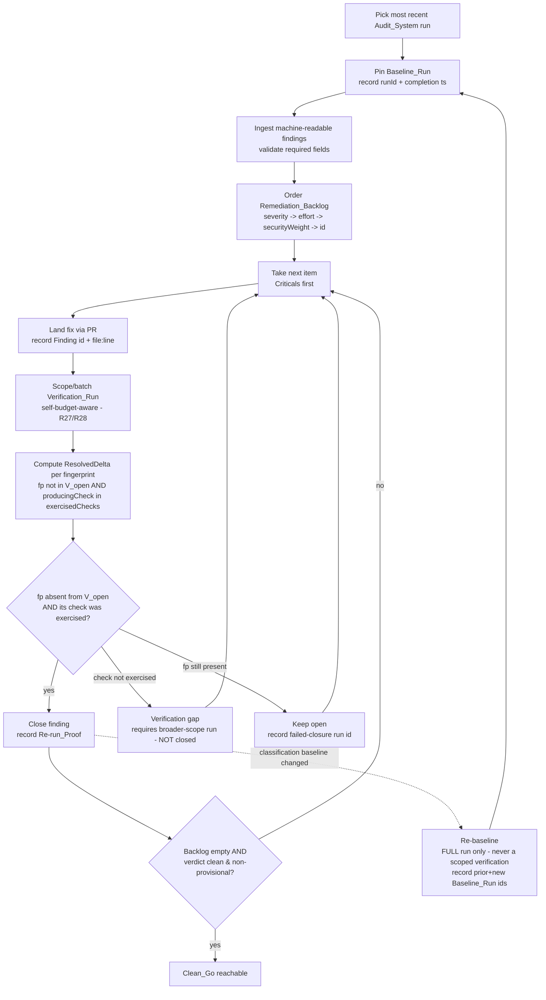
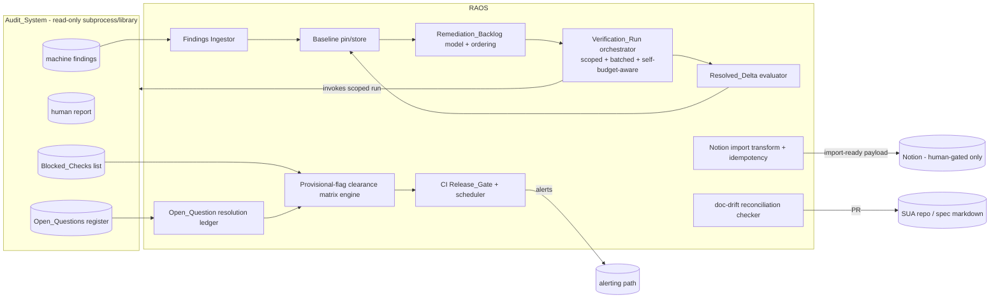
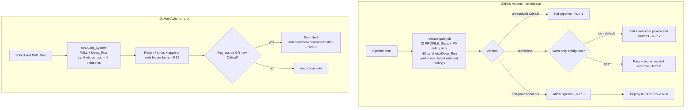

# Design Document: Remediation_And_Operations_System (RAOS)

## Overview

This design defines the **mechanism** of the `Remediation_And_Operations_System` (RAOS) — the human and operational loop that runs **after** the already-built `Audit_System` (spec `proposal-engine-audit-system`). The Audit_System emits, on each run, four artifact sinks (a machine-readable findings set, a human-readable report, an `Open_Questions` register, and a `Blocked_Checks` list), 23 `Domain_Scores`, a security-weighted `Production_Readiness_Score`, and a `Go / Conditional-Go / No-Go` verdict carrying provisional flags. RAOS **consumes** that output and drives the System Under Audit (SUA, the repo at `/Users/danishsethi/VSCODE/ProposalOS`) from a No-Go / Conditional-Go to a clean, **non-provisional Go**.

RAOS does **not** re-specify engine behavior. The engine's findings schema, `Finding_Fingerprint`, `Classification`, `substrateBacking`, self-budget caps, scoring, severity model, and the synthetic-run harness are treated here as **preconditions** and reused verbatim (see `proposal-engine-audit-system/design.md`). RAOS invokes the engine as a read-only subprocess/library and reads its four sinks.

RAOS spans five workstreams and a cross-cutting layer:

- **WS1** — triage and remediate findings in severity-then-effort order, closing each by re-run proof (Requirements 1–5).
- **WS2** — resolve the blocking `Open_Questions` only a human can decide, with full provenance (Requirements 6–9).
- **WS3** — eliminate every provisional flag (Requirements 10–13).
- **WS4** — import findings into Notion after a human applies the six-property schema extension (Requirements 14–16).
- **WS5** — operationalize the audit as a CI release gate plus scheduled drift run (Requirements 17–20).
- **Cross-Cutting** — doc-drift reconciliation, re-run-proof closure, verdict reachability, the non-destructive boundary, accepted-risk exclusion, Blocked_Check resolution, self-budget sizing, scoped/batched verification, and Medium/Low tracking (Requirements 21–29).

### The non-destructive boundary (load-bearing)

RAOS keeps the engine **read-only to production and to Notion** and channels every mutation through reviewed gates:

| Target                                         | How RAOS may change it                                                                                          | Never                                      |
| ---------------------------------------------- | --------------------------------------------------------------------------------------------------------------- | ------------------------------------------ |
| SUA repository (code, schema, infra config)    | **Normal pull requests** only (R24.2)                                                                           | direct writes to prod data / infra (R24.4) |
| `.kiro/specs/**` markdown (either spec)        | **Normal pull requests** only (R21.3)                                                                           | auto-written to any Notion copy            |
| Notion Findings Library / QA Test Cases        | **Only** through the human-gated `Notion_Import` (WS4, R24.3); idempotent upsert keyed on `Finding Fingerprint` | engine writing Notion directly (R14.1)     |
| Notion Hub + System Scorecard (INTENDED state) | recorded **human action items** (R6.4)                                                                          | RAOS writing them automatically            |

If any RAOS operation would write to production data, production infrastructure, or Notion outside the human-gated import, RAOS **aborts that operation and records the attempted write** (R24.4).

### The load-bearing closure model

No finding is "remediated" by assertion (R22.1). Closure is **proven by absence**: a `Finding_Fingerprint` that was OPEN in the pinned `Baseline_Run` open-findings set and is **ABSENT** from a later `Verification_Run` open-findings set — a `Resolved_Delta`. This is detailed in the next section because it is the single most important mechanism in the design.

### Build correctness vs operational outcome (two distinct gate kinds)

RAOS tasks fall into two kinds, and the checkpoints distinguish them:

- **Build gates** — "the RAOS mechanism is implemented and correct" (e.g. the Resolved_Delta evaluator, the verdict function, the provisional matrix, the 11 property tests). These pass on code + tests alone, independent of the SUA's actual state.
- **Operational-outcome gates** — "the live SUA reached a target state in this remediation pass" (e.g. the tenant-isolation Critical _actually_ closed by a Resolved_Delta; the verdict _actually_ a non-provisional Go). These can pass only if the SUA is genuinely remediable to that state in this pass — every Critical fixed, every High below the threshold, every provisional source clearable, the required infra (e.g. a real Temporal server) available.

RAOS can be 100% built-and-correct while the SUA is still No-Go. Tasks that _land changes against the live SUA_ (RLS policies, the adapter filter, standing up Temporal, supplying capabilities) and the two operational-outcome checkpoints (tenant-isolation closed; clean-Go reached) are therefore **conditional on real remediation success** and may take **multiple remediation cycles** to satisfy. The build gates are not.

## Closure Model (load-bearing): Baseline_Run / Verification_Run / Resolved_Delta

### Why classification cannot prove closure

The engine assigns every finding that is **present in a run** exactly one `Classification`:

- `New` — no prior match in the pinned ledger;
- `Regression` — a previously-resolved finding that **came back**;
- `Confirms-Prior` — a prior finding **still open**.

All three denote a finding that is **currently open in that run**. None denotes a resolved finding. Therefore closure can **never** be represented by a classification value — and in particular a `Regression` is the _opposite_ of closure (a fix that did not hold). Closure is proven only by a fingerprint's **absence** from the verification open-findings set.

### Definitions

- **Baseline_Run** — the single pinned Audit_System run RAOS freezes as (a) the source of the `Remediation_Backlog` and (b) the open-findings reference set for closure. It does not change as verification re-runs execute; only an explicit **re-baseline** action advances it, recording prior and new run identifiers (R1.7).
- **Verification_Run** — a scoped or full Audit_System run RAOS triggers to test whether one or more remediated fingerprints are now absent. It proves closure but does **not** replace the Baseline_Run unless RAOS explicitly re-baselines (R1.7).
- **Resolved_Delta** — the sole accepted proof of closure: a `Finding_Fingerprint` present-and-open in the `Baseline_Run` open-set and **absent** from a later `Verification_Run` open-set.
- **Re-run_Proof** — the recorded evidence of a `Resolved_Delta`: the `fingerprint`, the `Baseline_Run` id in which it was open, and the `Verification_Run` id from whose open-set it is absent (R5.3).

### Set-difference computation (scope-aware — load-bearing)

Let `B_open` be the set of fingerprints open in the Baseline_Run, `V_open` the set of fingerprints open in a Verification_Run, and `exercisedChecks` the set of `sourceCheckId`s the Verification_Run actually exercised. **A pure `B_open ∖ V_open` is sound only for a full run.** A scoped Verification_Run produces a `V_open` containing fingerprints only from the checks it exercised, so any baseline fingerprint whose producing check was _not_ in scope is trivially absent from `V_open` and would be falsely "closed" without ever being tested. To prevent silently manufacturing closures, the resolved-delta is **gated on the producing check having actually run**:

```
ResolvedDelta(B_open, V_open, exercisedChecks) =
  { fp ∈ B_open | fp ∉ V_open ∧ producingCheck(fp) ∈ exercisedChecks }
```

where `producingCheck(fp)` is the `sourceCheckId` of the baseline Finding that carries `fp`. **`producingCheck` is resolved from the engine's per-finding `sourceCheckId`, never derived from the fingerprint** — STATIC fingerprints deliberately omit `checkId` (only Runtime fingerprints include it), so two static checks in one domain are indistinguishable by fingerprint alone (see #2 in Data Models).

A fingerprint `fp` open in the baseline:

- `fp ∉ V_open ∧ producingCheck(fp) ∈ exercisedChecks` ⇒ **closed** (Resolved_Delta) — status may become `done` once a merged change also exists (R5.1).
- `fp ∈ V_open` ⇒ **still open**, regardless of whether its classification in `V` is `Confirms-Prior`, `Regression`, or `New` (R2.5, R4.7, R22.3).
- `producingCheck(fp) ∉ exercisedChecks` ⇒ **out of scope, NOT closed**; RAOS records a verification gap and the fingerprint requires a broader-scope run (R2.6, R28.4). This is the case the scope guard exists to catch.

Membership is keyed strictly on the engine's `Finding_Fingerprint` (`domain` + normalized `actual_source` + closed-enum `issue_signature` [+ `checkId` for Runtime checks]). RAOS never re-derives fingerprints; it reads them, and their `sourceCheckId`, from the engine artifacts.

### Location-relocation false-closure limitation

Because a fingerprint embeds the normalized `actual_source`, a fix that **relocates or renames code** changes `actual_source` → a new fingerprint. The old fingerprint then vanishes from `V_open` (and would be marked closed) while the unfixed issue may reappear as a `New` finding under a different fingerprint not in `B_open`. To guard against this false closure, when a Resolved_Delta coincides with a `New` finding in the same `domain` carrying the same `issue_signature` in the same Verification_Run, RAOS flags a **possible false closure** as an Open_Question for human disambiguation rather than silently closing.

### Status lifecycle (definition of done, R5)

```
open ──(merged change, no verification yet)──▶ remediation-pending
remediation-pending ──(Verification_Run, fp still present)──▶ remediation-pending  (record failed-closure run id, R5.5)
remediation-pending ──(Verification_Run, Resolved_Delta)────▶ done  (record Re-run_Proof, R5.1/R5.3)
```

A finding reaches `done` **iff** it has BOTH (a) a merged code/spec change AND (b) a Resolved_Delta (R5.1, R5.2). A merged change without a verification ⇒ `remediation-pending` (R5.4); a verification where the fingerprint persists ⇒ `remediation-pending` + failed-closure run id (R5.5).

### Remediation loop diagram



## Architecture

RAOS is a coordination layer over the read-only engine. It owns no audit logic; it owns ingestion, ordering, closure evaluation, human-decision ledgers, provisional bookkeeping, the Notion import transform, the CI gate, and the doc-drift checker.



### Components

1. **Findings Ingestor** — loads every Finding in the Baseline_Run's machine-readable set with all required fields (`id`, `domain`, `severity`, `workaround_available`, `effort_estimate`, `classification`, `issue_signature`); routes incomplete findings to an exceptions list with a count and excludes them from automated ordering (R1.2, R1.5).
2. **Baseline pin/store** — pins exactly one run (default: most recent completion timestamp) as `Baseline_Run`, records run id + completion timestamp, and resists replacement except via explicit re-baseline (R1.1, R1.7). **Re-baseline is restricted to FULL runs only** — never a scoped Verification_Run — because re-pinning `B_open` from a scoped partial open-set would silently drop every out-of-scope baseline finding from the backlog unverified (see #3). Stores the frozen `B_open` reference set and each baseline Finding's `sourceCheckId`.
3. **Remediation_Backlog model + ordering** — deterministic, total ordering by `severity` → `effort_estimate` → domain security weight → Finding `id` (R1.4); emits a contiguous 1..N position artifact (R1.6); Medium/Low appended after Critical/High (R29.1).
4. **Verification_Run orchestrator** — triggers scoped runs limited to the `sourceCheckId`s that produce the fingerprints under verification, supports batching, and scopes every run to fit the self-budget caps (R27, R28). Records the `exercisedChecks` set and any out-of-scope fingerprints as requiring a broader run (R28.4).
5. **Resolved_Delta evaluator** — computes the scope-gated delta `{ fp ∈ B_open | fp ∉ V_open ∧ producingCheck(fp) ∈ exercisedChecks }` per fingerprint independently within a batch, closes only fingerprints that are both absent **and** whose producing check was exercised, records `Re-run_Proof`, and flags possible relocation false-closures as Open_Questions (R5.3, R28.3).
6. **Open_Question resolution ledger** — an append-only, immutable record set distinct from Findings and Blocked_Checks (R9.2, R9.6); each resolution captures decision text, owner, UTC timestamp, and the provisional flags it clears (R9.1).
7. **Provisional-flag clearance matrix engine** — tracks every provisional source and its cleared/uncleared state; zero-provisional (R13) iff all rows cleared.
8. **Notion import transform + idempotency** — emits an import-ready payload and performs the human-gated idempotent upsert keyed on the `Finding Fingerprint` property (WS4). The engine itself never writes Notion (R14.1).
9. **CI Release_Gate + scheduler** — fails on unresolved Critical, fails on provisional by default (configurable warn-only with recorded override), passes on non-provisional Go; runs a scheduled Drift_Run; manages artifact retention and the append-only ledger version bump (WS5).
10. **doc-drift reconciliation checker** — verifies the three artifacts within each spec agree on load-bearing values; fails on divergence and reports diverging artifacts/values; delivers edits via PR (R21).

### How RAOS invokes the engine

RAOS treats the engine as a **read-only library/subprocess**. It never patches engine internals. It (a) requests a run with a **scope** (a set of check ids / domains / fingerprints and a sample sizing) and a **self-budget** within the engine's configured caps, then (b) consumes the four emitted sinks. The engine's non-destructiveness (sandboxed synthetic execution, no prod/Notion writes) is a precondition RAOS relies on and re-asserts at the boundary (R24.1).

## Components and Interfaces

### Verification_Run orchestrator (scoped + batched + self-budget-aware)

- **Scoping (R28.1):** given a set of fingerprints `F` under verification, the orchestrator maps each `fp ∈ F` to its baseline Finding's `sourceCheckId` and selects exactly that set of checks (and their domains) to run. **Scope is driven by `sourceCheckId`, not by the fingerprint** (STATIC fingerprints omit `checkId`, so the fingerprint alone cannot disambiguate two static checks in a domain). A full run is used only when explicitly requested.
- **Batching (R28.2, R28.3):** multiple pending fixes are verified in one run; the Resolved_Delta evaluator then evaluates each fingerprint independently against that single run's `(V_open, exercisedChecks)`.
- **Out-of-scope fingerprints (R28.4):** if a scoped run does not exercise the `sourceCheckId` producing a given fingerprint (e.g. a cross-domain dependency pulled the scope wider than planned, or the check could not run), it is recorded as requiring a broader-scope run and is **not** closed on the scoped run alone — the scope guard in `ResolvedDelta` enforces this.
- **Self-budget fit (R27.1, R28.5):** projected runtime/cost stay within the engine's `selfBudget` caps. If full coverage cannot fit, the orchestrator either splits coverage across multiple capped runs whose combined results cover the required checks (R27.3) or records a human action item to raise the caps with owner + justification.

### Open_Question resolution ledger

Each resolution is validated (non-empty decision text + valid owner) before persistence; an invalid submission is rejected and the Open_Question stays unresolved (R9.4). A persistence failure also retains the unresolved state (R9.5). Entries are immutable — modification/deletion after write is rejected (R9.6). A resolution that clears zero flags is still recorded, noting it made no change to provisional status (R9.3).

## Data Models

TypeScript-style interfaces. Types imported from the engine are reused **verbatim** and not redefined: `Severity`, `EffortEstimate`, `Classification`, `IssueSignature`, `Capability`, `Finding`, `OpenQuestion`, `BlockedCheck`, `RunHeader`, `DomainScore`, `FindingsLibraryRow`, `QaTestCaseRow` (see `proposal-engine-audit-system/design.md` § Data Models).

```typescript
// ── Reused from the Audit_System engine (NOT redefined here) ──
// type Severity = "Critical" | "High" | "Medium" | "Low";
// type EffortEstimate = "Quick Win (1-2 hrs)" | "Small (1-2 days)" | "Medium (3-5 days)" | "Large (1-2 weeks)" | "XL (2+ weeks)";
// type Classification = "New" | "Regression" | "Confirms-Prior";
// type Capability = "notionRead" | "nonProdDb" | "gcpVertex" | "langSmith" | "testExecution" | "secretScan" | "costInstrumentation";
// interface Finding { id; fingerprint; domain; severity; workaround_available; issueSignature;
//                     effortEstimate; sourceCheckId; checkKind; classification; substrateBacking?; ... }
//   NOTE: sourceCheckId + checkKind are emitted per-finding by the engine (audit R1.5 / task 1.26)
//         and are REQUIRED by RAOS for scope-gated closure; producingCheck(fp) := finding.sourceCheckId.
import type {
  Severity,
  EffortEstimate,
  Classification,
  Capability,
  Finding,
  OpenQuestion,
  BlockedCheck,
  RunHeader,
  DomainScore,
} from '../proposal-engine-audit-system/types';

type IsoUtc = string; // ISO-8601 UTC, ≥ second precision
type FindingStatus = 'open' | 'remediation-pending' | 'done';
type Verdict = 'Go' | 'Conditional-Go' | 'No-Go';

// ── WS1: baseline, backlog, closure ──
interface BaselineRun {
  runId: string; // the pinned Audit_System run
  completedAt: IsoUtc; // completion timestamp at pin time
  full: true; // a Baseline_Run is ALWAYS a full run; re-baseline never pins a scoped run (R1.7, #3)
  openFingerprints: string[]; // B_open: fingerprints open in this run
  producingCheckOf: Record<string, string>; // fingerprint → sourceCheckId, for scope-gated closure (#2)
  findings: Finding[]; // full ingested findings set
  exceptions: { findingId: string; missingFields: string[] }[]; // R1.5
  exceptionCount: number;
  priorBaselineRunId?: string; // set when this baseline replaced another (re-baseline, R1.7)
}

interface VerificationRun {
  runId: string;
  baselineRunId: string; // the baseline this run verifies against
  scopeFingerprints: string[]; // fingerprints under verification (R28.1)
  exercisedChecks: string[]; // sourceCheckIds the run ACTUALLY exercised — the scope guard for closure (#1)
  openFingerprints: string[]; // V_open
  full: boolean; // true only if a full run was explicitly requested
  completed: boolean; // false ⇒ verification gap (R2.6)
  selfBudget: RunHeader['selfBudget']; // carried from the engine run header
}

interface RemediationBacklogItem {
  position: number; // contiguous 1..N, no gaps/dupes (R1.6)
  finding: Finding;
  status: FindingStatus;
  // ordering keys (R1.4), applied in this exact precedence:
  orderKeys: {
    severityRank: number; // Critical=0, High=1, Medium=2, Low=3
    effortRank: number; // EffortEstimate enum index ascending
    securityWeight: number; // engine domain security weight, ordered DESCENDING
    findingId: string; // final deterministic tie-break, ASCENDING
  };
}

interface ResolvedDelta {
  fingerprint: string;
  baselineRunId: string; // where it was open
  verificationRunId: string; // from whose open-set it is absent
  closedAt: IsoUtc;
}

type ClosureKind = 'code-merge' | 'decision-cleared'; // #medium: not all closures have a PR

interface RerunProof {
  // the ONLY accepted closure proof for code-merge findings (R5.3, R22.2)
  fingerprint: string;
  baselineRunId: string;
  verificationRunId: string;
  closureKind: ClosureKind;
  mergedChangeRef?: string; // PR/commit that landed the fix — required when closureKind === "code-merge"
  decisionRef?: string; // OpenQuestionResolution/CanonicalCostDecision/ToSDetermination id — required when "decision-cleared"
  exercisedCheckConfirmed: boolean; // producingCheck(fp) ∈ exercisedChecks — MUST be true to record a code-merge proof (#1)
  recordedAt: IsoUtc;
}

// ── WS2: human decisions ──
interface OpenQuestionResolution {
  // immutable, append-only ledger entry (R9.6)
  openQuestionId: string;
  decisionText: string; // non-empty (R9.4)
  owner: string; // valid owner id (R9.4)
  resolvedAt: IsoUtc; // ≥ second precision (R9.1)
  clearedFlags: ProvisionalSource[]; // may be empty (R9.3)
  readonly immutable: true;
}

interface CanonicalCostDecision {
  // R6
  value: number; // cost-per-audit, 0.01 ≤ value ≤ 999.99
  owner: string;
  decidedAt: IsoUtc;
  clearsFlags: ProvisionalSource[];
  requirementsPrMerged: boolean; // PR propagating value to requirements docs (R6.4)
  hubActionItemApplied: boolean; // Notion Hub human action item (R6.4/R6.5)
  scorecardActionItemApplied: boolean; // Notion System Scorecard human action item
}

interface ToSDetermination {
  // R7, per scraped source
  source: string; // e.g. "Google Business Profile", "Yelp"
  robotsResult: 'compliant' | 'non-compliant' | 'not-applicable';
  rateLimitRps: number; // ≤ source-permitted AND ≤ 1.0 req/s (R7.1)
  tosReview: 'permitted' | 'prohibited' | 'conditional';
  reviewerNotes: string; // ≥ 1 char (R7.1)
  owner: string;
  createdAt: IsoUtc;
  clearsFlags: ProvisionalSource[];
  // derived: stale when (now - createdAt) > 90 days ⇒ posture unresolved (R7.4)
}

interface SchemaExtensionSignoff {
  // R8
  outcome: 'signed-off' | 'rejected' | 'withheld';
  owner: string;
  decidedAt: IsoUtc;
  clearsFlags: ProvisionalSource[]; // populated only when signed-off
}

interface AcceptedRiskOrSuppression {
  // R25
  findingId: string;
  kind: 'accepted-risk' | 'suppressed';
  reason: string;
  riskRegisterRef: string; // REQUIRED; absence ⇒ unauthorized exclusion (R25.4)
  owner: string;
  authorized: boolean; // false when riskRegisterRef missing/invalid
  // #4 security bar: a leakage/cross-tenant Critical can NEVER be excluded by ordinary acceptance.
  isSecurityLeakageCritical: boolean; // derived from the finding (domain/issue_signature)
  elevatedSignoff?: {
    // the ONLY way a security-leakage Critical may be excluded
    owner: string;
    decidedAt: IsoUtc;
    justification: string;
  };
  // excludable === false when isSecurityLeakageCritical && elevatedSignoff is absent (see Property 5b)
  excludable: boolean;
}

// ── WS3: provisional bookkeeping ──
type ProvisionalSource =
  | 'cost-conflict' // R6  → Domain 10
  | 'stub-domain5' // R10 → Domain 5
  | 'blocked-check' // R26 → per capability/domain
  | 'self-budget-cap' // R27
  | 'latency-percentile'; // R12 → Domain 10 latency

interface ProvisionalFlagClearanceMatrixRow {
  source: ProvisionalSource;
  detail: string; // e.g. capability + domain for a Blocked_Check
  state: 'cleared' | 'uncleared';
  clearingRequirementRef: string; // R6/R10/R26/R27/R12
  evidenceRef: string | null; // decision id, Re-run_Proof, Deep_Run id, etc.
}
interface ProvisionalFlagClearanceMatrix {
  rows: ProvisionalFlagClearanceMatrixRow[];
  zeroProvisional: boolean; // true IFF every row.state === "cleared" (R13)
}

interface BlockedCheckResolution {
  // R26
  checkId: string;
  domains: number[];
  missingCapability: Capability;
  supplied: boolean; // capability supplied?
  verificationRunId: string | null; // run where the previously-blocked check ran
  result: 'cleared' | 'unresolved-coverage-gap';
}

interface SelfBudgetPlan {
  // R27
  requiredCheckIds: string[];
  cappedRuns: { runId: string; checkIds: string[] }[]; // split coverage (R27.3)
  raiseCapActionItem?: { owner: string; justification: string }; // alt to splitting
  capInducedOmissionRemaining: boolean; // false ⇒ self-budget provisional cleared (R27.4)
}

interface DeepRunResult {
  // R12
  runsPerIndustry: number; // 20 ≤ n ≤ 100 (R12.1, R12.2)
  warmSamplesPerIndustry: Record<string, number>;
  warmP95Ms?: number; // computed only when ≥19 warm samples/industry
  warmP99Ms?: number;
  gatingMode: 'warm-p95' | 'p50-fallback'; // fallback when warm samples < 19 (R12.6)
  coverageGap?: string; // recorded when fallback occurs
}

// ── WS4: Notion import ──
interface NotionImportRecord {
  findingFingerprint: string; // SIXTH property — external-id idempotency key (R16.1)
  impactScore: number; // 1..10 from severity (R15.1)
  findingType: 'Missing' | 'Underperforming' | 'Broken' | 'Opportunity' | 'Risk';
  effortEstimate: EffortEstimate; // direct (R15.2)
  notes: string; // rich evidence/impact/fix (R15.3)
  evidenceLinks: string; // single URL (R15.3)
  severityNative?: Severity; // QA/Test Cases native Severity (R15.4)
  notionPageId?: string; // set after upsert
}

// ── Cross-cutting ──
interface DocDriftReport {
  // R21
  spec: 'proposal-engine-audit-system' | 'proposal-engine-remediation-and-operations';
  loadBearingValues: {
    name: 'domain-count' | 'critical-deduction' | 'legal-scraping-domain';
    requirementsValue: string;
    designValue: string;
    tasksValue: string;
    consistent: boolean;
  }[];
  pass: boolean; // false iff any value diverges (R21.4/R21.5)
  divergences: { name: string; artifacts: string[]; values: string[] }[];
}
```

## Persistence Layer (where the ledgers live)

Because Notion is barred as a write target and production is read-only, RAOS's state lives in **version-controlled, append-only files in the SUA repository**, delivered and changed only through reviewed pull requests (consistent with the non-destructive boundary). Concretely, under `.kiro/raos/` (committed):

| Store                                            | File(s)                                                   | Mutability                                                                              |
| ------------------------------------------------ | --------------------------------------------------------- | --------------------------------------------------------------------------------------- |
| Baseline pin + `B_open`                          | `baseline/<runId>.json`                                   | write-once per baseline; re-baseline writes a new file referencing `priorBaselineRunId` |
| Remediation_Backlog                              | `backlog/<baselineRunId>.json`                            | regenerated deterministically from the baseline; reproducible (Property 2)              |
| Verification runs + Re-run_Proofs                | `verifications/<runId>.json`, `proofs/<fingerprint>.json` | append-only                                                                             |
| Open_Question resolutions                        | `ledger/open-questions.jsonl`                             | **append-only, immutable** (R9.6)                                                       |
| Canonical_Cost / ToS / SchemaExtension decisions | `ledger/decisions.jsonl`                                  | append-only, immutable                                                                  |
| Accepted-risk / suppression records              | `ledger/exclusions.jsonl`                                 | append-only; each entry carries Risk Register ref + owner                               |
| Provisional-flag clearance matrix                | `state/provisional-matrix.json`                           | rewritten per evaluation; history preserved by git                                      |
| Pinned-ledger versions                           | `ledger/prior-findings-v<N>.json`                         | append-only (R19.2); never mutated                                                      |

**Immutability enforcement** is two-layered: (1) the writer rejects any modify/delete of an existing `.jsonl` entry or a write-once file at the application layer (R9.6); (2) because every change is a git commit landed via PR, any tampering is visible in history and reviewable — there is no out-of-band write path. Retention (R19.1) is satisfied by git history plus the configured retention policy on the four engine sinks (stored under `artifacts/<runId>/`). The append-only ledger version bump (R19.2) writes a new `prior-findings-v<N>.json` and never edits a prior version; a bump that changes the classification baseline carries the human sign-off field and is reviewed in the PR (R19.3).

The Notion import maps each Finding onto the human-applied schema. The mapping reuses the engine's `FindingsLibraryRow` shape; RAOS adds the **sixth property** (`Finding Fingerprint`) as the idempotency key.

| Internal field                     | Notion property                                | Mechanism                                              |
| ---------------------------------- | ---------------------------------------------- | ------------------------------------------------------ |
| `severity`                         | `Impact Score` (1–10) **+** `Finding Type`     | derived (numeric table below)                          |
| `effort_estimate`                  | `Effort Estimate` (enum)                       | **direct** (R15.2; verified enum match)                |
| rich `evidence` / `impact` / `fix` | notes property                                 | carried as text (R15.3)                                |
| `evidenceArtifactUrl`              | `Evidence Links`                               | **single URL** only (R15.3)                            |
| QA/Test Case `severity`            | native `Severity`                              | **direct** for QA Test Cases DB (R15.4)                |
| **`fingerprint`**                  | **`Finding Fingerprint` (unique external-id)** | **idempotency match key (R16.1)** — the sixth property |

### Concrete severity → Impact Score derivation

| Internal `severity` | `Impact Score` (1–10) | Default `Finding Type`                         |
| ------------------- | --------------------- | ---------------------------------------------- |
| Critical            | 9–10 (default **10**) | `Broken` or `Risk` (leakage/security → `Risk`) |
| High                | 7–8 (default **8**)   | `Underperforming` or `Broken`                  |
| Medium              | 4–6 (default **5**)   | `Underperforming` or `Missing`                 |
| Low                 | 1–3 (default **2**)   | `Opportunity`                                  |

(`Finding Type` is chosen from the live enum `Missing / Underperforming / Broken / Opportunity / Risk` by the finding's nature; this matches the engine's `FindingsLibraryRow` so import stays consistent with the engine's transform.)

**Schema extension is human-applied (six properties).** The `Findings_Library_Schema_Extension` adds `Severity`, `Domain`, `Intended Source`, `Actual Source`, a rich-evidence property, and the unique `Finding Fingerprint` (external-id) property (R14.2). RAOS **defines** the extension; a human **applies** it; the import is **blocked until applied + signed off** (R8.3, R8.4, R14.3). Invoking the import while sign-off is outstanding is rejected, leaves Notion unchanged, and returns an "outstanding sign-off" indication (R8.4).

## Provisional-flag clearance matrix

Zero-provisional (R13) is reached **iff every row is cleared**. Each provisional source maps to what clears it, the evidence captured, and the requirement reference.

| Provisional source                          | What clears it                                                                                                                                                                           | Evidence captured                                                       | Requirement |
| ------------------------------------------- | ---------------------------------------------------------------------------------------------------------------------------------------------------------------------------------------- | ----------------------------------------------------------------------- | ----------- |
| **Cost conflict** (Domain 10)               | A recorded `Canonical_Cost_Decision` propagated to requirements via PR **and** both Notion human action items (Hub + Scorecard) marked applied                                           | `CanonicalCostDecision` id; merged PR ref; two applied action-item refs | **R6**      |
| **Stub-backed Domain 5**                    | Domain 5 checks re-run against a health-checked `Temporal_Dev_Server` so every contributing finding carries `substrateBacking = "real-dev"`                                              | Verification_Run id; per-finding `substrateBacking` values              | **R10**     |
| **Blocked_Check** (per capability)          | Supply the missing capability (`nonProdDb`/`gcpVertex`/`langSmith`/`testExecution`/`secretScan`/`costInstrumentation`/`notionRead`) and re-run so the check runs to a non-blocked result | `BlockedCheckResolution` with verification run id                       | **R26**     |
| **Self-budget cap**                         | Scope/split runs to fit caps (or raise caps with provenance) so no cap-induced omission remains                                                                                          | `SelfBudgetPlan` with `capInducedOmissionRemaining = false`             | **R27**     |
| **Latency-percentile coverage** (Domain 10) | A Deep_Run yielding ≥19 warm samples/industry to compute warm p95/p99 and gate on warm p95                                                                                               | `DeepRunResult` with `gatingMode = "warm-p95"`                          | **R12**     |

**Zero-provisional (R13):** `matrix.zeroProvisional === true` iff all rows `cleared`. While any row is uncleared, RAOS withholds Clean_Go and reports which source remains (R13.1, R13.3).

**Domain 10 carries two provisional sources** — the cost conflict (R6) and latency-percentile coverage (R12). The domain-level provisional flag on Domain 10 clears **only when both** matrix rows are cleared; clearing one alone leaves Domain 10 provisional.

## CI gate + scheduler architecture

### Release_Gate (R17)

Mapped to the SUA's actual stack — **GitHub Actions** (`.github/workflows/` exist: `ci-cd-pipeline.yml`, `test.yml`, `secret-scan.yml`), **GCP Cloud Run** deploy target, **Next.js 14** app.

**CI profile vs full audit (load-bearing for feasibility).** A full Audit_System run (23 domains + synthetic Default_Sample/Deep_Run across ≥5 industries + LLM calls + gitleaks + `npm audit`) takes minutes-to-hours and would blow GitHub Actions limits on every release PR. The blocking `release-gate` job therefore runs a **bounded CI profile**, not a full run:

| Profile                        | Scope                                                                                                                                                                                                                                     | Where it runs                                 |
| ------------------------------ | ----------------------------------------------------------------------------------------------------------------------------------------------------------------------------------------------------------------------------------------- | --------------------------------------------- |
| **CI profile** (blocking gate) | Static_Checks + P0 safety checks only — tenant-isolation (RLS/adapter/BYPASSRLS), secret scan, dependency audit, and the verdict computation over the **most recent retained findings set**. **No synthetic Default_Sample or Deep_Run.** | `release-gate` job on release PRs             |
| **Full / Deep_Run**            | All 23 domains incl. synthetic runs and Deep_Run percentiles                                                                                                                                                                              | scheduled `Drift_Run` (cron), not the PR gate |

The CI profile reuses the latest scheduled full run's synthetic-derived findings (latency/cost/quality/reliability) rather than re-measuring them per PR; it re-measures only the fast, deterministic Static + P0 safety checks. **The gate's verdict is a `Gate_Verdict` explicitly scoped to what it actually re-ran on the candidate commit — it is NOT the full `Production_Readiness` Go a scheduled full run produces.** Every reused-synthetic domain is tagged with its source run id + age and treated as **provisional on the candidate commit** (its synthetic behavior was never measured on this commit). Under fail-on-provisional-by-default this means a static-and-P0-clean candidate that still carries reused-synthetic provisional domains does **not** report a clean non-provisional Go; it falls under the same fail-by-default / recorded-warn-only-override policy. The gate evaluates:

| Verdict condition                                                                                      | Gate outcome                                                                                                                                                    |
| ------------------------------------------------------------------------------------------------------ | --------------------------------------------------------------------------------------------------------------------------------------------------------------- |
| Any unresolved Critical present (Static/P0 on the candidate commit)                                    | **fail** (R17.1)                                                                                                                                                |
| `Gate_Verdict` provisional — incl. any reused-synthetic domain tagged provisional-on-candidate (R17.5) | **fail by default** annotated with provisional sources + reused-finding source run id/age; configurable `warn-only` with a **recorded override** (R17.2, R17.6) |
| Static + P0 clean AND no reused-synthetic provisional domain remaining                                 | **pass** as a non-provisional `Gate_Verdict` (R17.3, R17.4)                                                                                                     |

`Gate_Verdict` is recorded distinctly from the scheduled run's `Production_Readiness` verdict; the gate never asserts the full Go on the strength of stale synthetic evidence.

### Scheduled Drift_Run (R18) + alerting (R20)

A scheduled GitHub Actions workflow (cron) runs a recurring `Drift_Run`. When it produces a `Regression`-classified finding (R18.2) or a **new Critical** (R18.3), RAOS emits an alert through the configured alerting path. The alert payload includes `id`, `domain`, `severity`, and `classification` (R20.3).

### Artifact retention + append-only ledger (R19)

- Each run's four sinks are retained per the configured retention policy (R19.1).
- On completion, RAOS appends a new `priorLedgerVersion` for the run **without mutating any prior frozen version** (append-only, R19.2).
- A bump that would **add or reclassify a prior finding used as a matching baseline** requires **human sign-off** before it is used for classification (R19.3); routine append-only bumps that only record the run's own findings do **not** require re-sign-off.
- RAOS records, per run, the ledger version used for New/Regression/Confirms-Prior classification (R19.4).

### CI gate + scheduled-run flow diagram



## Notion import transform + idempotency mechanism

The engine emits an **import-ready payload only and never writes Notion** (R14.1). The human-gated procedure is:

1. **Precondition gate** — the six-property schema extension is applied by a human and signed off (R8.2, R14.3). If not, the import is rejected, Notion is left unchanged, and an "outstanding sign-off" indication is returned (R8.4).
2. **Transform** — pure functions map each Finding to a `NotionImportRecord`:
   - `toFindingsLibrary(f)` → `impactScore` (severity table) + `findingType` + `effortEstimate` (direct) + `notes` (rich evidence/impact/fix) + `evidenceLinks` (single URL) + `findingFingerprint` (the sixth property).
   - `toQaTestCase(f)` → native `severity` + description (R15.4).
3. **Idempotent upsert keyed on `Finding Fingerprint`** (R16) — the human gate is _schema applied + sign-off_; once that gate is satisfied, **RAOS performs the upsert programmatically** (the boundary table permits RAOS — not the engine — to execute this single Notion write path):

```
for each record r in payload:
    existing = notion.query(db, where FindingFingerprint == r.findingFingerprint)
    if existing exists:  notion.update(existing.pageId, r)   // update-in-place (R16.2)
    else:                notion.create(db, r)                // create + populate FP (R16.3)
```

Because the upsert matches on the unique `Finding Fingerprint` property, **importing the same payload twice produces the same set of Notion records as importing it once** (R16.4). The engine never performs these writes; RAOS executes the upsert only through this human-gated path (R24.3).

## Doc-drift reconciliation mechanism

RAOS checks that the three artifacts (`requirements.md`, `design.md`, `tasks.md`) agree on **load-bearing values** within **both** specs (R21.1):

| Load-bearing value              | Canonical value                    |
| ------------------------------- | ---------------------------------- |
| 23-domain count                 | **23** SUA-Scored Domains (not 22) |
| Load-bearing Critical deduction | **5** (not 10)                     |
| Legal/scraping domain inclusion | Domain 23 / R36 **present**        |

The `doc-drift check` reads each value from all three artifacts of a spec. If they diverge on any load-bearing value, the check **fails** and reports the diverging artifacts and the divergent values (R21.4); while they are mutually consistent the check **passes** (R21.5). When RAOS edits spec markdown to resolve drift, the edits are delivered through a **normal pull request** (the spec docs are version-controlled in the SUA repo) and are **never auto-written to any Notion-resident copy** (R21.3, R24).

## Tenant-isolation dual-layer design (the known Critical)

The known single-layer-isolation Critical (System Scorecard) is closed by enforcing isolation at **both** layers and proving closure by Resolved_Delta on the tenant-isolation fingerprint (R4).

- **DB layer (RLS):** a Postgres RLS policy on **100% of tenant-scoped tables** — `count(tenant-scoped tables with active RLS) == count(tenant-scoped tables)` (R4.1).
- **Adapter layer (`tenantId` filter):** an injected `tenantId` predicate on **100% of tenant-scoped query paths** via `lib/auth/wrappedPrismaAdapter.ts` and `lib/tenant/context.ts` — `count(paths with enforced tenantId) == count(tenant-scoped paths)` (R4.2).
- **No bypass roles:** `count(application DB roles with BYPASSRLS) == 0` (R4.3).
- **Closure:** when the dual-layer fix lands (citing Finding `id` + each `file:line`, R4.4), RAOS triggers exactly one Verification_Run scoped to the tenant-isolation Critical's fingerprint and marks it closed **only** if that fingerprint was open in the Baseline_Run and is **absent** from the Verification_Run open-set (R4.5). If any tenant-scoped path lacks RLS or the adapter filter, the Finding stays Critical and the domain stays No-Go (R4.6). If the fingerprint re-appears (no Resolved_Delta), the Critical is **not** closed (R4.7).

The engine's `AST tenant-path enumeration` static check (audit design) is the source of the path/table inventory; RAOS consumes its findings and verifies the dual-layer counts as preconditions for closure.

## Correctness Properties

_A property is a characteristic or behavior that should hold true across all valid executions of a system — essentially, a formal statement about what the system should do. Properties serve as the bridge between human-readable specifications and machine-verifiable correctness guarantees._

These properties target RAOS's **deterministic core** (closure set-difference, backlog ordering, import idempotency, exclusion arithmetic, the provisional matrix, verdict logic, the done-status mapping, doc-drift, and ToS completeness). Engine internals (fingerprinting, scoring, synthetic-run measurement) are **preconditions** verified by the Audit_System's own property tests and are not re-tested here.

### Property 1: Resolved_Delta is exactly the scope-gated set-difference on fingerprints

_For any_ Baseline open-set `B_open`, Verification open-set `V_open`, set of exercised checks `exercisedChecks`, and _for any_ assignment of classifications (`New`/`Regression`/`Confirms-Prior`) to the fingerprints in `V_open`, the set of closed fingerprints equals exactly `{ fp ∈ B_open | fp ∉ V_open ∧ producingCheck(fp) ∈ exercisedChecks }`; consequently (a) no fingerprint present in `V_open` is ever closed regardless of its classification, (b) **no fingerprint whose producing check was not exercised is ever closed** (it is recorded as a verification gap), and (c) in a batched run each fingerprint is evaluated independently against the same `(V_open, exercisedChecks)`.

**Validates: Requirements 2.4, 2.5, 2.6, 4.5, 4.7, 5.1, 22.2, 22.3, 28.3, 28.4**

### Property 2: Remediation_Backlog ordering is deterministic and total

_For any_ set of ingested Findings, ordering by `severity` → `effort_estimate` ascending → domain security weight descending → Finding `id` ascending produces a strict total order whose emitted positions are a contiguous integer sequence `1..N` with no gaps or duplicates, and re-ordering the same set yields an identical sequence.

**Validates: Requirements 1.4, 1.6, 1.8**

### Property 3: Incomplete findings are excepted and excluded from ordering

_For any_ Finding missing at least one required field (`id`, `domain`, `severity`, `workaround_available`, `effort_estimate`, `classification`, `issue_signature`), that Finding appears in the exceptions list naming the missing field(s), is counted in the exception count, and does not appear in the ordered Remediation_Backlog.

**Validates: Requirements 1.5**

### Property 4: Notion import is idempotent on Finding_Fingerprint

_For any_ import payload (including payloads with repeated fingerprints and against a store containing pre-existing records), applying the fingerprint-keyed upsert twice produces the same set of Notion records as applying it once, where a matching `Finding Fingerprint` updates in place and a non-matching one creates exactly one new record.

**Validates: Requirements 16.2, 16.3, 16.4**

### Property 5: Accepted-risk and suppressed findings are excluded only when authorized

_For any_ findings set with arbitrary Accepted_Risk / Suppressed_Finding annotations, the verdict gate counts (unresolved Critical, unresolved High, unresolved High with `workaround_available = false`) exclude every annotated finding that carries a valid Risk Register reference and exclude **no** finding that lacks one, and every finding lacking a reference is surfaced as an unauthorized exclusion.

**Validates: Requirements 25.2, 25.4**

### Property 6: A security-leakage Critical can never be excluded by ordinary acceptance

_For any_ finding flagged `isSecurityLeakageCritical` (a tenant-leakage / cross-tenant Critical), `excludable` is `false` unless an `elevatedSignoff` record is present; an ordinary Risk Register reference alone never makes it excludable, so such a Critical can never be removed from the verdict gate counts by ordinary accepted-risk/suppression and therefore cannot be used to manufacture a Clean_Go.

**Validates: Requirements 25.2, 25.4, 23.1**

### Property 7: Provisional matrix is monotonic over the pure data structure and Clean_Go-equivalent

_For any_ provisional-flag clearance matrix considered as a pure data structure, `zeroProvisional` is true if and only if every row's state is `cleared`; setting any single row to `cleared` never changes another row to `uncleared` (data-structure monotonicity); and a Clean_Go determination is withheld while `zeroProvisional` is false. **This property is scoped to the matrix as a value.** It does **not** claim global monotonic progress across runs: a real Verification_Run or Deep_Run may _discover_ a new Blocked_Check or a latency regression that adds or re-sets a row, so the operational path to zero-provisional is not guaranteed monotonic and may regress when re-runs surface new provisional sources.

**Validates: Requirements 13.1, 13.2, 13.3**

### Property 8: Verdict logic is correct and a clean Go is reachable

_For any_ unresolved counts and flags (computed after excluding Accepted_Risk/Suppressed per Property 5): the verdict is `No-Go` when any unresolved Critical exists or the unresolved High count `≥ Y`; at most `Conditional-Go` when the unresolved High count `≥ X` or any unresolved High has `workaround_available = false`; and `Go` exactly when there is no unresolved Critical, the unresolved High count `< X`, every unresolved High has `workaround_available = true`, and no provisional flag is set — and this last `Go` case is satisfiable (a clean Go is reachable).

**Validates: Requirements 23.1, 23.2, 23.3, 23.4, 23.5**

### Property 9: Definition of done requires merged change AND Resolved_Delta

_For any_ combination of (merged-change-present, verification-run-executed, fingerprint-still-present), a Finding's status is `done` if and only if a merged change exists **and** a Resolved_Delta exists; a merged change with no covering verification yields `remediation-pending`; a covering verification in which the fingerprint persists yields `remediation-pending` with the failed-closure run id recorded.

**Validates: Requirements 5.1, 5.2, 5.4, 5.5**

### Property 10: Doc-drift check passes iff artifacts agree

_For any_ triple of load-bearing values drawn from `requirements.md`, `design.md`, and `tasks.md` for a load-bearing name, the doc-drift check passes if and only if all three values are equal; when they diverge the report names the diverging artifacts and their values.

**Validates: Requirements 21.4, 21.5**

### Property 11: ToS determination is resolved iff complete and within the rate ceiling

_For any_ ToS_Determination, the source's compliance posture is treated as resolved if and only if all required fields are present (a `robots.txt` result, a Terms-of-Service review result, reviewer notes of ≥1 character) and the configured `rateLimitRps` does not exceed the lower of the source-permitted rate and 1.0 request/second, and a determination older than 90 days is treated as unresolved.

**Validates: Requirements 7.1, 7.2, 7.4**

## Error Handling

The table below covers error conditions and edge cases end-to-end.

| Scenario                                                | Detection                                                                                           | Handling                                                                                                                                               | Requirement                 |
| ------------------------------------------------------- | --------------------------------------------------------------------------------------------------- | ------------------------------------------------------------------------------------------------------------------------------------------------------ | --------------------------- |
| **Verification run incomplete**                         | `VerificationRun.completed === false` or open-set does not cover the fingerprint's scope            | Keep finding open; record an unresolved verification gap; never close                                                                                  | R2.6, R5                    |
| **Out-of-scope fingerprint in a scoped run**            | `producingCheck(fp) ∉ exercisedChecks`                                                              | Do **not** close (scope guard in `ResolvedDelta`); record as requiring a broader-scope run                                                             | R28.4, #1                   |
| **Relocation/rename false closure**                     | A Resolved_Delta coincides with a same-domain, same-`issue_signature` `New` finding in the same run | Flag a possible false closure as an Open_Question for human disambiguation; do not silently close                                                      | #medium (relocation)        |
| **Security-leakage Critical proposed for exclusion**    | Accepted_Risk/Suppression on an `isSecurityLeakageCritical` finding without `elevatedSignoff`       | Refuse exclusion (`excludable = false`); keep it in the gate counts                                                                                    | R25, #4                     |
| **Fingerprint collision**                               | Two distinct issues map to one fingerprint                                                          | **Defer to the engine** — collision is the engine's `Open_Question` (`kind = "fingerprint-collision"`); RAOS reads it and does not invent a resolution | engine R27.5 (precondition) |
| **Self-budget cap hit mid-verification**                | Engine `RunHeader.selfBudget.capHit !== null`, `partial = true`                                     | Record which checks did not run; keep affected verdict provisional; split coverage across capped runs or raise caps with provenance                    | R27.2, R27.3                |
| **Schema extension not applied / sign-off outstanding** | Import invoked while sign-off outstanding                                                           | Reject invocation; leave Notion unchanged; return "outstanding sign-off" indication                                                                    | R8.3, R8.4, R14.3           |
| **Unauthorized accepted-risk exclusion**                | Accepted_Risk/Suppressed lacks a Risk Register reference                                            | Do **not** exclude from gates; surface as an unauthorized exclusion                                                                                    | R25.4                       |
| **Cold-start recurrence reducing warm samples**         | Deep_Run warm samples/industry `< 19` (cold starts recurred mid-batch)                              | Do not apply warm-run gating; fall back to p50 gating; record an insufficient-warm-samples coverage gap                                                | R12.6                       |
| **Notion match-key absent**                             | No record with the incoming `Finding Fingerprint` exists                                            | Create a new record and populate its `Finding Fingerprint` property (not an error; the create branch of the idempotent upsert)                         | R16.3                       |
| **Missing required Finding fields on ingest**           | Field-presence validation at ingest                                                                 | Add to exceptions list naming the field; surface count; exclude from ordering until supplied                                                           | R1.5                        |
| **Invalid Open_Question resolution / cost decision**    | Missing owner/decision text, or cost value out of `[0.01, 999.99]`                                  | Reject; retain prior unresolved state / leave flags unchanged; return error naming the invalid field                                                   | R9.4, R6.3                  |
| **Provenance persistence failure**                      | Write of a resolution entry fails                                                                   | Retain the Open_Question unresolved; return a "not recorded" error indication                                                                          | R9.5                        |
| **Attempted write outside the boundary**                | A RAOS op would write prod data/infra or Notion outside the human-gated import                      | Abort the operation; record the attempted write                                                                                                        | R24.4                       |

## Testing Strategy

**Dual approach.** Property-based tests verify the universal properties above; example/integration tests verify specific scenarios, mappings, and external-system wiring.

**Property-based testing.** RAOS's deterministic core is pure logic over generated inputs (fingerprint sets, finding sets, matrices, count/flag tuples), so PBT is appropriate. RAOS reuses the existing toolchain from `production-hardening` and `proposal-engine-audit-system`: **`fast-check` + `vitest`**. Each of the 11 correctness properties is implemented by a **single** property-based test configured to run a **minimum of 100 iterations**, tagged:

```
// Feature: proposal-engine-remediation-and-operations, Property {number}: {property_text}
```

Notion and the Audit_System engine are **mocked** for property tests (an in-memory fingerprint-keyed store for the import idempotency property; fixture open-sets for the closure property), keeping iterations cheap and deterministic.

**Example / unit tests** (specific scenarios, not universal):

- Severity → Impact Score band + Finding Type enum membership, per severity (R15.1).
- Release_Gate verdict→outcome: Critical→fail; provisional→fail (default); provisional+warn-only→pass with recorded override; non-provisional Go→pass (R17).
- Open_Question resolution immutability: write then reject modify/delete (R9.6).
- Non-destructive boundary: with mocked prod/Notion clients, assert the engine path issues no writes and a violating op aborts + records (R24.1, R24.4).
- Re-baseline records prior + new Baseline_Run ids (R1.7).

**Integration tests** (external wiring / side effects, 1–3 examples each — PBT not appropriate):

- Scheduled Drift_Run triggers an engine run (GitHub Actions cron wiring) (R18.1).
- Alert payload contains `id`, `domain`, `severity`, `classification` (R20.3).
- Append-only ledger bump does not mutate any prior frozen version, and a classification-baseline change requires human sign-off (R19.2, R19.3).
- Artifact retention persists the four sinks per policy (R19.1).

**Why PBT is scoped this way.** CI gate wiring, the scheduler, artifact retention, alerting emission, and the non-destructive boundary are infrastructure/side-effect concerns whose behavior does not vary meaningfully with input — they are covered by example/integration tests, not property tests, per the decision guide.

---

After review and approval of this design, the next phase produces `tasks.md`. The model offers to return to requirements clarification if gaps are identified.
