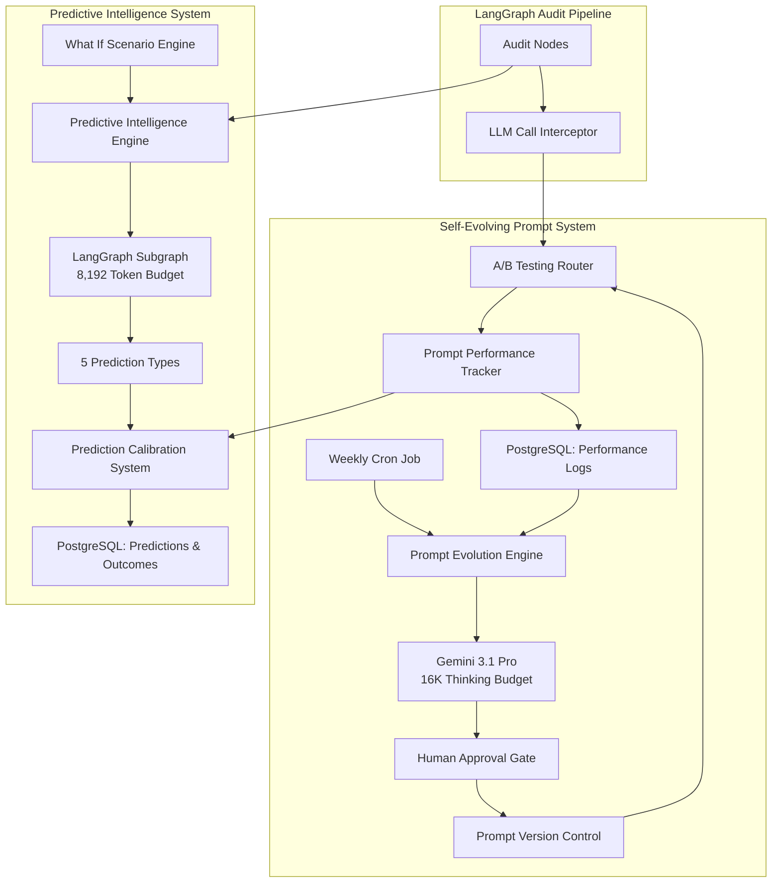

# Design Document: Self-Evolving Prompts & Predictive Intelligence

## Overview

This feature introduces autonomous prompt optimization and forward-looking intelligence to the SEO audit system. The design consists of two major subsystems:

1. **Self-Evolving Prompt System**: Automatically tracks, experiments with, and evolves LLM prompts based on performance data
2. **Predictive Intelligence Engine**: Generates forward-looking predictions about traffic, rankings, competitors, revenue, and algorithm risks

The system operates continuously, learning from every LLM interaction and using that knowledge to improve future performance without manual intervention. The predictive engine provides strategic insights that help users make data-driven decisions about recommendation prioritization.

## Architecture

### High-Level Architecture



### Component Interaction Flow

1. **LLM Call Flow**: Audit nodes → A/B Router → LLM → Performance Tracker → PostgreSQL
2. **Evolution Flow**: Cron Job → Evolution Engine → Gemini → Human Approval → Version Control → A/B Test
3. **Prediction Flow**: User Request → Predictive Engine → LangGraph Subgraph → Calibration → Response
4. **Scenario Flow**: User Input → Scenario Engine → Predictive Engine → Recalculated Outcomes

## Components and Interfaces

### 1. Prompt Performance Tracker

**Purpose**: Logs every LLM call with comprehensive metadata for analysis and optimization.

**Data Model**:
```typescript
interface PromptPerformanceLog {
  id: string;
  timestamp: Date;
  promptVersionHash: string;
  nodeId: string;
  qualityScore: number;
  downstreamImpact: number;
  costUSD: number;
  latencyMs: number;
  inputTokens: number;
  outputTokens: number;
  experimentId?: string;
  variantId?: string;
  metadata: Record<string, any>;
}
```

**Interface**:
```typescript
class PromptPerformanceTracker {
  async logPerformance(log: PromptPerformanceLog): Promise<void>;
  async getPerformanceByVersion(versionHash: string, timeRange?: TimeRange): Promise<PromptPerformanceLog[]>;
  async getAggregateMetrics(versionHash: string): Promise<AggregateMetrics>;
  async getUnderperformingPrompts(threshold: number): Promise<PromptVersion[]>;
}

interface AggregateMetrics {
  avgQualityScore: number;
  avgDownstreamImpact: number;
  avgCostUSD: number;
  avgLatencyMs: number;
  totalCalls: number;
  p50Latency: number;
  p95Latency: number;
  p99Latency: number;
}
```

**Storage**: PostgreSQL table with indexes on `promptVersionHash`, `timestamp`, and `qualityScore`.

### 2. A/B Testing Framework

**Purpose**: Runs controlled experiments comparing prompt variants with automatic winner detection.

**Data Model**:
```typescript
interface ABExperiment {
  id: string;
  name: string;
  nodeId: string;
  status: 'active' | 'completed' | 'paused';
  variants: ABVariant[];
  startDate: Date;
  endDate?: Date;
  winnerVariantId?: string;
  statisticalSignificance?: number;
}

interface ABVariant {
  id: string;
  promptVersionHash: string;
  trafficPercentage: number;
  sampleSize: number;
  avgQualityScore: number;
  avgDownstreamImpact: number;
}
```

**Interface**:
```typescript
class ABTestingFramework {
  async createExperiment(config: ExperimentConfig): Promise<ABExperiment>;
  async routeRequest(nodeId: string, context: any): Promise<string>; // Returns version hash
  async checkForWinner(experimentId: string): Promise<WinnerResult | null>;
  async completeExperiment(experimentId: string, winnerVariantId: string): Promise<void>;
  async getActiveExperiments(): Promise<ABExperiment[]>;
}

interface ExperimentConfig {
  name: string;
  nodeId: string;
  variants: Array<{
    promptVersionHash: string;
    trafficPercentage: number;
  }>;
}

interface WinnerResult {
  winnerVariantId: string;
  pValue: number;
  confidenceLevel: number;
  performanceDelta: number;
}
```

**Statistical Testing**: Uses two-sample t-test for quality score comparison with p < 0.05 threshold.

### 3. Prompt Evolution Engine

**Purpose**: Analyzes underperforming prompts and generates improved variants using Gemini.

**Data Model**:
```typescript
interface PromptEvolutionJob {
  id: string;
  timestamp: Date;
  promptVersionHash: string;
  currentPerformance: AggregateMetrics;
  analysisResults: AnalysisResults;
  generatedVariants: GeneratedVariant[];
  status: 'analyzing' | 'generating' | 'awaiting_approval' | 'completed';
}

interface GeneratedVariant {
  id: string;
  promptText: string;
  reasoning: string;
  expectedImprovements: string[];
  approvalStatus: 'pending' | 'approved' | 'rejected';
}

interface AnalysisResults {
  identifiedIssues: string[];
  performanceGaps: string[];
  improvementOpportunities: string[];
}
```

**Interface**:
```typescript
class PromptEvolutionEngine {
  async analyzeUnderperformingPrompts(): Promise<PromptVersion[]>;
  async generateVariants(promptVersion: PromptVersion, performance: AggregateMetrics): Promise<GeneratedVariant[]>;
  async submitForApproval(variants: GeneratedVariant[]): Promise<void>;
  async deployApprovedVariant(variantId: string): Promise<ABExperiment>;
}
```

**Gemini Prompt Structure**:
```typescript
const EVOLUTION_PROMPT_TEMPLATE = `
You are an expert prompt engineer analyzing LLM prompt performance.

Current Prompt:
{currentPrompt}

Performance Data:
- Average Quality Score: {avgQualityScore}
- Average Downstream Impact: {avgDownstreamImpact}
- Sample Size: {sampleSize}
- Latency P95: {p95Latency}ms

Identified Issues:
{identifiedIssues}

Task: Generate 3 improved prompt variants that address the identified issues.
For each variant, explain your reasoning and expected improvements.

Use your full 16,384 token thinking budget to deeply analyze the prompt structure,
identify weaknesses, and design improvements.
`;
```

### 4. Prompt Version Control

**Purpose**: Provides Git-like versioning for prompts with rollback and branching capabilities.

**Data Model**:
```typescript
interface PromptVersion {
  versionHash: string;
  nodeId: string;
  promptText: string;
  createdAt: Date;
  createdBy: string;
  parentVersionHash?: string;
  branchName: string;
  changelog: string;
  isActive: boolean;
  performanceDelta?: PerformanceDelta;
}

interface PerformanceDelta {
  qualityScoreChange: number;
  costChange: number;
  latencyChange: number;
  comparedToVersion: string;
}
```

**Interface**:
```typescript
class PromptVersionControl {
  async createVersion(prompt: string, nodeId: string, changelog: string): Promise<PromptVersion>;
  async getVersionHistory(nodeId: string): Promise<PromptVersion[]>;
  async rollbackToVersion(versionHash: string): Promise<void>;
  async createBranch(fromVersionHash: string, branchName: string): Promise<void>;
  async compareVersions(hash1: string, hash2: string): Promise<VersionComparison>;
  async getActiveVersion(nodeId: string): Promise<PromptVersion>;
}

interface VersionComparison {
  version1: PromptVersion;
  version2: PromptVersion;
  textDiff: string;
  performanceDelta: PerformanceDelta;
}
```

**Version Hash Generation**: SHA-256 hash of `${nodeId}:${promptText}:${timestamp}`.

### 5. Predictive Intelligence Engine

**Purpose**: Generates forward-looking predictions using a LangGraph subgraph with 8,192 token thinking budget.

**Data Model**:
```typescript
interface PredictionRequest {
  auditId: string;
  recommendations: Recommendation[];
  currentMetrics: CurrentMetrics;
  historicalData: HistoricalData;
}

interface PredictionResponse {
  predictions: {
    trafficForecast: TrafficForecast;
    rankingTrajectory: RankingTrajectory;
    competitorThreat: CompetitorThreat;
    revenueImpact: RevenueImpact;
    algorithmRisk: AlgorithmRisk;
  };
  generatedAt: Date;
  confidenceLevel: number;
}

interface TrafficForecast {
  timeHorizon: string; // e.g., "3 months", "6 months"
  projectedTraffic: number;
  confidenceInterval: [number, number];
  keyDrivers: string[];
}

interface RankingTrajectory {
  targetKeywords: Array<{
    keyword: string;
    currentRank: number;
    projectedRank: number;
    confidenceInterval: [number, number];
    timeToTarget: string;
  }>;
}

interface CompetitorThreat {
  threatLevel: 'low' | 'medium' | 'high';
  competitors: Array<{
    domain: string;
    threatScore: number;
    reasoning: string;
  }>;
}

interface RevenueImpact {
  projectedRevenue: number;
  confidenceInterval: [number, number];
  roi: number;
  paybackPeriod: string;
}

interface AlgorithmRisk {
  riskLevel: 'low' | 'medium' | 'high';
  riskFactors: string[];
  mitigationStrategies: string[];
}
```

**Interface**:
```typescript
class PredictiveIntelligenceEngine {
  async generatePredictions(request: PredictionRequest): Promise<PredictionResponse>;
  async getPredictionHistory(auditId: string): Promise<PredictionResponse[]>;
}
```

**LangGraph Subgraph Structure**:
```typescript
const predictiveSubgraph = new StateGraph({
  channels: {
    request: null,
    trafficAnalysis: null,
    rankingAnalysis: null,
    competitorAnalysis: null,
    revenueAnalysis: null,
    algorithmAnalysis: null,
    predictions: null,
  }
})
  .addNode("analyzeTraffic", analyzeTrafficNode)
  .addNode("analyzeRankings", analyzeRankingsNode)
  .addNode("analyzeCompetitors", analyzeCompetitorsNode)
  .addNode("analyzeRevenue", analyzeRevenueNode)
  .addNode("analyzeAlgorithm", analyzeAlgorithmNode)
  .addNode("synthesizePredictions", synthesizePredictionsNode)
  .addEdge(START, "analyzeTraffic")
  .addEdge("analyzeTraffic", "analyzeRankings")
  .addEdge("analyzeRankings", "analyzeCompetitors")
  .addEdge("analyzeCompetitors", "analyzeRevenue")
  .addEdge("analyzeRevenue", "analyzeAlgorithm")
  .addEdge("analyzeAlgorithm", "synthesizePredictions")
  .addEdge("synthesizePredictions", END);
```

Each node uses Gemini with a portion of the 8,192 token budget, with the synthesis node having the largest allocation.

### 6. Prediction Calibration System

**Purpose**: Tracks prediction accuracy and adjusts confidence intervals over time.

**Data Model**:
```typescript
interface PredictionRecord {
  id: string;
  predictionType: 'traffic' | 'ranking' | 'competitor' | 'revenue' | 'algorithm';
  predictedValue: number;
  confidenceInterval: [number, number];
  actualValue?: number;
  observedAt?: Date;
  predictionDate: Date;
  auditId: string;
  accuracy?: number;
}

interface CalibrationMetrics {
  predictionType: string;
  totalPredictions: number;
  observedPredictions: number;
  meanAbsoluteError: number;
  calibrationScore: number; // How well confidence intervals match actual coverage
  recommendedAdjustment: number;
}
```

**Interface**:
```typescript
class PredictionCalibrationSystem {
  async recordPrediction(prediction: PredictionRecord): Promise<void>;
  async recordOutcome(predictionId: string, actualValue: number): Promise<void>;
  async getCalibrationMetrics(predictionType: string): Promise<CalibrationMetrics>;
  async adjustConfidenceIntervals(predictionType: string): Promise<void>;
  async getAccuracyTrends(predictionType: string, timeRange: TimeRange): Promise<AccuracyTrend[]>;
}

interface AccuracyTrend {
  date: Date;
  accuracy: number;
  sampleSize: number;
}
```

**Calibration Algorithm**: Uses isotonic regression to adjust confidence intervals based on observed coverage rates.

### 7. What If Scenario Engine

**Purpose**: Enables interactive exploration of different recommendation combinations with real-time recalculation.

**Data Model**:
```typescript
interface ScenarioRequest {
  auditId: string;
  selectedRecommendations: string[]; // Array of recommendation IDs
  baselineMetrics: CurrentMetrics;
}

interface ScenarioResult {
  scenarioId: string;
  projectedROI: number;
  projectedTimeline: string;
  projectedTraffic: number;
  confidenceIntervals: {
    roi: [number, number];
    traffic: [number, number];
  };
  comparisonToBaseline: {
    roiDelta: number;
    trafficDelta: number;
    timelineDelta: string;
  };
  calculationTimeMs: number;
}
```

**Interface**:
```typescript
class WhatIfScenarioEngine {
  async calculateScenario(request: ScenarioRequest): Promise<ScenarioResult>;
  async compareScenarios(scenarioIds: string[]): Promise<ScenarioComparison>;
  async saveScenario(scenario: ScenarioResult): Promise<void>;
  async getScenarioHistory(auditId: string): Promise<ScenarioResult[]>;
}

interface ScenarioComparison {
  scenarios: ScenarioResult[];
  bestROI: string; // scenario ID
  fastestTimeline: string; // scenario ID
  highestTraffic: string; // scenario ID
}
```

**Performance Optimization**: 
- Caches baseline predictions for each audit
- Uses incremental recalculation for recommendation changes
- Parallelizes independent prediction calculations
- Target: < 5 second response time

## Data Models

### PostgreSQL Schema

```sql
-- Prompt Performance Logs (append-only)
CREATE TABLE prompt_performance_logs (
  id UUID PRIMARY KEY DEFAULT gen_random_uuid(),
  timestamp TIMESTAMPTZ NOT NULL DEFAULT NOW(),
  prompt_version_hash VARCHAR(64) NOT NULL,
  node_id VARCHAR(255) NOT NULL,
  quality_score DECIMAL(5,2) NOT NULL,
  downstream_impact DECIMAL(5,2) NOT NULL,
  cost_usd DECIMAL(10,6) NOT NULL,
  latency_ms INTEGER NOT NULL,
  input_tokens INTEGER NOT NULL,
  output_tokens INTEGER NOT NULL,
  experiment_id UUID,
  variant_id UUID,
  metadata JSONB
);

CREATE INDEX idx_performance_version_time ON prompt_performance_logs(prompt_version_hash, timestamp DESC);
CREATE INDEX idx_performance_node ON prompt_performance_logs(node_id);
CREATE INDEX idx_performance_experiment ON prompt_performance_logs(experiment_id);

-- Prompt Versions
CREATE TABLE prompt_versions (
  version_hash VARCHAR(64) PRIMARY KEY,
  node_id VARCHAR(255) NOT NULL,
  prompt_text TEXT NOT NULL,
  created_at TIMESTAMPTZ NOT NULL DEFAULT NOW(),
  created_by VARCHAR(255) NOT NULL,
  parent_version_hash VARCHAR(64),
  branch_name VARCHAR(255) NOT NULL DEFAULT 'main',
  changelog TEXT NOT NULL,
  is_active BOOLEAN NOT NULL DEFAULT FALSE,
  FOREIGN KEY (parent_version_hash) REFERENCES prompt_versions(version_hash)
);

CREATE INDEX idx_versions_node ON prompt_versions(node_id);
CREATE INDEX idx_versions_active ON prompt_versions(node_id, is_active) WHERE is_active = TRUE;

-- A/B Experiments
CREATE TABLE ab_experiments (
  id UUID PRIMARY KEY DEFAULT gen_random_uuid(),
  name VARCHAR(255) NOT NULL,
  node_id VARCHAR(255) NOT NULL,
  status VARCHAR(50) NOT NULL,
  start_date TIMESTAMPTZ NOT NULL DEFAULT NOW(),
  end_date TIMESTAMPTZ,
  winner_variant_id UUID,
  statistical_significance DECIMAL(5,4)
);

CREATE TABLE ab_variants (
  id UUID PRIMARY KEY DEFAULT gen_random_uuid(),
  experiment_id UUID NOT NULL,
  prompt_version_hash VARCHAR(64) NOT NULL,
  traffic_percentage INTEGER NOT NULL,
  sample_size INTEGER NOT NULL DEFAULT 0,
  avg_quality_score DECIMAL(5,2),
  avg_downstream_impact DECIMAL(5,2),
  FOREIGN KEY (experiment_id) REFERENCES ab_experiments(id),
  FOREIGN KEY (prompt_version_hash) REFERENCES prompt_versions(version_hash)
);

-- Predictions
CREATE TABLE predictions (
  id UUID PRIMARY KEY DEFAULT gen_random_uuid(),
  audit_id UUID NOT NULL,
  prediction_type VARCHAR(50) NOT NULL,
  predicted_value DECIMAL(15,2) NOT NULL,
  confidence_interval_lower DECIMAL(15,2) NOT NULL,
  confidence_interval_upper DECIMAL(15,2) NOT NULL,
  actual_value DECIMAL(15,2),
  observed_at TIMESTAMPTZ,
  prediction_date TIMESTAMPTZ NOT NULL DEFAULT NOW(),
  metadata JSONB
);

CREATE INDEX idx_predictions_audit ON predictions(audit_id);
CREATE INDEX idx_predictions_type_date ON predictions(prediction_type, prediction_date DESC);
CREATE INDEX idx_predictions_observed ON predictions(prediction_type, observed_at) WHERE observed_at IS NOT NULL;

-- Scenarios
CREATE TABLE scenarios (
  id UUID PRIMARY KEY DEFAULT gen_random_uuid(),
  audit_id UUID NOT NULL,
  selected_recommendations JSONB NOT NULL,
  projected_roi DECIMAL(10,2) NOT NULL,
  projected_timeline VARCHAR(100) NOT NULL,
  projected_traffic INTEGER NOT NULL,
  confidence_intervals JSONB NOT NULL,
  comparison_to_baseline JSONB NOT NULL,
  calculation_time_ms INTEGER NOT NULL,
  created_at TIMESTAMPTZ NOT NULL DEFAULT NOW()
);

CREATE INDEX idx_scenarios_audit ON scenarios(audit_id, created_at DESC);
```

## Error Handling

### Error Categories

1. **Performance Tracking Errors**
   - Database write failures: Retry with exponential backoff (3 attempts)
   - Invalid quality scores: Log warning and use default value
   - Missing metadata: Continue with partial data

2. **A/B Testing Errors**
   - Traffic routing failures: Fall back to current production version
   - Statistical calculation errors: Log error and continue experiment
   - Invalid experiment configuration: Reject with validation error message

3. **Prompt Evolution Errors**
   - Gemini API failures: Retry with exponential backoff, alert on repeated failures
   - Invalid generated prompts: Discard variant and log issue
   - Approval timeout: Auto-reject after 7 days

4. **Prediction Errors**
   - LangGraph execution failures: Return cached predictions if available
   - Token budget exceeded: Truncate context and retry
   - Invalid input data: Return error with specific validation messages

5. **Calibration Errors**
   - Insufficient data: Use default confidence intervals until baseline reached
   - Calculation errors: Log error and skip adjustment cycle

6. **Scenario Calculation Errors**
   - Timeout (> 5 seconds): Return partial results with warning
   - Invalid recommendation IDs: Filter out invalid IDs and continue
   - Cache miss: Recalculate from scratch

### Error Response Format

```typescript
interface ErrorResponse {
  error: {
    code: string;
    message: string;
    details?: any;
    retryable: boolean;
  };
}
```

### Monitoring and Alerting

- Alert on performance tracker write failures > 5% over 5 minutes
- Alert on A/B test routing failures > 1% over 5 minutes
- Alert on prompt evolution job failures
- Alert on prediction engine failures > 10% over 15 minutes
- Alert on scenario calculation timeouts > 20% over 5 minutes

## Testing Strategy

The testing strategy employs both unit tests and property-based tests to ensure comprehensive coverage:

### Unit Testing Approach

Unit tests focus on:
- Specific examples demonstrating correct behavior
- Edge cases (empty inputs, boundary values, null handling)
- Error conditions and failure modes
- Integration points between components
- Database operations and schema validation

### Property-Based Testing Approach

Property tests verify universal correctness properties across randomized inputs:
- Each property test runs minimum 100 iterations
- Tests reference design document properties using tags
- Tag format: `Feature: self-evolving-prompts-predictive-intelligence, Property {N}: {property_text}`

### Testing Tools

- **Unit Testing**: Jest/Vitest for TypeScript
- **Property Testing**: fast-check library for TypeScript
- **Database Testing**: Testcontainers for PostgreSQL integration tests
- **LangGraph Testing**: LangSmith for experiment tracking and validation

### Test Configuration

```typescript
// Property test configuration
const propertyTestConfig = {
  numRuns: 100,
  timeout: 10000,
  verbose: true,
};
```

### Coverage Requirements

- Minimum 80% code coverage for core components
- 100% coverage for critical paths (performance logging, A/B routing)
- All correctness properties must have corresponding property tests
- All error conditions must have unit tests


## Correctness Properties

A property is a characteristic or behavior that should hold true across all valid executions of a system—essentially, a formal statement about what the system should do. Properties serve as the bridge between human-readable specifications and machine-verifiable correctness guarantees.

### Property 1: Performance Log Completeness

*For any* LLM call, when logged by the Prompt_Performance_Tracker, the stored record SHALL contain all required fields: version hash, quality score, downstream impact, cost, latency, input tokens, and output tokens.

**Validates: Requirements 1.1, 10.2**

### Property 2: Append-Only Log Integrity

*For any* performance log record, once written to PostgreSQL, the record SHALL never be modified or deleted, and the total record count SHALL only increase over time.

**Validates: Requirements 1.2, 10.1**

### Property 3: Query Filter Correctness

*For any* query with filters (version hash, time range, or quality score threshold), all returned performance logs SHALL match the specified filter criteria.

**Validates: Requirements 1.3**

### Property 4: Aggregate Metric Accuracy

*For any* set of performance logs for a given prompt version, the calculated aggregate metrics (average quality score, average cost, average latency, percentiles) SHALL match the values computed directly from the raw logs.

**Validates: Requirements 1.4**

### Property 5: Quality Score Comparability

*For any* two quality scores from different prompt versions, the scores SHALL be numeric values that support comparison operations (greater than, less than, equal to).

**Validates: Requirements 1.5**

### Property 6: A/B Configuration Validation

*For any* A/B test configuration, if the configuration is valid (traffic percentages sum to 100, variants reference existing prompts), it SHALL be accepted; if invalid, it SHALL be rejected with a specific error message.

**Validates: Requirements 2.1**

### Property 7: Traffic Distribution Accuracy

*For any* A/B experiment with configured traffic split percentages, over a sufficiently large sample of requests (n > 1000), the actual distribution of traffic to each variant SHALL be within 5% of the configured percentages.

**Validates: Requirements 2.2**

### Property 8: Statistical Significance Detection

*For any* A/B experiment where one variant has significantly better performance (p < 0.05), the A/B_Testing_Framework SHALL detect the winner and report the correct variant ID.

**Validates: Requirements 2.3**

### Property 9: Variant Metric Isolation

*For any* A/B experiment with multiple variants, performance metrics logged for one variant SHALL not affect the metrics calculated for other variants.

**Validates: Requirements 2.5**

### Property 10: Underperforming Prompt Identification

*For any* set of prompts with various quality scores, when the Prompt_Evolution_Engine identifies underperforming prompts using a threshold, all identified prompts SHALL have quality scores below the threshold, and all non-identified prompts SHALL have scores at or above the threshold.

**Validates: Requirements 3.1**

### Property 11: Generated Prompt Validity

*For any* prompt variant generated by the Prompt_Evolution_Engine, the variant SHALL conform to the expected prompt structure and be compatible with the target LangGraph node's input requirements.

**Validates: Requirements 3.4**

### Property 12: Version Hash Uniqueness

*For any* two different prompt versions (different text, node ID, or timestamp), the generated version hashes SHALL be unique.

**Validates: Requirements 4.1**

### Property 13: Version Changelog Completeness

*For any* prompt version created, the version record SHALL include a non-empty changelog entry.

**Validates: Requirements 4.2**

### Property 14: Version History Completeness

*For any* prompt with multiple versions, querying the version history SHALL return all versions with complete data: timestamps, changelogs, and performance deltas (where applicable).

**Validates: Requirements 4.3**

### Property 15: Rollback Round-Trip

*For any* prompt version A, if we create a new version B, then rollback to A, the active version SHALL be equivalent to the original version A.

**Validates: Requirements 4.4**

### Property 16: Branch Parent Relationship

*For any* branch created from a parent version, the branch's first version SHALL correctly reference the parent version hash.

**Validates: Requirements 4.5**

### Property 17: Performance Delta Accuracy

*For any* two prompt versions with performance data, the calculated performance delta (quality score change, cost change, latency change) SHALL match the difference between their aggregate metrics.

**Validates: Requirements 4.6**

### Property 18: Prediction Output Completeness

*For any* prediction request, the Predictive_Intelligence_Engine SHALL produce all five prediction types: traffic forecast, ranking trajectory, competitor threat, revenue impact, and algorithm risk.

**Validates: Requirements 5.1**

### Property 19: Prediction Confidence Intervals

*For any* prediction generated, each prediction type SHALL include confidence interval bounds (lower and upper).

**Validates: Requirements 5.3, 7.5**

### Property 20: Traffic Forecast Structure

*For any* traffic forecast prediction, the output SHALL include a time horizon, projected traffic value, confidence interval, and key drivers list.

**Validates: Requirements 5.4**

### Property 21: Competitor Threat Structure

*For any* competitor threat assessment, the output SHALL include a threat level (low/medium/high) and a list of competitors with threat scores.

**Validates: Requirements 5.5**

### Property 22: Revenue Impact Structure

*For any* revenue impact prediction, the output SHALL include projected revenue, confidence interval, ROI, and payback period.

**Validates: Requirements 5.6**

### Property 23: Prediction Storage Completeness

*For any* prediction made, the stored prediction record SHALL include the predicted value, confidence interval, timestamp, and prediction type.

**Validates: Requirements 6.1**

### Property 24: Accuracy Calculation Correctness

*For any* prediction with an observed outcome, the calculated accuracy metric SHALL equal the absolute difference between the predicted value and actual value, normalized appropriately.

**Validates: Requirements 6.2**

### Property 25: Calibration Type Isolation

*For any* prediction type, the calibration metrics calculated SHALL be based only on predictions of that type, not mixed with other types.

**Validates: Requirements 6.3**

### Property 26: Confidence Interval Adjustment

*For any* prediction type with poor calibration (observed coverage significantly different from expected), the Prediction_Calibration_System SHALL adjust future confidence intervals in the direction that improves calibration.

**Validates: Requirements 6.4**

### Property 27: Scenario Input Validation

*For any* scenario request, if the recommendation IDs are valid, the request SHALL be accepted; if any ID is invalid, the request SHALL either reject the invalid IDs or reject the entire request with an error message.

**Validates: Requirements 7.1**

### Property 28: Scenario Calculation Performance

*For any* scenario request, the What_If_Scenario_Engine SHALL return results within 5 seconds.

**Validates: Requirements 7.2, 9.4**

### Property 29: Scenario Baseline Comparison

*For any* scenario result, the output SHALL include both the projected metrics and the comparison to baseline (deltas for ROI, traffic, and timeline).

**Validates: Requirements 7.3**

### Property 30: Multi-Scenario Comparison Completeness

*For any* set of scenarios being compared, the comparison output SHALL include all scenarios and identify which scenario is best for each metric (ROI, timeline, traffic).

**Validates: Requirements 7.4**

### Property 31: LangGraph Interface Stability

*For any* LangGraph node, whether or not an A/B experiment is active, the node's input and output types SHALL remain unchanged.

**Validates: Requirements 8.3**

### Property 32: Node Execution Logging

*For any* LangGraph node execution, a corresponding performance log entry SHALL be created in the Prompt_Performance_Tracker.

**Validates: Requirements 8.4**

### Property 33: Performance Tracker Write Latency

*For any* performance log write operation, the operation SHALL complete within 100ms.

**Validates: Requirements 9.1**

### Property 34: A/B Routing Overhead

*For any* LLM call routed through the A/B_Testing_Framework, the routing overhead SHALL add no more than 10ms to the total latency.

**Validates: Requirements 9.2**

### Property 35: Prediction Token Budget Compliance

*For any* prediction generation, the total tokens used by the Predictive_Intelligence_Engine SHALL not exceed 8,192 tokens.

**Validates: Requirements 9.3**

### Property 36: Time-Range Query Efficiency

*For any* time-range query on performance logs, the query SHALL use database indexes and complete efficiently (sub-second response for queries over millions of records).

**Validates: Requirements 10.4**

### Property 37: Version History Data Completeness

*For any* stored prompt version, the record SHALL include complete changelog and performance delta information (where performance data is available).

**Validates: Requirements 10.3**
