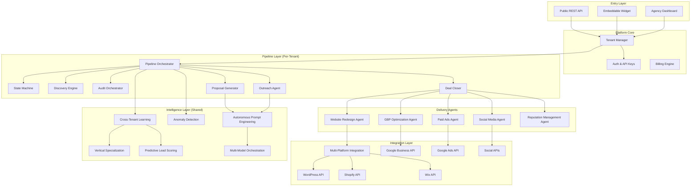

# Design Document: Sprint 5-6 Integration & Pilot

## Overview

Sprint 5-6 transforms the Proposal Engine from an autonomous agency tool into a platform operating system with market domination capabilities. The architecture extends the existing pipeline infrastructure (completed in Sprints 2-4) with five major subsystems:

1. **Advanced Delivery Agents** - AI-powered agents for website redesign, GBP optimization, paid ads, social media, and reputation management achieving 90%+ delivery automation
2. **White-Label Platform** - Multi-tenant architecture enabling 100+ agencies to operate under their own branding with complete isolation
3. **API & Developer Ecosystem** - Public REST API, SDKs, Zapier integration, and embeddable audit widgets for 100+ API consumers
4. **Compounding Intelligence v2** - Cross-tenant learning, vertical specialization engine, predictive lead scoring, and anomaly detection
5. **Hyper-Scale Infrastructure** - Auto-scaling to 60,000+ prospects/day, multi-model orchestration, and international expansion

Key design decisions:
- **Agent-based delivery architecture**: Each delivery capability is an independent, stateless agent that can be scaled horizontally
- **Platform-first multi-tenancy**: All data models include tenant isolation by design, not as an afterthought
- **Event-driven intelligence**: Learning and optimization happen asynchronously via event streams
- **Self-healing by default**: Every component implements circuit breakers, auto-failover, and remediation

## Architecture

The system follows a **platform architecture** with tenant-isolated pipelines feeding into shared intelligence layers.



### Execution Model

The platform operates on three execution tiers:

1. **Synchronous API Layer**: Request-response for audit triggers, status queries, and widget interactions
2. **Async Pipeline Layer**: Cron-triggered batch processing for discovery, outreach, and delivery (existing pattern)
3. **Event-Driven Intelligence Layer**: Pub/sub for learning updates, anomaly detection, and prompt optimization

## Components and Interfaces

### 1. Website Redesign Agent (`lib/pipeline/agents/websiteRedesignAgent.ts`)

AI-powered agent for generating and deploying complete website redesigns.

```typescript
interface RedesignConfig {
  clientId: string;
  proposalId: string;
  deliverableId: string;
  existingSiteUrl: string;
  brandColors?: string[];
  industry: string;
  designPreferences?: {
    style: 'modern' | 'classic' | 'minimal' | 'bold';
    layout: 'single-page' | 'multi-page';
  };
}

interface RedesignMockup {
  id: string;
  previewUrl: string;
  screenshotUrls: { desktop: string; mobile: string };
  generatedAt: Date;
  designTool: 'v0' | 'screenshot-to-code' | 'custom';
  codeBundle: {
    html: string;
    css: string;
    assets: string[];
  };
}

interface WebsiteRedesignAgent {
  analyzeSite(url: string): Promise<SiteAnalysis>;
  generateMockup(config: RedesignConfig): Promise<RedesignMockup>;
  createPreviewDeployment(mockup: RedesignMockup): Promise<string>; // preview URL
  deployToProduction(mockupId: string, platformCredentials: PlatformCredentials): Promise<DeploymentResult>;
  handleRejection(mockupId: string, feedback: string): Promise<RedesignMockup>;
}
```

### 2. GBP Optimization Agent (`lib/pipeline/agents/gbpOptimizationAgent.ts`)

Agent for managing Google Business Profile listings.

```typescript
interface GBPOptimizationConfig {
  clientId: string;
  placeId: string;
  businessName: string;
  industry: string;
  targetKeywords: string[];
}

interface GBPOptimizationAgent {
  verifyClaimStatus(placeId: string): Promise<{ claimed: boolean; claimable: boolean }>;
  initiateClaimProcess(config: GBPOptimizationConfig): Promise<ClaimResult>;
  optimizeProfile(config: GBPOptimizationConfig): Promise<OptimizationResult>;
  generateAndUploadPhotos(config: GBPOptimizationConfig, assets?: string[]): Promise<PhotoUploadResult>;
  schedulePost(config: GBPOptimizationConfig, content: PostContent): Promise<ScheduledPost>;
  respondToReview(reviewId: string, sentiment: 'positive' | 'negative', draftResponse: string): Promise<ReviewResponse>;
  answerQuestion(questionId: string, answer: string): Promise<QAResponse>;
  getPerformanceMetrics(placeId: string, dateRange: DateRange): Promise<GBPMetrics>;
}

interface GBPMetrics {
  views: number;
  searches: number;
  websiteClicks: number;
  directionRequests: number;
  phoneCalls: number;
  photoViews: number;
  reviewCount: number;
  averageRating: number;
}
```

### 3. Paid Ads Agent (`lib/pipeline/agents/paidAdsAgent.ts`)

Agent for managing Google Ads campaigns.

```typescript
interface PaidAdsConfig {
  clientId: string;
  businessName: string;
  industry: string;
  serviceArea: { city: string; radius: number };
  tier: 'starter' | 'growth' | 'pro';
  monthlyBudget: number;
  targetKeywords: string[];
  landingPageUrl: string;
}

interface AdCampaign {
  id: string;
  name: string;
  type: 'search' | 'display';
  status: 'draft' | 'active' | 'paused' | 'ended';
  budget: { daily: number; monthly: number };
  targeting: {
    keywords: string[];
    locations: string[];
    demographics?: DemographicTargeting;
  };
  adGroups: AdGroup[];
  performance?: CampaignPerformance;
}

interface PaidAdsAgent {
  createCampaign(config: PaidAdsConfig): Promise<AdCampaign>;
  generateAdVariants(campaignId: string, count: number): Promise<AdVariant[]>;
  startABTest(campaignId: string, variants: AdVariant[]): Promise<ABTest>;
  optimizeBidding(campaignId: string): Promise<BiddingOptimization>;
  adjustForPerformance(campaignId: string, targetCPA: number): Promise<AdjustmentResult>;
  generatePerformanceReport(campaignId: string, dateRange: DateRange): Promise<PerformanceReport>;
  pauseCampaign(campaignId: string): Promise<void>;
  requestBudgetApproval(campaignId: string, newBudget: number): Promise<ApprovalRequest>;
}
```

### 4. Social Media Agent (`lib/pipeline/agents/socialMediaAgent.ts`)

Agent for generating and posting social media content.

```typescript
interface SocialMediaConfig {
  clientId: string;
  businessName: string;
  industry: string;
  brandVoice: 'professional' | 'friendly' | 'casual' | 'authoritative';
  platforms: ('instagram' | 'facebook' | 'linkedin')[];
  postingFrequency: { postsPerWeek: number };
  localMarket: { city: string; region: string };
}

interface SocialPost {
  id: string;
  platform: 'instagram' | 'facebook' | 'linkedin';
  contentType: 'promotional' | 'educational' | 'behind-the-scenes' | 'testimonial' | 'community';
  caption: string;
  hashtags: string[];
  mediaUrls: string[];
  scheduledAt: Date;
  status: 'draft' | 'scheduled' | 'posted' | 'failed';
  engagement?: PostEngagement;
}

interface SocialMediaAgent {
  generateContentCalendar(config: SocialMediaConfig, weeks: number): Promise<ContentCalendar>;
  generatePost(config: SocialMediaConfig, contentType: string): Promise<SocialPost>;
  schedulePost(post: SocialPost): Promise<ScheduledPost>;
  postNow(post: SocialPost): Promise<PostResult>;
  getEngagementMetrics(clientId: string, dateRange: DateRange): Promise<EngagementMetrics>;
  adjustStrategy(clientId: string, performanceData: EngagementMetrics): Promise<StrategyAdjustment>;
  flagForReview(postId: string, reason: string): Promise<void>;
}
```

### 5. Reputation Management Agent (`lib/pipeline/agents/reputationAgent.ts`)

Agent for monitoring and managing online reputation.

```typescript
interface ReputationConfig {
  clientId: string;
  businessName: string;
  platforms: ('google' | 'yelp' | 'bbb' | 'facebook' | 'industry-specific')[];
  alertThreshold: number; // sentiment score below which to alert
  autoRespondPositive: boolean;
  escalationEmail: string;
}

interface Review {
  id: string;
  platform: string;
  rating: number;
  text: string;
  authorName: string;
  postedAt: Date;
  sentiment: 'positive' | 'neutral' | 'negative';
  sentimentScore: number;
  responded: boolean;
  responseText?: string;
  respondedAt?: Date;
}

interface ReputationAgent {
  configureMonitoring(config: ReputationConfig): Promise<void>;
  getReviews(clientId: string, filters?: ReviewFilters): Promise<Review[]>;
  analyzesentiment(reviews: Review[]): Promise<SentimentAnalysis>;
  generateResponse(review: Review): Promise<{ response: string; confidence: number }>;
  postResponse(reviewId: string, response: string): Promise<ResponseResult>;
  flagForHumanReview(reviewId: string, reason: string): Promise<void>;
  getReputationReport(clientId: string, dateRange: DateRange): Promise<ReputationReport>;
  identifyPatterns(clientId: string): Promise<ReviewPatterns>;
}
```

### 6. Multi-Platform Integration Layer (`lib/platform/integrations/`)

Unified interface for deploying to various website platforms.

```typescript
type SupportedPlatform = 'wordpress' | 'shopify' | 'wix' | 'squarespace' | 'custom';

interface PlatformCredentials {
  platform: SupportedPlatform;
  apiKey?: string;
  accessToken?: string;
  siteUrl: string;
  additionalConfig?: Record<string, unknown>;
}

interface DeploymentChange {
  type: 'speed-optimization' | 'seo-fix' | 'content-update' | 'full-redesign';
  description: string;
  files?: { path: string; content: string }[];
  settings?: Record<string, unknown>;
}

interface MultiPlatformIntegration {
  detectPlatform(siteUrl: string): Promise<{ platform: SupportedPlatform; confidence: number }>;
  validateCredentials(credentials: PlatformCredentials): Promise<boolean>;
  createBackup(credentials: PlatformCredentials): Promise<BackupResult>;
  deploy(credentials: PlatformCredentials, changes: DeploymentChange[]): Promise<DeploymentResult>;
  rollback(credentials: PlatformCredentials, backupId: string): Promise<RollbackResult>;
  getDeploymentHistory(clientId: string): Promise<DeploymentLog[]>;
}

// Platform-specific adapters
interface WordPressAdapter extends PlatformAdapter {
  installPlugin(pluginSlug: string): Promise<void>;
  updateTheme(themeData: ThemeData): Promise<void>;
  optimizeImages(): Promise<OptimizationResult>;
}

interface ShopifyAdapter extends PlatformAdapter {
  updateThemeSettings(settings: Record<string, unknown>): Promise<void>;
  addMetafields(metafields: Metafield[]): Promise<void>;
}
```

### 7. White-Label Platform (`lib/platform/tenant/`)

Multi-tenant architecture for agency white-labeling.

```typescript
interface TenantConfig {
  id: string;
  name: string;
  slug: string; // URL-safe identifier
  tier: 'starter' | 'growth' | 'enterprise';
  branding: {
    logo: string;
    primaryColor: string;
    secondaryColor: string;
    companyName: string;
    contactEmail: string;
    supportEmail: string;
  };
  domains: {
    proposalDomain?: string; // e.g., proposals.agencyname.com
    portalDomain?: string;   // e.g., portal.agencyname.com
    widgetDomain?: string;   // e.g., audit.agencyname.com
  };
  limits: {
    prospectsPerDay: number;
    activeClients: number;
    apiRequestsPerHour: number;
  };
  billing: {
    stripeCustomerId: string;
    subscriptionId: string;
    revenueSharePercent: number; // 20-30%
  };
  settings: {
    verticals: string[];
    geographies: string[];
    autoOutreach: boolean;
    humanReviewThreshold: number;
  };
  createdAt: Date;
  status: 'active' | 'suspended' | 'cancelled';
}

interface TenantManager {
  createTenant(config: Partial<TenantConfig>): Promise<TenantConfig>;
  getTenant(tenantId: string): Promise<TenantConfig>;
  updateTenant(tenantId: string, updates: Partial<TenantConfig>): Promise<TenantConfig>;
  suspendTenant(tenantId: string, reason: string): Promise<void>;
  getUsageMetrics(tenantId: string, dateRange: DateRange): Promise<TenantUsage>;
  applyBranding(tenantId: string, content: BrandableContent): Promise<BrandedContent>;
  validateDomain(domain: string): Promise<DomainValidation>;
  provisionDomain(tenantId: string, domain: string, type: 'proposal' | 'portal' | 'widget'): Promise<void>;
}

interface TenantBilling {
  calculateRevenueShare(tenantId: string, period: BillingPeriod): Promise<RevenueShareCalculation>;
  generateInvoice(tenantId: string, period: BillingPeriod): Promise<Invoice>;
  processPayment(invoiceId: string): Promise<PaymentResult>;
  getSubscriptionStatus(tenantId: string): Promise<SubscriptionStatus>;
  upgradeTier(tenantId: string, newTier: 'starter' | 'growth' | 'enterprise'): Promise<void>;
}
```

### 8. Public API (`app/api/v1/`)

REST API for external integrations.

```typescript
// API Route Structure
// POST   /api/v1/audits              - Create new audit
// GET    /api/v1/audits/:id          - Get audit status and results
// GET    /api/v1/audits/:id/findings - Get audit findings
// GET    /api/v1/audits/:id/proposal - Get generated proposal
// POST   /api/v1/outreach/:leadId    - Trigger outreach for a lead
// GET    /api/v1/clients             - List clients
// GET    /api/v1/clients/:id         - Get client details
// POST   /api/v1/webhooks            - Register webhook endpoint
// DELETE /api/v1/webhooks/:id        - Remove webhook

interface APIKeyConfig {
  id: string;
  tenantId: string;
  name: string;
  keyHash: string; // bcrypt hash of the key
  permissions: ('read' | 'write' | 'admin')[];
  rateLimit: {
    requestsPerHour: number;
    requestsPerDay: number;
  };
  lastUsedAt?: Date;
  expiresAt?: Date;
  status: 'active' | 'revoked';
}

interface WebhookConfig {
  id: string;
  tenantId: string;
  url: string;
  events: WebhookEvent[];
  secret: string; // for signature verification
  status: 'active' | 'paused' | 'failed';
  failureCount: number;
  lastDeliveredAt?: Date;
}

type WebhookEvent = 
  | 'audit.completed'
  | 'audit.failed'
  | 'proposal.generated'
  | 'proposal.viewed'
  | 'email.sent'
  | 'email.opened'
  | 'email.clicked'
  | 'deal.closed'
  | 'client.created';

interface PublicAPI {
  validateAPIKey(key: string): Promise<APIKeyConfig | null>;
  checkRateLimit(keyId: string): Promise<{ allowed: boolean; remaining: number }>;
  createAudit(tenantId: string, input: AuditInput): Promise<AuditResponse>;
  getAudit(tenantId: string, auditId: string): Promise<AuditResponse>;
  triggerOutreach(tenantId: string, leadId: string): Promise<OutreachResponse>;
  registerWebhook(tenantId: string, config: Partial<WebhookConfig>): Promise<WebhookConfig>;
  deliverWebhook(webhookId: string, event: WebhookEvent, payload: unknown): Promise<void>;
}
```

### 9. Embeddable Audit Widget (`lib/widget/`)

JavaScript widget for lead capture on agency websites.

```typescript
interface WidgetConfig {
  tenantId: string;
  containerId: string;
  theme: {
    primaryColor: string;
    buttonText: string;
    formFields: ('email' | 'phone' | 'name')[];
  };
  behavior: {
    showResultsInline: boolean;
    redirectUrl?: string;
    captureBeforeResults: boolean;
  };
  tracking: {
    utmSource?: string;
    customFields?: Record<string, string>;
  };
}

interface WidgetAnalytics {
  impressions: number;
  submissions: number;
  completions: number;
  conversionRate: number;
  averageTimeToSubmit: number;
  topReferrers: { url: string; count: number }[];
}

// Widget JavaScript API (client-side)
interface ProposalEngineWidget {
  init(config: WidgetConfig): void;
  on(event: 'submit' | 'complete' | 'error', callback: (data: unknown) => void): void;
  destroy(): void;
}

// Server-side widget management
interface WidgetManager {
  generateEmbedCode(tenantId: string, config: WidgetConfig): string;
  processSubmission(tenantId: string, submission: WidgetSubmission): Promise<AuditResult>;
  getAnalytics(tenantId: string, dateRange: DateRange): Promise<WidgetAnalytics>;
  updateConfig(tenantId: string, config: Partial<WidgetConfig>): Promise<void>;
}
```

### 10. Cross-Tenant Learning (`lib/intelligence/crossTenantLearning.ts`)

Anonymized learning across all tenants.

```typescript
interface AnonymizedPattern {
  id: string;
  vertical: string;
  geoRegion: string;
  patternType: 'win_rate' | 'finding_effectiveness' | 'pricing' | 'email_template';
  data: {
    winRate?: number;
    effectiveFindingTypes?: string[];
    optimalPriceRange?: { min: number; max: number };
    bestEmailPatterns?: string[];
  };
  sampleSize: number;
  confidence: number;
  lastUpdated: Date;
  modelVersion: string;
}

interface CrossTenantLearning {
  aggregatePatterns(outcomes: AnonymizedOutcome[]): Promise<void>;
  getPatterns(filters: PatternFilters): Promise<AnonymizedPattern[]>;
  computeLift(tenantId: string): Promise<{ withSharedLearning: number; withoutSharedLearning: number }>;
  ensureAnonymized(data: Record<string, unknown>): boolean;
  getModelVersion(): string;
  rollbackModel(version: string): Promise<void>;
  optOut(tenantId: string): Promise<void>;
  optIn(tenantId: string): Promise<void>;
}

interface AnonymizedOutcome {
  vertical: string;
  geoRegion: string;
  painScore: number;
  outcome: 'won' | 'lost' | 'ghosted';
  tierChosen?: string;
  dealValue?: number;
  findingTypes: string[];
  emailTemplateId?: string;
  // NO tenant ID, business name, or contact info
}
```

### 11. Vertical Specialization Engine (`lib/intelligence/verticalSpecialization.ts`)

Auto-detection and playbook generation for new verticals.

```typescript
interface VerticalPlaybook {
  id: string;
  vertical: string;
  status: 'emerging' | 'testing' | 'production' | 'deprecated';
  config: {
    effectiveFindings: { type: string; weight: number }[];
    emailTemplates: { id: string; winRate: number }[];
    pricingStrategy: {
      essentials: { min: number; max: number };
      growth: { min: number; max: number };
      premium: { min: number; max: number };
    };
    commonObjections: { objection: string; response: string }[];
    industryTerms: string[];
  };
  performance: {
    winRate: number;
    averageDealSize: number;
    timeToClose: number;
    sampleSize: number;
  };
  createdAt: Date;
  lastOptimized: Date;
}

interface VerticalSpecializationEngine {
  detectEmergingVerticals(threshold: number): Promise<EmergingVertical[]>;
  generatePlaybook(vertical: string, outcomes: VerticalOutcome[]): Promise<VerticalPlaybook>;
  startABTest(playbookId: string, controlId: string): Promise<ABTest>;
  evaluateABTest(testId: string): Promise<ABTestResult>;
  promotePlaybook(playbookId: string): Promise<void>;
  optimizePlaybook(playbookId: string, newOutcomes: VerticalOutcome[]): Promise<VerticalPlaybook>;
  getPlaybookPerformance(playbookId: string): Promise<PlaybookPerformance>;
  listPlaybooks(filters?: PlaybookFilters): Promise<VerticalPlaybook[]>;
}
```

### 12. Predictive Lead Scoring (`lib/intelligence/predictiveScoring.ts`)

ML-based close probability prediction.

```typescript
interface PredictiveModel {
  id: string;
  version: string;
  type: 'gradient_boosting' | 'neural_network' | 'ensemble';
  features: string[];
  performance: {
    accuracy: number;
    precision: number;
    recall: number;
    aucRoc: number;
    f1Score: number;
  };
  trainedOn: number; // sample size
  trainedAt: Date;
  status: 'training' | 'validating' | 'production' | 'deprecated';
}

interface LeadScore {
  leadId: string;
  closeProbability: number; // 0-100
  confidence: number; // 0-1
  factors: {
    factor: string;
    contribution: number; // positive or negative
    value: unknown;
  }[];
  modelVersion: string;
  scoredAt: Date;
}

interface PredictiveLeadScoring {
  trainModel(outcomes: TrainingOutcome[]): Promise<PredictiveModel>;
  validateModel(modelId: string, testSet: TrainingOutcome[]): Promise<ValidationResult>;
  scoreProspect(prospect: ProspectFeatures): Promise<LeadScore>;
  batchScore(prospects: ProspectFeatures[]): Promise<LeadScore[]>;
  getModelPerformance(modelId: string): Promise<ModelPerformance>;
  compareToRuleBased(modelId: string, testSet: TrainingOutcome[]): Promise<ComparisonResult>;
  rollbackModel(version: string): Promise<void>;
  getFeatureImportance(modelId: string): Promise<FeatureImportance[]>;
}

interface ProspectFeatures {
  vertical: string;
  painScore: number;
  geoRegion: string;
  businessSize?: 'small' | 'medium' | 'large';
  websiteAge?: number;
  reviewCount?: number;
  competitorGap?: number;
  engagementSignals?: {
    emailOpens: number;
    proposalViews: number;
    chatInteractions: number;
  };
}
```

### 13. Anomaly Detection & Self-Healing (`lib/intelligence/anomalyDetection.ts`)

Automated issue detection and remediation.

```typescript
interface AnomalyConfig {
  metric: string;
  baseline: number;
  threshold: number; // standard deviations
  windowMinutes: number;
  remediationAction?: RemediationAction;
}

interface DetectedAnomaly {
  id: string;
  metric: string;
  currentValue: number;
  baselineValue: number;
  deviation: number; // standard deviations
  detectedAt: Date;
  severity: 'low' | 'medium' | 'high' | 'critical';
  status: 'detected' | 'remediating' | 'resolved' | 'escalated';
  remediationAttempts: RemediationAttempt[];
}

type RemediationAction = 
  | { type: 'rotate_domains'; config: { minHealthyDomains: number } }
  | { type: 'adjust_pricing'; config: { adjustmentPercent: number } }
  | { type: 'switch_api_provider'; config: { fallbackProvider: string } }
  | { type: 'pause_stage'; config: { stage: string; durationMinutes: number } }
  | { type: 'alert_only'; config: { channels: string[] } };

interface AnomalyDetectionSystem {
  configureMetric(config: AnomalyConfig): Promise<void>;
  checkMetrics(): Promise<DetectedAnomaly[]>;
  triggerRemediation(anomalyId: string): Promise<RemediationResult>;
  getRemediationHistory(filters?: RemediationFilters): Promise<RemediationAttempt[]>;
  learnFromRemediation(attemptId: string, outcome: 'success' | 'failure'): Promise<void>;
  escalate(anomalyId: string, reason: string): Promise<void>;
  getSystemHealth(): Promise<SystemHealthReport>;
}

interface SelfHealingPipeline {
  handleDeliverabilityDrop(currentRate: number): Promise<RemediationResult>;
  handleConversionDrop(vertical: string, currentRate: number): Promise<RemediationResult>;
  handleAPIFailure(provider: string, errorRate: number): Promise<RemediationResult>;
  handleLatencySpike(stage: string, p95Latency: number): Promise<RemediationResult>;
  getAutomatedRemediationRate(): Promise<number>; // target: 99%+
}
```

### 14. Autonomous Prompt Engineering (`lib/intelligence/promptEngineering.ts`)

Self-optimizing prompt system.

```typescript
interface PromptVariant {
  id: string;
  basePromptId: string;
  version: number;
  content: string;
  taskType: 'email_generation' | 'proposal_writing' | 'objection_handling' | 'diagnosis';
  status: 'draft' | 'testing' | 'production' | 'deprecated';
  performance: {
    sampleSize: number;
    successRate: number; // task-specific metric
    qualityScore: number;
    costPerCall: number;
  };
  createdAt: Date;
  createdBy: 'human' | 'autonomous';
}

interface ABTestConfig {
  controlVariantId: string;
  testVariantId: string;
  trafficSplit: number; // 0-1, portion going to test
  minSampleSize: number;
  significanceThreshold: number; // p-value
  improvementThreshold: number; // minimum improvement to promote
}

interface AutonomousPromptEngineering {
  generateVariant(basePromptId: string): Promise<PromptVariant>;
  startABTest(config: ABTestConfig): Promise<ABTest>;
  evaluateTest(testId: string): Promise<ABTestResult>;
  promoteVariant(variantId: string): Promise<void>;
  rollbackToVersion(promptId: string, version: number): Promise<void>;
  getPromptHistory(promptId: string): Promise<PromptVariant[]>;
  generateWeeklyReport(): Promise<PromptPerformanceReport>;
  validateGuardrails(variant: PromptVariant): Promise<GuardrailValidation>;
}

interface GuardrailValidation {
  passed: boolean;
  checks: {
    noHarmfulContent: boolean;
    noMisleadingClaims: boolean;
    complianceCheck: boolean;
    brandSafetyCheck: boolean;
  };
  flaggedIssues: string[];
}
```

### 15. Multi-Model Orchestration (`lib/intelligence/modelOrchestration.ts`)

Dynamic routing between LLM providers.

```typescript
type LLMProvider = 'openai' | 'anthropic' | 'google' | 'meta';
type ModelId = 'gpt-4o' | 'gpt-4-turbo' | 'claude-3-opus' | 'claude-3-sonnet' | 'gemini-pro' | 'llama-3';

interface ModelBenchmark {
  modelId: ModelId;
  taskType: string;
  metrics: {
    quality: number; // 0-100
    latencyP50: number; // ms
    latencyP95: number; // ms
    costPer1kTokens: number; // cents
    errorRate: number;
  };
  lastBenchmarked: Date;
  sampleSize: number;
}

interface RoutingDecision {
  selectedModel: ModelId;
  reason: string;
  fallbackModels: ModelId[];
  estimatedCost: number;
  estimatedLatency: number;
}

interface MultiModelOrchestration {
  selectModel(taskType: string, requirements: ModelRequirements): Promise<RoutingDecision>;
  executeWithFallback(task: LLMTask, routing: RoutingDecision): Promise<LLMResponse>;
  benchmarkModel(modelId: ModelId, taskType: string, testCases: TestCase[]): Promise<ModelBenchmark>;
  getBenchmarks(filters?: BenchmarkFilters): Promise<ModelBenchmark[]>;
  registerNewModel(modelId: ModelId, provider: LLMProvider): Promise<void>;
  getOptimalModelForCost(taskType: string, maxCostPerCall: number): Promise<ModelId>;
  getCostAnalytics(dateRange: DateRange): Promise<CostAnalytics>;
}

interface ModelRequirements {
  minQuality: number;
  maxLatency: number;
  maxCost: number;
  preferredProvider?: LLMProvider;
}

interface LLMTask {
  taskType: string;
  prompt: string;
  maxTokens: number;
  temperature: number;
  metadata?: Record<string, unknown>;
}
```

### 16. Hyper-Scale Infrastructure (`lib/infrastructure/`)

Infrastructure components for 60K+ prospects/day.

```typescript
interface ScalingConfig {
  minInstances: number;
  maxInstances: number;
  targetCPUUtilization: number;
  targetMemoryUtilization: number;
  scaleUpThreshold: number;
  scaleDownThreshold: number;
  cooldownSeconds: number;
}

interface DatabaseShardConfig {
  shardKey: 'tenant_id' | 'created_at' | 'geo_region';
  shardCount: number;
  replicationFactor: number;
  readReplicas: number;
}

interface EmailInfrastructure {
  domains: EmailDomain[];
  warmupConfig: WarmupConfig;
  rotationPolicy: RotationPolicy;
  healthCheckInterval: number;
}

interface EmailDomain {
  domain: string;
  status: 'warming' | 'healthy' | 'flagged' | 'blacklisted';
  dailyLimit: number;
  sentToday: number;
  reputation: number; // 0-100
  lastHealthCheck: Date;
  dnsRecords: {
    spf: boolean;
    dkim: boolean;
    dmarc: boolean;
  };
}

interface InfrastructureManager {
  getScalingStatus(): Promise<ScalingStatus>;
  adjustScaling(config: Partial<ScalingConfig>): Promise<void>;
  getShardHealth(): Promise<ShardHealth[]>;
  rebalanceShards(): Promise<void>;
  getDomainHealth(): Promise<EmailDomain[]>;
  rotateDomain(domain: string, reason: string): Promise<void>;
  acquireNewDomain(): Promise<EmailDomain>;
  warmupDomain(domain: string): Promise<WarmupProgress>;
  getCDNMetrics(): Promise<CDNMetrics>;
  purgeCache(patterns: string[]): Promise<void>;
}
```

### 17. Localization Engine (`lib/platform/localization/`)

International expansion support.

```typescript
type SupportedCountry = 'US' | 'UK' | 'CA' | 'AU' | 'ES' | 'BR';
type SupportedLanguage = 'en' | 'en-GB' | 'en-AU' | 'es' | 'fr' | 'pt-BR';

interface CountryConfig {
  country: SupportedCountry;
  language: SupportedLanguage;
  currency: string;
  currencySymbol: string;
  timezone: string;
  compliance: {
    dataResidency: boolean;
    gdprApplicable: boolean;
    pipedaApplicable: boolean;
    localRegulations: string[];
  };
  auditModules: {
    enabled: string[];
    disabled: string[];
    countrySpecific: string[];
  };
  emailConfig: {
    toneAdjustments: Record<string, string>;
    culturalReferences: string[];
    legalDisclaimer: string;
  };
  pricingMultiplier: number;
}

interface LocalizationEngine {
  getCountryConfig(country: SupportedCountry): Promise<CountryConfig>;
  localizeContent(content: string, targetCountry: SupportedCountry): Promise<string>;
  convertCurrency(amount: number, fromCurrency: string, toCurrency: string): Promise<number>;
  getLocalizedTemplate(templateId: string, country: SupportedCountry): Promise<string>;
  validateCompliance(content: string, country: SupportedCountry): Promise<ComplianceResult>;
  getCountryMetrics(country: SupportedCountry): Promise<CountryMetrics>;
}
```

## Data Models

### New Prisma Models

```prisma
// Delivery agent tasks
model DeliveryAgentTask {
  id              String   @id @default(uuid())
  tenantId        String
  clientId        String
  deliverableId   String
  agentType       String   // 'website_redesign', 'gbp_optimization', 'paid_ads', 'social_media', 'reputation'
  status          String   @default("queued") // 'queued', 'in_progress', 'pending_approval', 'completed', 'failed'
  config          Json     @default("{}")
  result          Json?
  errorMessage    String?
  startedAt       DateTime?
  completedAt     DateTime?
  createdAt       DateTime @default(now())
  updatedAt       DateTime @updatedAt

  @@index([tenantId, status])
  @@index([clientId])
  @@index([agentType, status])
}

// Website redesign mockups
model RedesignMockup {
  id              String   @id @default(uuid())
  tenantId        String
  taskId          String
  previewUrl      String
  screenshotDesktop String?
  screenshotMobile  String?
  codeBundle      Json
  status          String   @default("draft") // 'draft', 'pending_approval', 'approved', 'rejected', 'deployed'
  feedback        String?
  version         Int      @default(1)
  createdAt       DateTime @default(now())

  @@index([tenantId, taskId])
}

// Platform API keys
model APIKey {
  id              String   @id @default(uuid())
  tenantId        String
  name            String
  keyHash         String
  permissions     String[] @default(["read"])
  rateLimitHour   Int      @default(1000)
  rateLimitDay    Int      @default(10000)
  lastUsedAt      DateTime?
  expiresAt       DateTime?
  status          String   @default("active")
  createdAt       DateTime @default(now())

  @@index([tenantId])
  @@index([keyHash])
}

// Webhook configurations
model WebhookEndpoint {
  id              String   @id @default(uuid())
  tenantId        String
  url             String
  events          String[]
  secret          String
  status          String   @default("active")
  failureCount    Int      @default(0)
  lastDeliveredAt DateTime?
  createdAt       DateTime @default(now())
  updatedAt       DateTime @updatedAt

  @@index([tenantId])
}

// Widget analytics
model WidgetImpression {
  id              String   @id @default(uuid())
  tenantId        String
  sessionId       String
  referrerUrl     String?
  submittedAt     DateTime?
  completedAt     DateTime?
  leadId          String?
  createdAt       DateTime @default(now())

  @@index([tenantId, createdAt])
}

// Vertical playbooks
model VerticalPlaybook {
  id              String   @id @default(uuid())
  vertical        String
  status          String   @default("emerging")
  config          Json
  performance     Json
  createdAt       DateTime @default(now())
  lastOptimized   DateTime @default(now())

  @@unique([vertical])
  @@index([status])
}

// Predictive model versions
model PredictiveModel {
  id              String   @id @default(uuid())
  version         String
  modelType       String
  features        String[]
  performance     Json
  trainedOn       Int
  trainedAt       DateTime
  status          String   @default("training")
  modelArtifact   String?  // S3/GCS path

  @@index([status])
  @@index([version])
}

// Anomaly detection logs
model AnomalyLog {
  id              String   @id @default(uuid())
  metric          String
  currentValue    Float
  baselineValue   Float
  deviation       Float
  severity        String
  status          String   @default("detected")
  remediationAttempts Json @default("[]")
  detectedAt      DateTime @default(now())
  resolvedAt      DateTime?

  @@index([metric, detectedAt])
  @@index([status])
}

// Prompt variants for autonomous engineering
model PromptVariant {
  id              String   @id @default(uuid())
  basePromptId    String
  version         Int
  content         String   @db.Text
  taskType        String
  status          String   @default("draft")
  performance     Json     @default("{}")
  createdBy       String   @default("human")
  createdAt       DateTime @default(now())

  @@index([basePromptId, status])
  @@index([taskType])
}

// Model benchmarks
model ModelBenchmark {
  id              String   @id @default(uuid())
  modelId         String
  taskType        String
  metrics         Json
  sampleSize      Int
  benchmarkedAt   DateTime @default(now())

  @@unique([modelId, taskType])
  @@index([taskType])
}

// Email domain health
model EmailDomainHealth {
  id              String   @id @default(uuid())
  domain          String   @unique
  status          String   @default("warming")
  dailyLimit      Int      @default(50)
  sentToday       Int      @default(0)
  reputation      Int      @default(100)
  dnsValid        Boolean  @default(false)
  lastHealthCheck DateTime?
  createdAt       DateTime @default(now())
  updatedAt       DateTime @updatedAt

  @@index([status])
}
```


## Correctness Properties

*A property is a characteristic or behavior that should hold true across all valid executions of a system — essentially, a formal statement about what the system should do. Properties serve as the bridge between human-readable specifications and machine-verifiable correctness guarantees.*

### Property 1: Tenant Data Isolation

*For any* database query scoped to a tenant ID, the results must contain zero records belonging to a different tenant ID. This applies to all data models: prospects, audits, proposals, clients, deliverables, and analytics.

**Validates: Requirements 7.1, 7.8, 9.8**

### Property 2: Delivery Agent Task Creation

*For any* accepted proposal containing deliverables of a specific type (website redesign, GBP optimization, paid ads, social media, reputation management), the system must create a corresponding DeliveryAgentTask with the correct agent type within 5 minutes of acceptance.

**Validates: Requirements 1.1, 2.1, 3.1, 4.1, 5.1**

### Property 3: Mockup Preview Before Deployment

*For any* website redesign mockup, the mockup must have a valid preview URL before its status can transition to 'deployed'. No deployment can occur without a preview URL.

**Validates: Requirements 1.2, 1.3**

### Property 4: Rejection Triggers New Version

*For any* redesign mockup that is rejected, a new mockup version must be generated with an incremented version number, and the new mockup must incorporate the rejection feedback.

**Validates: Requirements 1.6**

### Property 5: Negative Review Human Review Gate

*For any* review with rating ≤ 3 stars, the auto-generated response must be flagged for human review and must not be posted automatically. Only positive reviews (4+ stars) can be auto-posted.

**Validates: Requirements 2.5, 2.6, 5.3, 5.4**

### Property 6: Budget Tier Enforcement

*For any* paid ads campaign, the initial budget must match the client's tier configuration (Starter, Growth, Pro). Budget changes exceeding the tier allocation must be flagged for approval before execution.

**Validates: Requirements 3.2, 3.8**

### Property 7: Deployment Backup Requirement

*For any* deployment to a client's website platform, a backup must be created before any changes are applied. The backup ID must be recorded in the deployment log.

**Validates: Requirements 6.6**

### Property 8: Failed Deployment Rollback

*For any* deployment that fails, the system must automatically rollback to the most recent backup. The deployment status must be set to 'failed' and the rollback must be logged.

**Validates: Requirements 6.7**

### Property 9: API Rate Limiting

*For any* API key, the number of requests in a rolling hour must not exceed the configured hourly rate limit, and the number of requests in a rolling day must not exceed the daily rate limit.

**Validates: Requirements 9.2**

### Property 10: Webhook Event Delivery

*For any* webhook-triggering event (audit.completed, proposal.generated, email.sent, deal.closed), all registered webhooks for that tenant and event type must receive a delivery attempt within 60 seconds.

**Validates: Requirements 9.4**

### Property 11: Widget Lead Creation

*For any* widget submission that includes contact information, a lead must be created in the tenant's pipeline with the audit results attached within 30 seconds of submission.

**Validates: Requirements 10.3, 10.5**

### Property 12: Cross-Tenant Learning Anonymization

*For any* record in the shared intelligence model, the record must contain zero tenant-identifiable data: no tenant IDs, business names, contact information, or prospect-specific identifiers.

**Validates: Requirements 11.2**

### Property 13: Predictive Score Bounds

*For any* prospect scored by the predictive lead scoring model, the close probability must be between 0 and 100 inclusive, and must be accompanied by a confidence score between 0 and 1 and a model version identifier.

**Validates: Requirements 13.2**

### Property 14: Anomaly Detection Threshold

*For any* monitored metric, when the current value deviates from the baseline by more than the configured threshold (in standard deviations), an anomaly must be flagged within 5 minutes.

**Validates: Requirements 14.1, 14.2**

### Property 15: Self-Healing Remediation Rate

*For any* set of detected anomalies over a 24-hour period, at least 99% must be resolved through automated remediation without human intervention.

**Validates: Requirements 14.4**

### Property 16: Prompt Guardrail Validation

*For any* prompt variant generated by the autonomous prompt engineering system, the variant must pass all guardrail checks (no harmful content, no misleading claims, compliance check, brand safety) before being promoted to production.

**Validates: Requirements 15.6**

### Property 17: Prompt Rollback on Degradation

*For any* promoted prompt variant that causes quality degradation (measured by outcome metrics dropping below baseline), the system must automatically rollback to the previous version within 1 hour.

**Validates: Requirements 15.8**

### Property 18: Model Failover

*For any* LLM task where the primary model fails (timeout, error, or unavailable), the system must automatically route to a fallback model and complete the task. No task should fail due to a single model being unavailable.

**Validates: Requirements 16.4**

### Property 19: Vertical Playbook A/B Test Promotion

*For any* vertical playbook in testing status, the playbook must only be promoted to production if it outperforms the control (generic template) by the configured improvement threshold with statistical significance.

**Validates: Requirements 12.4, 12.5**

### Property 20: Revenue Share Calculation

*For any* tenant billing period, the revenue share calculation must equal the sum of client revenue multiplied by the configured revenue share percentage (20-30%), and the calculation must be auditable with line-item detail.

**Validates: Requirements 7.6**

### Property 21: Tenant Branding Application

*For any* client-facing output (proposal, email, report, dashboard) generated for a tenant with branding configured, the output must contain the tenant's brand name, logo reference, and contact email, not the platform defaults.

**Validates: Requirements 7.4**

### Property 22: Platform Tier Limits

*For any* tenant on a specific platform tier (Starter, Growth, Enterprise), the daily prospect processing count must not exceed the tier's configured limit. Processing must pause when the limit is reached.

**Validates: Requirements 7.5**

### Property 23: Localization Currency Conversion

*For any* pricing displayed to a prospect in a non-US country, the currency must be converted to the local currency using current exchange rates, and the currency symbol must match the country configuration.

**Validates: Requirements 18.3**

### Property 24: Compliance Validation

*For any* content generated for a prospect in a country with specific compliance requirements (GDPR, PIPEDA), the content must pass compliance validation for that country before being sent or displayed.

**Validates: Requirements 18.2**

### Property 25: Moat Metric Alerting

*For any* competitive moat metric that trends negatively for 2 or more consecutive weeks, an alert must be generated and delivered to platform administrators.

**Validates: Requirements 20.7**

## Error Handling

### Agent-Level Error Handling

Each delivery agent implements a consistent error handling pattern:

1. **Retry with backoff**: Transient failures (API timeouts, rate limits) retry up to 3 times with exponential backoff
2. **Graceful degradation**: If a non-critical step fails, continue with remaining steps and flag the failure
3. **Human escalation**: After max retries, escalate to human review queue with full context
4. **Cost tracking**: Record costs incurred before failure for accurate billing

### Platform-Level Error Handling

1. **Circuit breakers**: Each external integration (Google APIs, social platforms, website platforms) has a circuit breaker that opens after 5 consecutive failures
2. **Fallback providers**: Critical integrations have fallback providers (e.g., multiple email sending services)
3. **Tenant isolation on failure**: A failure in one tenant's pipeline must not affect other tenants
4. **Audit logging**: All errors are logged with tenant ID, operation, error details, and stack trace

### Self-Healing Patterns

| Failure Type | Detection | Auto-Remediation | Escalation Threshold |
|--------------|-----------|------------------|---------------------|
| Email deliverability drop | Bounce rate > 5% | Rotate to healthy domain | 3 failed rotations |
| API provider outage | Error rate > 10% | Switch to fallback provider | No fallback available |
| Model quality degradation | Outcome metrics drop > 20% | Rollback to previous version | 2 consecutive rollbacks |
| Database latency spike | p95 > 500ms | Scale read replicas | p95 > 2s after scaling |
| Campaign underperformance | CPA > 2x target | Adjust bids and targeting | 3 failed adjustments |

## Testing Strategy

### Testing Framework

- **Unit tests**: Vitest (existing configuration)
- **Property-based tests**: `fast-check` library for TypeScript
- **Integration tests**: API endpoint testing with supertest
- **E2E tests**: Playwright for widget and dashboard testing
- **Minimum iterations**: 100 per property test

### Property-Based Tests

Each correctness property is implemented as a `fast-check` property test:

- **Tag format**: `Feature: sprint-5-6-integration-pilot, Property {N}: {title}`
- **Minimum 100 iterations** per property
- **Custom generators**: TenantConfig, DeliveryAgentTask, RedesignMockup, APIKey, WebhookConfig, etc.

### Test Organization

```
lib/platform/__tests__/
  tenant.property.test.ts          — Properties 1, 20, 21, 22
  api.property.test.ts             — Properties 9, 10
  widget.property.test.ts          — Property 11

lib/pipeline/agents/__tests__/
  deliveryAgents.property.test.ts  — Properties 2, 3, 4, 5, 6
  integration.property.test.ts     — Properties 7, 8

lib/intelligence/__tests__/
  crossTenant.property.test.ts     — Property 12
  predictive.property.test.ts      — Property 13
  anomaly.property.test.ts         — Properties 14, 15
  prompts.property.test.ts         — Properties 16, 17
  models.property.test.ts          — Property 18
  verticals.property.test.ts       — Property 19

lib/platform/localization/__tests__/
  localization.property.test.ts    — Properties 23, 24

lib/platform/metrics/__tests__/
  moats.property.test.ts           — Property 25
```

### Integration Testing

- **API tests**: All public API endpoints tested with valid/invalid auth, rate limiting, and error responses
- **Webhook tests**: Webhook delivery tested with mock endpoints, retry logic, and failure handling
- **Widget tests**: Widget embedding, submission, and lead creation tested in browser environment
- **Agent tests**: Each delivery agent tested with mock external APIs

### Performance Testing

- **Audit latency**: Target < 5 seconds for full audit
- **API response time**: Target < 200ms for read operations, < 500ms for write operations
- **Widget load time**: Target < 1 second for widget initialization
- **Concurrent tenants**: Test with 100+ concurrent tenant operations
