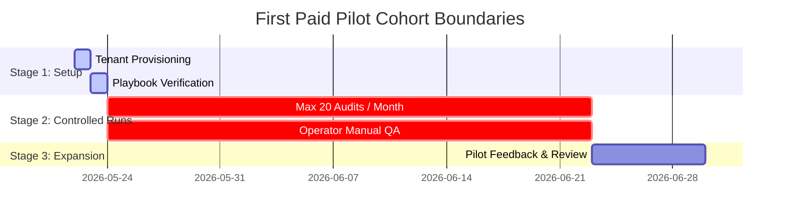

# First Paid Pilot Onboarding Script & Intake Workflow

This document provides the verbatim onboarding script, intake questionnaire, and expectation-setting guidelines for operators running the **ProposalOS First Paid Pilot** cohort.

> [!IMPORTANT]
> The system is currently certified for **FIRST_PILOT_READY** only. Under no circumstances should we pitch ProposalOS as a fully automated, high-scale General Availability platform. This cohort must understand they are getting a white-glove, operator-supervised experience with restricted volumes and manual QA steps.

---

## 1. Onboarding Strategy & Cohort Constraints

To ensure operational stability, safety, and high-quality results, the first paid pilot cohort is restricted by the following constraints:

- **Cohort Size**: Strictly capped at **5 active clients** max.
- **Audit Volume**: Capped at **20 audits per month** per client.
- **Outreach Volume**: **No bulk email campaigns**. Every outreach email must be manually verified and customized by an operator.
- **Environment**: Staging/Sandbox mode only. No live billing keys (`sk_live_*`) or live DNS redirects are permitted without direct supervised operator approval.

---

## 2. Verbatim Client Intake Interview Script

Operators must use the following script during the 1-on-1 onboarding video call:

### Part 2.1: Welcome & Framing

> "Thank you for joining our exclusive First Paid Pilot cohort for ProposalOS. We are incredibly excited to partner with you. Before we get into the details, I want to clarify how this phase works.
>
> ProposalOS is currently in a highly controlled, high-touch pilot mode. What this means for you is a premium, white-glove experience. Instead of leaving everything to a fully automated bot, our core engineering and operations team sits directly in the loop. We manually review, grade, and sign off on every audit and proposal before they reach your clients. This ensures near-zero error rates, perfect pricing accuracy, and complete brand safety, but it also means we enforce conservative volume limits."

### Part 2.2: Verbatim Intake Questionnaire

Operators must read the following questions and record the answers inside the Tenant's profile:

#### Question 1: Vertical Focus & Target Audience

> "To configure your playbooks correctly, what are the primary industries and sizes of businesses you are targeting? For example, are you focused on local service businesses like HVAC and Dental clinics, or are you looking to audit technology non-profits and larger corporate networks?"

#### Question 2: Custom Finding Tolerances

> "ProposalOS is built to detect security risks, site performance bottlenecks, and SEO issues. Are there specific findings that are non-negotiable for your agency? For example, do you want to highlight HIPAA compliance for clinics, or Core Web Vitals and Largest Contentful Paint for e-commerce stores?"

#### Question 3: Dynamic Pricing Multipliers

> "Our system dynamically computes pricing tiers based on the target organization's industry scale. What is your standard baseline pricing for a basic project, a growth package, and an enterprise engagement? This will help us tune our dynamic multipliers so that your proposals never under-price or over-price the client."

#### Question 4: Communication Tone & Spam Guards

> "For outbound email or proposal presentation, how formal should the copywriter be? Since we enforce strict anti-spam rules and copywriting filters—especially blocking any low-quality marketing terms for non-profit and open-source foundations—are there any custom branding terms you want us to write into your templates?"

---

## 3. Managing Technical Expectations & Volume Boundaries

During onboarding, operators must explicitly state and gain agreement on the following boundaries:

### 1. The 20-Audit Monthly Cap

> "To protect proxy budgets and ensure complete manual QA oversight, each tenant account is capped at 20 generated proposals per month. We want you to prioritize high-value, high-probability leads rather than running broad cold outreach campaigns."

### 2. The Human-in-the-Loop Safeguard

> "Because this is an early-stage pilot, all proposals default to 'DRAFT' status. You will be able to review, adjust, and export the proposals inside your dashboard. Outbound emails will never be sent automatically without your direct review and an operator's safety sign-off."

### 3. Stripe Sandbox Verification

> "All billing tests, client subscription checkout checkups, and client-side payments are currently run through the **Stripe Sandbox / Test Mode**. Do not attempt to use live-mode credit cards or live keys during this pilot phase."

---

## 4. Onboarding Checklist for Operators

Before handing over dashboard credentials to the pilot participant, confirm all items are checked off:

- [ ] **RLS Verified**: Tenant RLS policies are active on the target database, and data isolation has been verified.
- [ ] **Banned Words Filter Active**: The copywriter is verified to completely filter out SMB local-business terms for non-profit target crawls.
- [ ] **Settings Lock**: Max monthly audits is configured to `20` inside the Tenant's `settings` JSON block.
- [ ] **Onboarding Form Completed**: Intake responses have been logged in the client's records.
- [ ] **No Secrets Exposed**: Confirmed that no real Stripe keys (`sk_live_`), production database URLs, or real client domains are visible in any documentation.
