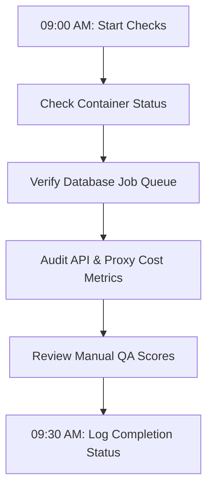

# First Pilot Operator Runbook

This document defines the daily administrative protocols, system health checks, budget trackers, and emergency procedures for operators managing the **ProposalOS First Paid Pilot** cohort.

---

## 1. Daily Morning Health Checks

Every morning at **09:00 AM**, the designated on-duty operator must execute the following diagnostic checkup sequence.



### Check 1.1: Container & Web Server Status

Ensure the Next.js server and database connection are fully healthy:

```bash
# Verify container runtime logs (GCP Cloud Run or Docker Staging)
docker ps --filter "name=proposal-engine"
```

- **Target**: Ensure CPU and Memory utilization sits below **`70%`**.
- **Diagnostic Command**: Run `npm run status` or query the staging system dashboard to verify zero system restarts or memory crashes in the last 24 hours.

### Check 1.2: Database Job Queue Inspection

Check for stuck or failed audits. Stale audits are automatically failed by our TTL cron after 2 hours, but operators should verify crawler health manually:

```sql
-- Count running and failed audits
SELECT status, COUNT(*)
FROM "Audit"
WHERE "createdAt" > NOW() - INTERVAL '1 day'
GROUP BY status;
```

- **Target**: Crawler success rates (`status = 'COMPLETE'`) must be **`>= 85%`**. Any spike in `'FAILED'` audits must be cross-referenced with crawler failure classifications (`ANTI_BOT` or `TIMEOUT`) in the findings logs.

---

## 2. Telemetry, Budget, and Spent Thresholds

To protect the business from runaway API costs or infinite crawling loops, operators must track and log daily OpenAI and proxy credit utilization.

### Daily Spend Limits:

- **Max Daily Proxy Credit Usage**: `$15.00`
- **Max Daily LLM Token Costs**: `$10.00`
- **Max Cumulative Pilot Budget (Monthly)**: `$400.00`

### Checking Spend Logs:

Query the internal database for cumulative API cost cents generated by the dynamic findings scorer:

```sql
-- Query cumulative API spend in the last 24 hours (in cents)
SELECT SUM(apiCostCents) / 100.0 AS "Cumulative Cost USD"
FROM "Audit"
WHERE "startedAt" > NOW() - INTERVAL '1 day';
```

---

## 3. Emergency Freeze Scenarios

If the system exhibits runaway scraping loops, memory exhaustion, or security anomalies, the operator must execute the appropriate Emergency Freeze protocol immediately.

### Scenario A: Runaway Scraper Loop / Proxy Depletion

If a crawler gets stuck recursively fetching a website or triggers heavy proxy costs:

1.  **Kill Scraper Engine**: Manually terminate any active crawler subprocesses or trigger the global scraper shutdown command.
2.  **Zero-Out Concurrency settings**: Set the tenant's concurrent scraper quota to `0` inside the database to freeze active queues:
    ```sql
    UPDATE "Tenant"
    SET settings = jsonb_set(settings, '{concurrencyLimit}', '0')
    WHERE slug = 'pilot-alpha';
    ```
3.  **Halt Job Scheduler**: Set the queue dispatcher service to offline in the env configs.

### Scenario B: Security/RLS Leakage Warning

If Tenant A reports seeing Tenant B's findings:

1.  **Freeze All Inbound HTTP Traffic**: Scale down Cloud Run container instances to `0` or place the app in Maintenance Mode immediately.
2.  **Verify environment RLS configurations**: Re-apply migrations to force database role restrictions:
    ```bash
    # Execute RLS enforcement scripts
    npx prisma db execute --file scripts/enforce-rls.sql
    ```
3.  **Perform manual token audit**: De-authorize all active user sessions by clearing the `Session` table:
    ```sql
    DELETE FROM "Session";
    ```

### Scenario C: Stripe Payment Issues (Double-billing or Webhook Errors)

If Stripe triggers duplicate events or webhooks fail with 500 errors:

1.  **Pause Staging Webhook forwarder**: Stop the stripe forwarding process or temporarily delete the webhook URL from the Stripe dashboard.
2.  **Set Status to Suspended**: Prevent new upgrades by suspending subscription flows in the database:
    ```sql
    UPDATE "Tenant" SET status = 'suspended' WHERE id = 'pilot-alpha-uuid';
    ```

---

## 4. Daily Pilot Metrics Tracker (Template)

Operators must fill out the following tracking log in the team's operational logbook each evening:

```markdown
# DAILY OPERATIONAL TRACKER

Date: 2026-05-**\_ | On-Duty Operator: **************\_****************

1. Active Pilot Tenants: [ ] / 5
2. Total Audits Run Today: [ ]
3. Crawler Success Rate (%): [ ] % (Target: >= 85%)
   - Classified ANTI_BOT: [ ]
   - Classified TIMEOUT: [ ]
   - Classified HTTP_ERROR: [ ]
4. Total OpenAI Spend Today ($): $ [ ] (Limit: $10.00)
5. Total Proxy Credit Spend Today ($): $ [ ] (Limit: $15.00)
6. Average Manual QA Score: [ ] / 10 (Target: >= 7.5)
7. # Client Complaints / Incidents: **************\_\_\_**************
```
