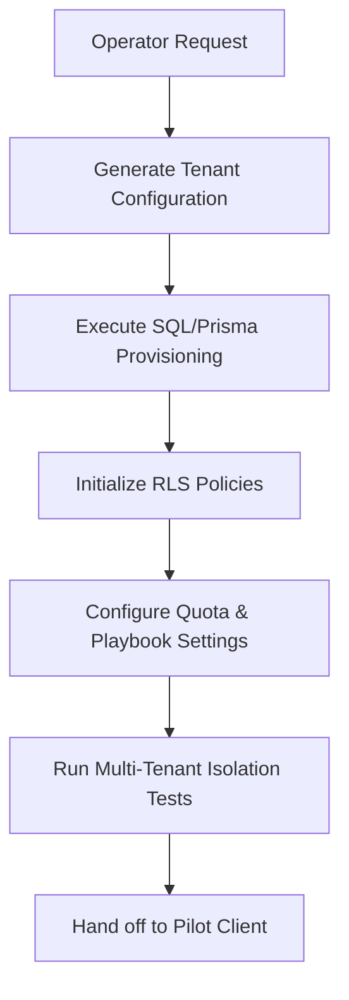

# First Pilot Tenant Provisioning Guide

This document defines the strict, operator-supervised manual and scripted workflow for provisioning a new tenant in the **ProposalOS First Paid Pilot** phase.

> [!IMPORTANT]
> The system is currently certified for **FIRST_PILOT_READY** only. Under no circumstances should any General Availability (GA) scale provisioning workflows or automated self-serve sign-ups be enabled. Every tenant must be manually provisioned and verified by an authorized operator.

---

## 1. Tenant Provisioning Architecture

To maintain high data privacy and prevent cross-tenant leakage, ProposalOS relies on PostgreSQL Row-Level Security (RLS) on all core models (`Audit`, `AuditJob`, `Finding`, `Proposal`, `User`, etc.).



---

## 2. Provisioning Steps

### Step 2.1: Tenant Database Seeding

An operator executes the following Prisma script commands to safely create the tenant record, set limits, and initialize default playbooks.

#### Scripted Tenant Creation

We use a structured TypeScript seeding/provisioning script (located at `scripts/provision-tenant.ts` or via an equivalent administrative CLI). Below is the logical query executed against the database:

```typescript
import { PrismaClient } from '@prisma/client';
import bcrypt from 'bcryptjs';

const prisma = new PrismaClient();

async function provisionPilotTenant() {
  const name = 'Pilot Agency Alpha';
  const slug = 'pilot-alpha';
  const domain = 'pilot-alpha.proposalengine.app';
  const email = 'owner@pilot-alpha.com';

  console.log(`🌱 Provisioning Pilot Tenant: ${name}...`);

  // 1. Create Tenant with strict Pilot Quotas & Branding settings
  const tenant = await prisma.tenant.upsert({
    where: { slug },
    update: {},
    create: {
      name,
      slug,
      domain,
      planTier: 'starter', // Lock to starter tier for the pilot
      status: 'active',
      subscriptionStatus: 'active',
      requireHumanReview: true, // MUST be true for Pilot stage (Manual QA required)
      branding: {
        primaryColor: '#4F46E5',
        logoUrl: 'https://assets.proposalengine.app/pilot-alpha/logo.png',
        allowedOrigins: ['https://pilot-alpha.com', 'https://*.pilot-alpha.com'], // Widget allowlist
      },
      settings: {
        maxAuditsPerMonth: 20, // Strict quota constraint for pilot
        concurrencyLimit: 2, // Bound scraper concurrency to protect proxy budget
        enableSlackAlerts: true,
      },
    },
  });

  // 2. Provision Primary Owner Account
  // Password must be a secure temporary hash
  const temporaryPassword = '[TEMPORARY_SECURE_PASSWORD]';
  const passwordHash = await bcrypt.hash(temporaryPassword, 10);

  const ownerUser = await prisma.user.upsert({
    where: { email },
    update: { tenantId: tenant.id },
    create: {
      email,
      name: 'Pilot Alpha Owner',
      passwordHash,
      role: 'owner',
      tenantId: tenant.id,
      subscriptionTier: 'STARTER',
      auditsLimit: 20,
      auditsThisMonth: 0,
      emailVerified: new Date(),
    },
  });

  // 3. Seed Dynamic Playbooks for the Tenant
  const playbooks = [
    {
      industry: 'dental',
      name: 'Dental & Orthodontics',
      pricingConfig: { starter: 1500, growth: 3000, premium: 5000 },
      proposalLanguage: {
        valueProp: 'Maximize patient acquisition and local SEO visibility.',
        painPoints: ['Empty chair time', 'Weak Google Maps positioning', 'No online booking'],
      },
    },
    {
      industry: 'hvac',
      name: 'HVAC & Local Services',
      pricingConfig: { starter: 1200, growth: 2500, premium: 4500 },
      proposalLanguage: {
        valueProp: 'Dominate regional dispatch searches and fill seasonal slumps.',
        painPoints: ['Low off-season volume', 'Wasted ad budget', 'Slow response times'],
      },
    },
  ];

  for (const pb of playbooks) {
    await prisma.playbook.upsert({
      where: {
        tenantId_industry: {
          tenantId: tenant.id,
          industry: pb.industry,
        },
      },
      update: {},
      create: {
        tenantId: tenant.id,
        industry: pb.industry,
        name: pb.name,
        pricingConfig: pb.pricingConfig,
        proposalLanguage: pb.proposalLanguage,
        isDefault: true,
      },
    });
  }

  console.log(`✅ Provisioning Complete for Tenant ID: ${tenant.id}`);
  console.log(`✅ Owner Created: ${ownerUser.email}`);
}

provisionPilotTenant()
  .catch((e) => {
    console.error('❌ Provisioning Failed:', e);
    process.exit(1);
  })
  .finally(() => prisma.$disconnect());
```

---

## 3. Row-Level Security (RLS) Isolation Verification

Before delivering credentials to the pilot participant, the operator must execute database-level isolation checks.

> [!WARNING]
> RLS validation prevents the critical security failure of Tenant A being able to read or tamper with Tenant B's client audits and pricing data.

### Validation SQL Query (Prisma / Raw SQL)

Run the following checks directly inside the PostgreSQL database client to confirm RLS policies restrict cross-tenant views:

```sql
-- 1. Assume the security role for the web server connections
SET ROLE blazecrawl_tenant_role;

-- 2. Simulate acting on behalf of Tenant A (Pilot Alpha)
SET LOCAL app.current_tenant_id = 'pilot-alpha-uuid-12345';

-- 3. Query all proposals
SELECT id, "tenantId", "status" FROM "Proposal";
-- EXPECTED: Only records matching tenantId = 'pilot-alpha-uuid-12345' are returned.

-- 4. Attempt to insert a proposal for Tenant B (Malicious or Cross-Tenant write)
INSERT INTO "Proposal" (id, "auditId", "tenantId", "status")
VALUES ('proposal-test-id', 'audit-test-id', 'tenant-beta-uuid-abcde', 'DRAFT');
-- EXPECTED: SQL Error "Permission Denied" or insert fail due to RLS constraint.

-- 5. Switch to Tenant B (Pilot Beta) and verify the previous record is invisible
SET LOCAL app.current_tenant_id = 'tenant-beta-uuid-abcde';
SELECT id, "tenantId" FROM "Proposal" WHERE id = 'proposal-test-id';
-- EXPECTED: 0 rows returned.
```

---

## 4. Quota Constraints & Rate-Limit Configurations

To prevent scraper resource depletion or infinite loops, enforce the following tenant constraints inside `brandingConfig`/`settings`:

| Quota Constraint              | Value                   | Enforcement Layer                    | Action on Violation                                |
| :---------------------------- | :---------------------- | :----------------------------------- | :------------------------------------------------- |
| **Max Audits/Month**          | `20`                    | API Controller / `User` table limits | Hard block, return `429 Too Many Requests`         |
| **Concurrent Audits**         | `2`                     | Job Queue Scheduler                  | Keep in `QUEUED` state until current runs complete |
| **Target Website Exclusions** | Non-Profits, Govt Sites | Inbound Crawler Sanitizer            | Deny crawl, emit warning                           |
| **Allowed Origin Domains**    | Specific Pilot Domains  | Middleware CORs Check                | Reject widget iframe loader                        |

---

## 5. Rollback and Clean-up Procedures

In the event of a pilot tenant cancellation, the operator must execute a clean-up transaction. This is handled gracefully via PostgreSQL cascading deletes on the `Tenant` table to prevent orphaned data leakages.

```sql
-- Safe teardown of a pilot tenant
BEGIN;

-- 1. Remove all records cascading down from Tenant ID
DELETE FROM "Tenant" WHERE id = 'pilot-alpha-uuid-12345';

-- 2. Verify all linked Audits, Proposals, Findings, and Users are expunged
SELECT COUNT(*) FROM "Audit" WHERE "tenantId" = 'pilot-alpha-uuid-12345'; -- Should be 0
SELECT COUNT(*) FROM "Proposal" WHERE "tenantId" = 'pilot-alpha-uuid-12345'; -- Should be 0
SELECT COUNT(*) FROM "User" WHERE "tenantId" = 'pilot-alpha-uuid-12345'; -- Should be 0

COMMIT;
```
