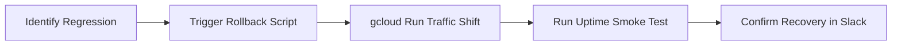

# Incident Response & Rollback Procedures — Paid Closed Beta

This document establishes the incident classification system, immediate action matrices, rollback runbooks, and post-mortem procedures for the ProposalOS Paid Closed Beta.

> [!CAUTION]
> **Data Isolation is Non-Negotiable**: Any suspected leakage of user data, RLS bypass, or database compromise requires an immediate system freeze (Severity-0/P0).

---

## 1. Incident Classification Matrix

| Incident Scenario                       |    Severity    | Immediate On-Call Action                                          |     Rollback Triggered?     |
| :-------------------------------------- | :------------: | :---------------------------------------------------------------- | :-------------------------: |
| **Suspected Tenant Data Leak**          | **P0 (Sev-0)** | Freeze affected database tables, pause worker queue, lock tenant. |  Yes (If code regression)   |
| **Database RLS / Policy Failure**       | **P0 (Sev-0)** | Halt Next.js application traffic, trigger pgBouncer audit locks.  |       Yes (Immediate)       |
| **Billing Double-Charge / Mismatch**    | **P1 (Sev-1)** | Disable Stripe checkouts via env flags, notify billing owner.     |  No (DB config adjustment)  |
| **Email Leak to Public / Wrong Target** | **P0 (Sev-0)** | Revoke Resend API keys, pause outreach pipeline, audit logs.      |   No (Credentials rotate)   |
| **Runaway LLM / Audit Costs**           | **P1 (Sev-1)** | Throttle daily audit quotas, pause high-cost prompt variations.   |   No (Config adjustment)    |
| **Stuck Queue / Worker Backup**         | **P2 (Sev-2)** | Clear stuck pipeline records, scale Cloud Run workers.            |      No (Scale check)       |
| **Degraded External LLM Provider**      | **P1 (Sev-1)** | Switch circuit breaker to Anthropic / OpenAI fallback.            |   No (Automatic failover)   |
| **Secret Leak in Logs or Git**          | **P0 (Sev-0)** | Revoke and rotate compromised API keys immediately.               |      No (Keys revoked)      |
| **Severe Proposal Hallucinations**      | **P2 (Sev-2)** | Mark affected proposal draft as unapproved, block download.       | Yes (If model config issue) |

---

## 2. Specific Scenario Playbooks

### Scenario A: Suspected Tenant Data Leak / RLS Failure

1. **Quarantine the Network**: Direct Cloud Run service to drop traffic or output a static error page.
2. **Isolate Database**: Kill active PostgreSQL connections:
   ```sql
   SELECT pg_terminate_backend(pid) FROM pg_stat_activity WHERE datname = 'proposal_engine';
   ```
3. **Execute RLS Validation Suite**: Run the multi-tenant isolation tests to localize the leak path:
   ```bash
   npx ts-node scripts/rls-smoke-test.ts
   ```

### Scenario B: Billing Double-Charge / Duplicate Subscriptions

1. **Disable Staging Checkouts**: In `.env.local`, set `STRIPE_CHECKOUT_DISABLED=true` and restart the runtime.
2. **Review Stripe Webhook Failures**: Trace incoming event logs:
   ```bash
   gcloud logging read "resource.type=cloud_run_revision AND textPayload:*stripe*" --limit=20
   ```
3. **Trigger Manual Refund**: Log into the Stripe dashboard, identify the duplicate `payment_intent`, and issue a refund. Ensure the database matches Stripe state:
   ```sql
   UPDATE "BillingTransaction" SET status = 'REFUNDED' WHERE "stripeChargeId" = 'ch_xxxx';
   ```

### Scenario C: Email Sent to Unintended Recipient

1. **Kill Resend Connection**: Revoke the active `RESEND_API_KEY` from the Resend control panel.
2. **Pause Outreach Engine**: Run the database script to freeze outreach stages:
   ```sql
   UPDATE "PipelineConfig" SET "pausedStages" = '["outreach"]';
   ```
3. **Audit Outreach Logs**: Verify how the target email address bypassed the developer safety regex:
   ```sql
   SELECT id, recipient, subject, "sentAt" FROM "OutreachEmailLog" ORDER BY "sentAt" DESC LIMIT 10;
   ```

### Scenario D: Runaway Audit Costs

1. **Determine Culprit**: Query the cost metrics to isolate the highest spending model:
   ```sql
   SELECT model, SUM(cost) FROM "LLMUsageLog" GROUP BY model ORDER BY SUM(cost) DESC;
   ```
2. **Enforce Daily Limits**: Reduce the hard daily limit of audits allowed on staging:
   ```sql
   UPDATE "AuditQuota" SET "dailyLimit" = 5;
   ```

---

## 3. Rollback Action Plan

When an engineering rollback is initiated, complete these steps within **2 minutes**:



### Step 1: App Service Rollback

Trigger the automated traffic-based rollback to switch 100% of user traffic to the previous stable Cloud Run revision:

```bash
./scripts/rollback.sh --service proposal-engine --region us-central1
```

### Step 2: Pause Async Worker Pipeline

To prevent data contamination, suspend the pipeline workers:

```bash
gcloud run services update proposal-os-worker --min-instances=0 --max-instances=0 --region=us-central1
```

### Step 3: Revoke Staging Tokens & Sessions

Force-close active client sessions to terminate invalid requests:

```sql
DELETE FROM "Session";
UPDATE "ApiKey" SET "revokedAt" = NOW() WHERE "revokedAt" IS NULL;
```

### Step 4: Database Restore / Point-in-Time Recovery (PITR)

If database state was corrupted by a migration, initiate PITR using GCP Cloud SQL console:

1. Locate the Cloud SQL instance: `proposal-os-db`.
2. Select **Backups** -> **Point-in-time recovery**.
3. Choose the timestamp exactly 1 minute prior to the failed migration.
4. Restore to a temporary clone first, verify, then swap connection strings.

---

## 4. Post-Mortem Template

Every P0 or P1 incident requires a blameless post-mortem filed within **24 hours** using this template:

```markdown
# Incident Post-Mortem — [YY-MM-DD] — [Brief Title]

## Executive Summary

- **Incident Commander**: [Name]
- **Severity**: [P0 / P1]
- **Duration**: [e.g., 23 minutes]
- **Impact**: [Number of affected tenants / audits]

## Timeline

- **HH:MM**: Alert triggered `[alert_name]`.
- **HH:MM**: On-call engineer acknowledged incident.
- **HH:MM**: Rollback script executed successfully.
- **HH:MM**: Health endpoint recovered to `200 OK`.

## Root Cause Analysis

Explain why this failure occurred. What went wrong? What was the technical pathway?

## Preventative Actions

- [ ] Action 1 (P0) - [Assignee]
- [ ] Action 2 (P1) - [Assignee]
```
