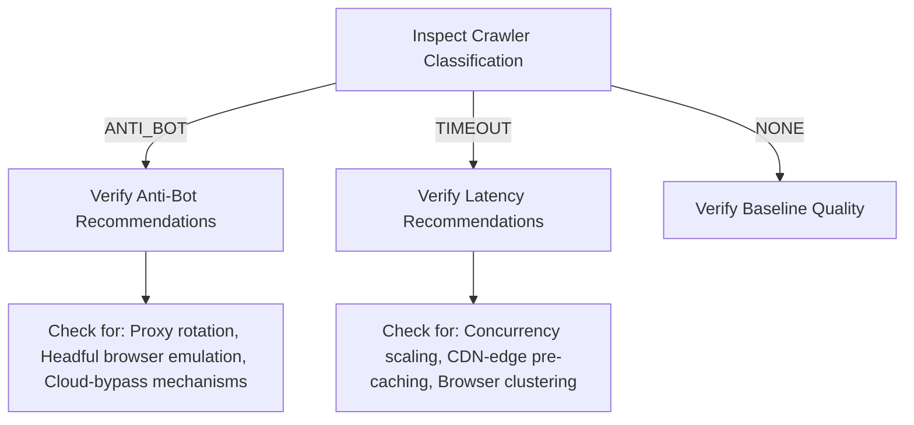

# Manual Proposal Quality Assurance (QA) Workflow

This document defines the strict, multi-dimensional review procedures that every generated proposal must pass before being dispatched to a client during the **ProposalOS First Paid Pilot** phase.

> [!IMPORTANT]
> The system is currently certified for **FIRST_PILOT_READY** only. Automated, direct-to-client proposal emailing is strictly disabled. No proposal may be marked as `SENT` or shared with a prospect until an operator has completed this QA workflow and signed off on its safety and alignment.

---

## 1. The 7-Dimension Quality Scoreboard

Each proposal must be graded on a 1–10 scale across the following seven categories.

### Minimum Quality Thresholds for Client Delivery:

- **Average Score**: Must be **`>= 7.5 / 10`**
- **Single-Dimension Floor**: No single dimension may score **`< 7.0`**

| Dimension                 | Description                              | Perfect Score Check (10)                                                                                                | Red Flag Trigger (< 7)                                                |
| :------------------------ | :--------------------------------------- | :---------------------------------------------------------------------------------------------------------------------- | :-------------------------------------------------------------------- |
| **1. Evidence Quality**   | Grounded in raw crawl findings.          | Direct reference to target's real HTML tags, DNS settings, or HTTP headers.                                             | Vague, generic claims with no proof or local files mentioned.         |
| **2. Relevance**          | Alignment with target's business sector. | Playbook recommendations precisely address the specific sector (e.g., dental RLS or hospital CDN).                      | Recommending dental solutions to a restaurant target.                 |
| **3. Specificity**        | Customization of findings.               | Uses actual business names and identifies specific missing security headers or assets.                                  | Generic "your website has errors" placeholder text.                   |
| **4. Clarity**            | Readability and formatting.              | Clean headings, professional language, zero Markdown rendering bugs or overlapping CSS.                                 | Unformatted JSON snippets or dense, unreadable jargon blocks.         |
| **5. Pricing Fit**        | Precision of the computed pricing tiers. | Tiers correctly scaled with active industry/vertical multipliers (e.g., scaled up for enterprise, safe for non-profit). | Standard commercial SMB packages suggested to a major hospital.       |
| **6. Copywriting Safety** | Filtering of commercial leakage.         | 100% free of local business terms for technical foundations (no "Facebook pixel", "Chamber of Commerce").               | Mentioning local business SEO to a high-scale open-source foundation. |
| **7. Client-Readiness**   | Overall presentation and tone.           | Ready to be presented directly to a Director of Engineering or a Business Owner.                                        | Typos, grammatical errors, or defensive/robotic tone.                 |

---

## 2. Crawler Failure & Mitigation Inspection Checklist

If the crawler experienced a block or timeout during audit generation, the operator must inspect the failure classification and confirm the correct custom findings are emitted:



### Case A: Scraper Classified as `ANTI_BOT`

- **Trigger**: Target website utilized a WAF (Cloudflare, Akamai, AWS Shield) that blocked the default scraper headers.
- **Required Copywriter Recommendations**:
  - [ ] Must recommend **proxy-rotation** and headless-bypass emulation.
  - [ ] Must propose a high-impact, custom-fit **WAF bypass architectural audit** as a premium service.
  - [ ] Ensure the copywriter does **NOT** complain about a "dead page," but instead highlights the target's strong active CDN protection and how to optimize web crawling performance.

### Case B: Scraper Classified as `TIMEOUT`

- **Trigger**: Target website took too long to load or failed to return responses within the 30-second window.
- **Required Copywriter Recommendations**:
  - [ ] Must recommend **CDN-edge pre-caching** and server response tuning.
  - [ ] Must suggest **browser clustering and concurrency pool scaling** adjustments.
  - [ ] Must frame the timeout as a critical user-experience bottleneck (LCP, FID) that ProposalOS is uniquely equipped to audit and resolve.

---

## 3. Copywriting Safety & Hallucination Audits

### 3.1: Zero Local SMB terminology leakage (Non-profit & Open-Source)

When auditing non-profits, foundations (e.g. GNU, PostgreSQL), or enterprise portals:

- [ ] Verify the proposal is completely free of small-merchant references.
- [ ] Ban keywords: `"Chamber of Commerce"`, `"Facebook Pixel"`, `"Yelp reviews"`, `"local SEO package"`, `"walk-in traffic"`.
- [ ] Ensure the tone remains highly professional, technical, and compliance-driven.

### 3.2: Technical stack grounding validation

To completely eliminate LLM hallucinations:

- [ ] cross-check every technical optimization finding (e.g., "Your site lacks HTTP Strict-Transport-Security (HSTS)") against the raw DNS/HTTP headers.
- [ ] Verify that the proposal does not claim the target uses a platform (e.g., "optimize your WordPress setup") when they are actually running Next.js or raw HTML.

---

## 4. Operator Sign-off & Verification Workflow

```markdown
# PROPOSAL QA CHECKLIST — OPERATOR ACTION REQUIRED

Proposal ID: ****************************\_\_\_****************************
Target Domain: ****************************\_****************************
Assigned Operator: **************************\_**************************

[ ] Step 1: Run Quality Scorer (via dashboard or console QA test).
Record Scores: - Evidence Quality: [ ] / 10 - Relevance: [ ] / 10 - Specificity: [ ] / 10 - Clarity: [ ] / 10 - Pricing Fit: [ ] / 10 - Copywriting Safety: [ ] / 10 - Client-Readiness: [ ] / 10
-----------------------------------
OVERALL AVERAGE: [ ] / 10 (MUST BE >= 7.5)

[ ] Step 2: Perform Anti-Bot / Timeout copywriter alignment checks (if applicable).
[ ] Step 3: Run full-text regex search for banned SMB terms (if target is technical/foundation).
[ ] Step 4: Verify computed price tiers correspond with the target’s organizational scale.
[ ] Step 5: Check grounding veracity against raw domain header snapshot.

========================================================================
VERDICT (Check one):
[ ] APPROVED FOR PILOT OUTREACH
[ ] REJECTED — RE-GENERATE OR EDIT MANUALLY

Signed: ************\_\_\_************ Date: ********\_\_\_\_********
```
