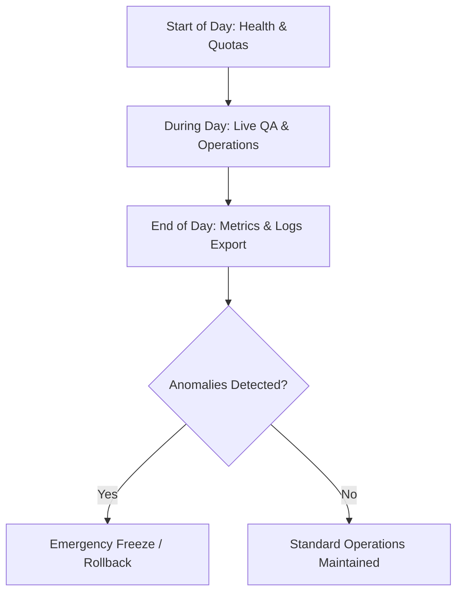

# Paid Closed Beta Runbook — Operator Manual

This document is the standard operating runbook for the ProposalOS Paid Closed Beta. It contains the procedures, SQL queries, and commands required to maintain the stability, performance, and safety of the system.

> [!WARNING]
>
> - **Sandbox Enforced**: Do not utilize live Stripe API keys (`sk_live_*`) or public cold email routes.
> - **Capped Limits**: The cohort is capped at 1–5 tenants, 10–25 daily audits, and strictly internal-only email routing.

---

## Runbook Schedule Overview



---

## 1. Start of Day Procedures

Before users log in, the operator must execute the following safety checks:

### Step 1: Staging Environment Verification

Run the verification check script to ensure the environment variables are correctly loaded and do not leak production targets:

```bash
npx ts-node scripts/validate-env.ts
```

### Step 2: API & Health Checks

Verify the local staging endpoints are running and operational on port `3001`:

```bash
curl -fsS http://localhost:3001/api/health | jq .
```

Verify the following parameters in the JSON output:

- `status`: must be `"healthy"` (or acceptable staging state).
- `externalApis.resend`: must be `true` (fully connected).
- `externalApis.stripe`: must be `true` (fully connected).

### Step 3: Queue and Jobs Inspection

Verify there are no stuck jobs from the previous day:

```sql
SELECT id, "pipelineStatus", "updatedAt"
FROM "ProspectLead"
WHERE "pipelineStatus" = 'RUNNING'
AND "updatedAt" < NOW() - INTERVAL '30 minutes';
```

If stuck jobs are found, refer to **Operational Actions** below.

### Step 4: Cost Tracking Verification

Inspect the LLM cost metrics logged over the last 24 hours:

```sql
SELECT SUM(value) as total_cents
FROM "Metric"
WHERE name = 'llm_cost_total'
AND timestamp > NOW() - INTERVAL '24 hours';
```

Ensure total daily cost is well below the **$50.00 daily threshold**.

---

## 2. During Beta Operations

### How to Run a Sandbox Audit

To trigger a sandboxed audit pipeline run:

```bash
curl -X POST http://localhost:3001/api/audit \
  -H "Content-Type: application/json" \
  -H "x-api-key: your-api-key" \
  -d '{"name": "Local Test Plumber", "city": "Saskatoon"}'
```

### How to Inspect a Failed Audit

If a client reports a failed audit pipeline run, extract the step-level `PipelineErrorLog`:

```sql
SELECT id, stage, message, "errorCode", metadata, created_at
FROM "PipelineErrorLog"
ORDER BY created_at DESC
LIMIT 5;
```

### How to Regenerate a Proposal

If a generated proposal has formatting anomalies or requires regeneration due to a revised crawl:

```bash
npx ts-node scripts/regenerate-one-proposal-summary.ts --proposal-id=<PROPOSAL_UUID>
```

### How to Perform Manual Proposal Quality Control (QA)

Before releasing a proposal to beta customers, evaluate it using the quality review engine:

```bash
npx ts-node scripts/qa-review.ts --proposal-id=<PROPOSAL_UUID>
```

Confirm the overall score is **&ge; 8.0/10.0** and has zero markdown rendering hallucinations.

### How to Pause a Tenant

If a tenant violates quotas or exhibits suspicious behavior, freeze their operations immediately:

```sql
UPDATE "Tenant"
SET "isSuspended" = true, "suspendedAt" = NOW()
WHERE id = 'tenant-uuid';
```

### How to Disable Outreach & Billing Services

If an incident warrants pausing outbound integrations:

- **Outreach Disable**: Pause the outreach pipeline stage in the database.
  ```sql
  UPDATE "PipelineConfig"
  SET "pausedStages" = '["outreach"]'
  WHERE "tenantId" = 'tenant-uuid';
  ```
- **Billing Disable**: Turn off Stripe checkouts by setting:
  ```env
  # In .env.local
  STRIPE_CHECKOUT_DISABLED=true
  ```
  Restart the Next.js runtime.

### How to Rollback Code / Model Deployments

If a newly promoted feature causes severe failures:

1. Trigger the automated rollback script:
   ```bash
   ./scripts/rollback.sh --service proposal-engine --region us-central1
   ```
2. Verify that traffic has successfully reverted to the stable revision.

---

## 3. End of Day Procedures

### Step 1: Export Operational Metrics

Run the metrics collector to export daily statistics:

```sql
SELECT count(*) as total_audits,
       SUM(CASE WHEN "pipelineStatus" = 'completed' THEN 1 ELSE 0 END) as successful_audits
FROM "ProspectLead"
WHERE "createdAt" > NOW() - INTERVAL '24 hours';
```

### Step 2: Financial Reconciliation

Sum up all Stripe test invoices to confirm correct pricing mappings:

```sql
SELECT count(*), SUM("amountCents") as gross_test_revenue
FROM "BillingTransaction"
WHERE "status" = 'PAID' AND "createdAt" > NOW() - INTERVAL '24 hours';
```

### Step 3: Log Review for Security Anomalies

Scan database security tables to verify RLS isolation:

```bash
npx ts-node scripts/rls-smoke-test.ts
```

---

## 4. Emergency Freeze Checklist

If a **Severity-0 (P0)** security event occurs (e.g. suspected data leak, public email leak, active exploit):

1. **Disable Public Routing**:
   Block Next.js edge middleware router paths for public routes:
   ```sql
   UPDATE "FeatureFlag" SET "enabled" = false WHERE key = 'PUBLIC_AUDITS_ENABLED';
   ```
2. **Stop the Worker Pipeline**:
   Pause all asynchronous queue workers:
   ```bash
   gcloud run services update proposal-os-worker --min-instances=0 --max-instances=0 --region=us-central1
   ```
3. **Revoke Staging API Keys**:
   Instantly rotate staging tokens to prevent API abuse:
   ```sql
   UPDATE "ApiKey" SET "revokedAt" = NOW() WHERE "revokedAt" IS NULL;
   ```
4. **Notify Beta Users**:
   Trigger an operational status update alert to the Slack support channel (#beta-ops).
