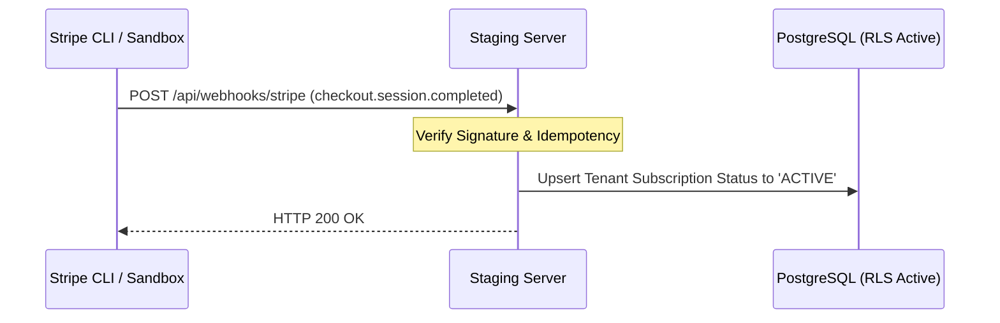

# Paid Pilot Billing Readiness Checklist

This document details the critical safety validation checklist for the **Stripe Sandbox / Test Mode Billing Engine** during the **ProposalOS First Paid Pilot** phase.

> [!CAUTION]
> **NO LIVE STRIPE KEYS IN PILOT.**
> Under no circumstances should live keys starting with `sk_live_` or `pk_live_` be loaded into any configuration, database, or environment file. The pilot operates 100% in Stripe Test Mode (`sk_test_` and `pk_test_`).

---

## 1. Safety Checks & Credential Verification

### 1.1 Stripe Key Format Verification

Before running billing simulations, the operator must verify that the environment variables are correctly structured with Sandbox-only markers:

```bash
# Execute this check on the staging container or local environment
# Target: Verify no live keys exist in environment
env | grep -E "STRIPE_SECRET_KEY|STRIPE_PUBLIC_KEY"
```

- **PASS Criteria**:
  - `STRIPE_SECRET_KEY` must begin with `sk_test_` (e.g., `sk_test_51O...****`).
  - `STRIPE_PUBLIC_KEY` must begin with `pk_test_` (e.g., `pk_test_51O...****`).
- **FAIL Criteria**:
  - Any variable starting with `sk_live_` or `pk_live_`.
  - Any cleartext secret displayed without masking or truncation in logs.

### 1.2 Webhook Signature Authentication

- Verify that `STRIPE_WEBHOOK_SECRET` starts with `whsec_` and corresponds to the Stripe CLI or Staging Dashboard Test Mode endpoint.
- Confirm that `api/webhooks/stripe` utilizes standard raw-body parsing and signature verification using the `stripe.webhooks.constructEvent` SDK method:

```typescript
// Core security verification inside webhook controller
const event = stripe.webhooks.constructEvent(rawBody, signature, process.env.STRIPE_WEBHOOK_SECRET);
```

---

## 2. Product-to-Price Mapping Validations

The billing engine maps Stripe Price IDs to internal ProposalOS tenant tiers. The operator must confirm that the price mapping conforms to the following schema in `settings` or the Stripe service config:

| Plan Tier   | Stripe Test Price ID     | Billing Interval | Price (USD) | Allowed Audits/Month               |
| :---------- | :----------------------- | :--------------- | :---------- | :--------------------------------- |
| **Starter** | `price_1OtestStarter123` | Monthly          | `$49.00`    | `20`                               |
| **Pro**     | `price_1OtestPro123`     | Monthly          | `$99.00`    | `100` (Restricted for pilot)       |
| **Agency**  | `price_1OtestAgency123`  | Monthly          | `$249.00`   | `Unlimited` (Restricted for pilot) |

---

## 3. Webhook Endpoint Configuration & Testing

To test webhook synchronization securely in the staging environment, use the Stripe CLI to trigger simulated checkouts:



### Simulated Webhook Testing Command:

Run this Stripe CLI command to pipe test events directly to your local or staging server webhook endpoint:

```bash
# Trigger a simulated checkout completed session
stripe trigger checkout.session.completed \
  --api-key sk_test_MASKED_SECRET_KEY \
  --forward-to http://localhost:3000/api/webhooks/stripe
```

---

## 4. Checkout Simulation Checklist

Operators must run a manual verification pass of the payment flow to ensure there are no breaking failures or cross-tenant leaks:

- [ ] **Simulate Starter Upgrade**:
  1. Access the Pilot Client dashboard.
  2. Navigate to `/billing` and click "Upgrade to Starter".
  3. Verify the browser redirects securely to the `checkout.stripe.com` test-mode portal.
- [ ] **Checkout Submission**:
  1. Complete checkout using Stripe's standard test card: `4242 4242 4242 4242`.
  2. Complete registration and redirect back to `/billing?session_id=cs_test_...`.
- [ ] **Webhook Validation**:
  1. Verify the container logs record a successful `checkout.session.completed` event.
  2. Verify `Tenant` row is updated with `subscriptionStatus = 'active'` and `stripeCustomerId` is populated.
- [ ] **Idempotency Check**:
  1. Re-send the exact same webhook payload using Postman or Stripe CLI.
  2. Confirm the server returns `200 OK` instantly with an `idempotency-key` match without creating duplicate subscription logs.
- [ ] **RLS Verification during checkout**:
  1. Verify the tenant's subscription changes do not alter or update any neighboring Tenant's data in the database.
